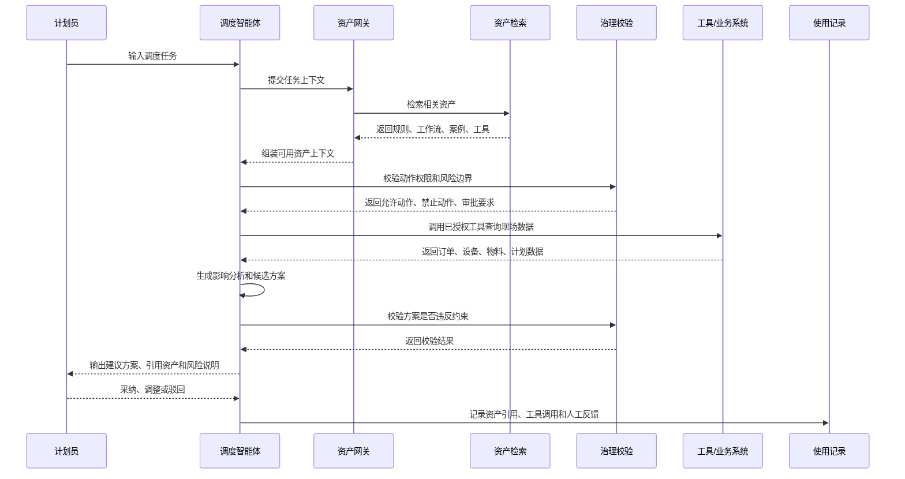
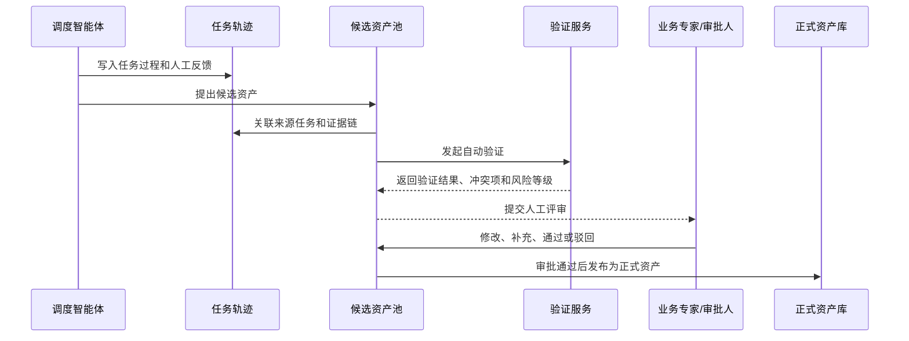

# 智能体资产管理产品设计文档

## 1. 文档目标

本文档用于梳理工业动态调度智能体资产管理模块的产品设计，重点说明首期要解决的问题、核心功能、交互逻辑、页面结构与页面草图。

本模块不是普通知识库或附件库，而是面向调度智能体的长期任务记忆、能力供给、治理审计与经验沉淀系统。

## 2. 产品定位

智能体资产管理模块用于管理能够被调度智能体持续复用的业务规则、工作流、工具接口、案例经验、评估指标和运行反馈。

它需要同时服务两类对象：

| 对象 | 需求 |
| --- | --- |
| 业务用户 | 维护资产、审核候选资产、查看资产价值、追踪智能体使用过程 |
| 调度智能体 | 检索可信资产、读取资产详情、调用授权工具、遵守治理约束、沉淀候选资产 |

核心目标是形成闭环：

```text
资产登记 -> 解析结构化 -> 验证审批 -> 发布使用 -> 任务引用 -> 效果反馈 -> 候选沉淀 -> 再次发布
```

## 3. 用户角色

| 角色 | 主要诉求 | 关键操作 |
| --- | --- | --- |
| 计划员 | 快速理解智能体使用了哪些资产，以及建议是否可信 | 查看资产引用、查看案例、反馈采纳或驳回原因 |
| 计划主管 | 控制规则、策略、计划变更类资产的发布风险 | 审批资产、查看风险边界、管理生效范围 |
| 工艺/业务专家 | 维护规则、约束、经验和业务口径 | 创建资产、修订版本、验证候选资产 |
| IT/系统管理员 | 管理接口、工具、权限和审计 | 配置工具资产、管理权限、查看调用日志 |
| 生产管理者 | 评估资产对调度效率和生产指标的贡献 | 查看价值分析、资产健康度和推广效果 |

## 4. 资产范围

首期建议支持以下资产类型：

| 资产类型 | 功能描述 | 示例 |
| --- | --- | --- |
| 规则约束资产 | 管理调度中的硬约束、软约束、优先级规则和策略边界 | 设备兼容规则、插单优先级、跨班生产限制 |
| 工作流资产 | 定义智能体处理某类任务的步骤、输入、工具和人工介入点 | 设备故障重排、物料短缺影响分析、插单评估 |
| 工具接口资产 | 管理智能体可调用的业务系统接口和工具能力 | MES 查询、ERP 订单查询、APS 求解器、规则校验器 |
| 案例经验资产 | 沉淀真实任务中的背景、方案、结果和复用条件 | 历史插单处理、故障应急调整、人工否决原因 |
| 指标评估资产 | 定义排程方案和资产效果的评价口径 | 准交率、换型次数、延期小时、采纳率 |
| 术语口径资产 | 管理企业内部术语、编码映射和业务计算口径 | 锁单、冻结区、急单、清线、班次口径 |

## 5. 核心功能

### 5.1 资产工作台

用于查看资产总体情况和待处理事项。

功能包括：

- 查看资产总量、分类分布、状态分布。
- 查看高频引用资产、低活跃资产、风险资产。
- 查看待验证、待审批、即将过期、长期未维护资产。
- 查看智能体提出的候选资产队列。
- 支持按资产类型、状态、适用范围、来源、标签、风险等级筛选。
- 支持进入资产详情、新建资产、处理候选资产和查看价值分析。

### 5.2 资产台账

用于集中管理全部正式资产和草稿资产。

功能包括：

- 列表查看资产名称、类型、状态、版本、适用范围、负责人、最近引用时间。
- 支持关键词检索和高级筛选。
- 支持批量停用、批量打标签、批量调整负责人。
- 支持查看资产引用次数、采纳率、最近变更记录。
- 支持从列表进入详情、编辑、提交验证、提交审批、停用或废止。

### 5.3 资产详情

用于展示一项资产的完整内容、治理信息和使用效果。

通用信息包括：

- 基础信息：名称、类型、摘要、标签、负责人、所属组织。
- 适用范围：工厂、车间、产线、产品族、客户类型、业务场景。
- 内容结构：人类可读说明、结构化配置、附件或引用数据。
- 治理信息：状态、版本、审批记录、风险等级、有效期、权限。
- 智能体使用：被哪些任务引用、引用原因、引用后结果、人工反馈。
- 证据链：来源任务、专家确认、验证结果、历史版本。

不同类型资产需要有专属字段：

| 类型 | 专属字段 |
| --- | --- |
| 规则约束资产 | 条件、约束类型、优先级、冲突处理、测试样例 |
| 工作流资产 | 触发条件、输入要求、执行步骤、调用工具、人工介入点、成功判断 |
| 工具接口资产 | 调用方式、入参出参、权限等级、错误处理、写回限制、审计要求 |
| 案例经验资产 | 事件背景、状态快照、候选方案、采用方案、执行结果、复用条件 |
| 指标评估资产 | 指标口径、计算公式、数据来源、适用场景、目标阈值 |

### 5.4 资产创建与编辑

用于人工创建资产或编辑已有资产。

首期建议采用分步表单：

1. 选择资产类型。
2. 填写业务描述和适用范围。
3. 使用 AI 辅助提取结构化字段。
4. 配置风险边界、权限和审批要求。
5. 补充测试样例、证据链和版本说明。
6. 校验并提交验证或审批。

关键交互要求：

- 表单根据资产类型动态展示字段。
- AI 可以辅助生成结构化内容，但必须由用户确认。
- 高风险字段修改后必须重新验证。
- 已发布资产不能直接覆盖，编辑时生成新版本草稿。

### 5.5 候选资产池

用于承接智能体从真实任务中提炼出的候选资产。

候选来源包括：

- 智能体任务轨迹。
- 人工反馈和纠偏。
- 多次被采纳的方案。
- 多次被否决的错误建议。
- 复盘会议或专家录入。

功能包括：

- 查看候选资产标题、类型、来源任务、证据数量、风险等级、推荐理由。
- 查看智能体提炼依据和原始任务链路。
- 支持合并相似候选、转为正式资产草稿、驳回、补充证据。
- 支持发起自动验证和人工审批。

### 5.6 验证与审批

用于确保资产在影响智能体正式决策前经过治理。

状态流转：

```text
草稿 -> 待验证 -> 验证中 -> 待审批 -> 已发布 -> 停用 -> 废止
候选 -> 待补充 -> 待验证 -> 待审批 -> 已发布
```

验证内容包括：

- 字段完整性校验。
- 适用范围校验。
- 与既有规则的冲突校验。
- 样例任务回放校验。
- 权限与风险边界校验。
- 高风险动作审批要求校验。

审批内容包括：

- 资产内容是否正确。
- 生效范围是否合理。
- 是否允许智能体读取、建议、申请或执行。
- 是否需要有效期、复审周期或灰度发布。

### 5.7 Agent 使用记录

用于追踪智能体在任务中如何使用资产。

记录内容包括：

- 任务编号、任务类型、触发人、发生时间。
- 智能体检索到的资产、实际引用的资产、未采用原因。
- 资产在方案中的作用：上下文、工具、治理约束、案例参考。
- 工具调用记录、治理校验结果、审批要求。
- 方案是否被采纳、人工修改内容、业务执行结果。

### 5.8 价值分析

用于衡量资产是否真正提升智能体表现和业务结果。

首期指标：

- 资产引用次数。
- 引用后方案采纳率。
- 关联任务成功率。
- 人工修正次数变化。
- 违规建议拦截次数。
- 候选资产转正率。
- 长期未使用资产数量。

分析维度：

- 按资产类型。
- 按业务场景。
- 按工厂、车间、产线。
- 按时间趋势。
- 按智能体或任务类型。

## 6. 交互逻辑

### 6.1 智能体使用资产



### 6.2 智能体沉淀候选资产



### 6.3 人工创建资产

```text
新建资产
  -> 选择资产类型
  -> 填写业务描述
  -> AI 辅助结构化
  -> 人工确认字段
  -> 配置适用范围和治理边界
  -> 上传证据或测试样例
  -> 提交验证
  -> 验证通过后提交审批
  -> 审批通过后发布
```

### 6.4 资产版本更新

```text
已发布资产
  -> 创建新版本草稿
  -> 修改内容
  -> 对比旧版本差异
  -> 重新验证受影响场景
  -> 审批通过
  -> 新版本生效
  -> 旧版本归档，可按权限回滚
```

## 7. 页面信息架构

```text
智能体资产管理
├─ 资产工作台
├─ 资产台账
│  ├─ 资产列表
│  ├─ 资产详情
│  └─ 新建/编辑资产
├─ 候选资产池
│  ├─ 候选列表
│  └─ 候选详情/转正
├─ 验证与审批
│  ├─ 待验证
│  ├─ 待审批
│  └─ 审批记录
├─ Agent 使用记录
│  ├─ 任务引用记录
│  ├─ 工具调用记录
│  └─ 治理校验记录
├─ 价值分析
└─ 治理配置
   ├─ 权限配置
   ├─ 风险等级
   ├─ 审批流程
   └─ 生效范围字典
```

## 8. 页面草图

以下为低保真页面草图，用于表达信息布局。高保真原型已沉淀在 `prototype/` 目录中。

### 8.1 资产工作台

```text
┌──────────────────────────────────────────────────────────────────────┐
│ 智能体资产工作台                         [搜索资产] [新建资产]       │
├──────────────┬───────────────────────────────────────────────────────┤
│ 侧边导航     │ 指标卡片                                               │
│              │ ┌────────┐ ┌────────┐ ┌────────┐ ┌────────┐          │
│ 工作台       │ │资产总量│ │已发布  │ │待审批  │ │候选资产│          │
│ 资产台账     │ └────────┘ └────────┘ └────────┘ └────────┘          │
│ 候选资产     │                                                       │
│ 审批验证     │ ┌──────────────────────────┐ ┌────────────────────┐ │
│ 使用记录     │ │ 资产列表/高频资产          │ │ 候选资产队列        │ │
│ 价值分析     │ │ 类型 状态 版本 引用 负责人 │ │ 来源 风险 证据 操作 │ │
│ 治理配置     │ └──────────────────────────┘ └────────────────────┘ │
│              │                                                       │
│              │ ┌──────────────────────────────────────────────────┐ │
│              │ │ 风险提醒：即将过期、长期未维护、冲突待处理资产     │ │
│              │ └──────────────────────────────────────────────────┘ │
└──────────────┴───────────────────────────────────────────────────────┘
```

### 8.2 资产详情页

```text
┌──────────────────────────────────────────────────────────────────────┐
│ 资产详情：设备故障后局部重排工作流       [编辑] [新建版本] [停用]     │
├──────────────────────────────────────────────────────────────────────┤
│ 状态：已发布  版本：v1.3  风险：中  适用：苏州一厂/总装一线          │
├──────────────────────────────┬───────────────────────────────────────┤
│ 基础信息                     │ 治理信息                              │
│ - 类型：工作流资产            │ - 审批人                              │
│ - 负责人                      │ - 生效时间/有效期                     │
│ - 标签                        │ - Agent 可用权限                      │
├──────────────────────────────┴───────────────────────────────────────┤
│ 内容结构                                                             │
│ 触发条件 | 输入要求 | 执行步骤 | 调用工具 | 人工介入点 | 成功判断     │
├──────────────────────────────────────────────────────────────────────┤
│ Agent 使用记录                                                       │
│ 任务编号  引用原因  输出方案  采纳结果  人工反馈  执行效果           │
├──────────────────────────────────────────────────────────────────────┤
│ 证据链与版本                                                         │
│ 来源任务 | 验证样例 | 审批记录 | 历史版本 | 差异对比                 │
└──────────────────────────────────────────────────────────────────────┘
```

### 8.3 新建资产向导

```text
┌──────────────────────────────────────────────────────────────────────┐
│ 新建资产                                                             │
├──────────────────────────────────────────────────────────────────────┤
│ 步骤：① 类型选择 -> ② 业务描述 -> ③ AI结构化 -> ④ 治理配置 -> ⑤ 校验提交 │
├──────────────────────────────────────────────────────────────────────┤
│ 左侧：表单输入                                                       │
│ ┌──────────────────────────────────────────────────────────────────┐ │
│ │ 资产类型：规则约束 / 工作流 / 工具接口 / 案例经验 / 指标评估       │ │
│ │ 名称：                                                            │ │
│ │ 业务描述：                                                        │ │
│ │ 适用范围：工厂、车间、产线、产品族、业务场景                       │ │
│ │ 风险等级：低 / 中 / 高                                             │ │
│ └──────────────────────────────────────────────────────────────────┘ │
│                                                                      │
│ 右侧：AI 辅助结构化结果                                               │
│ ┌──────────────────────────────────────────────────────────────────┐ │
│ │ 条件、约束、步骤、工具、审批点、测试样例                           │ │
│ │ [采纳建议] [修改字段] [重新生成]                                   │ │
│ └──────────────────────────────────────────────────────────────────┘ │
│                                             [保存草稿] [提交验证]     │
└──────────────────────────────────────────────────────────────────────┘
```

### 8.4 候选资产池

```text
┌──────────────────────────────────────────────────────────────────────┐
│ 候选资产池                              [按类型筛选] [按风险筛选]     │
├──────────────────────────────────────────────────────────────────────┤
│ 候选列表                                                             │
│ ┌──────────────────────────────────────────────────────────────────┐ │
│ │ 标题 | 类型 | 来源任务 | 证据数 | 风险 | 推荐理由 | 状态 | 操作     │ │
│ │ 插单冻结低优先级尾单 | 规则 | 4 | 中 | 多次采纳 | 待验证 | 查看     │ │
│ └──────────────────────────────────────────────────────────────────┘ │
├──────────────────────────────────────────────────────────────────────┤
│ 候选详情                                                             │
│ ┌──────────────────────────────┬───────────────────────────────────┐ │
│ │ 智能体提炼内容                │ 来源证据链                         │ │
│ │ - 建议规则                    │ - 任务轨迹                         │ │
│ │ - 适用范围                    │ - 人工反馈                         │ │
│ │ - 风险提示                    │ - 执行结果                         │ │
│ └──────────────────────────────┴───────────────────────────────────┘ │
│                         [补充证据] [转为草稿] [驳回] [提交验证]       │
└──────────────────────────────────────────────────────────────────────┘
```

### 8.5 Agent 使用记录

```text
┌──────────────────────────────────────────────────────────────────────┐
│ Agent 使用记录                                                       │
├──────────────────────────────────────────────────────────────────────┤
│ 筛选：任务类型 / 智能体 / 资产类型 / 时间 / 采纳结果 / 风险等级        │
├──────────────────────────────────────────────────────────────────────┤
│ 任务列表                                                             │
│ ┌──────────────────────────────────────────────────────────────────┐ │
│ │ 任务编号 | 任务类型 | 引用资产 | 工具调用 | 治理结果 | 采纳结果     │ │
│ └──────────────────────────────────────────────────────────────────┘ │
├──────────────────────────────────────────────────────────────────────┤
│ 任务详情                                                             │
│ ┌──────────────────────────────┬───────────────────────────────────┐ │
│ │ 时间线                        │ 引用资产说明                       │ │
│ │ 1. 检索资产                    │ - 为什么引用                       │ │
│ │ 2. 读取规则                    │ - 影响了哪个判断                   │ │
│ │ 3. 调用工具                    │ - 是否触发审批                     │ │
│ │ 4. 校验方案                    │ - 人工反馈                         │ │
│ │ 5. 输出建议                    │                                   │ │
│ └──────────────────────────────┴───────────────────────────────────┘ │
└──────────────────────────────────────────────────────────────────────┘
```

### 8.6 价值分析

```text
┌──────────────────────────────────────────────────────────────────────┐
│ 资产价值分析                            [时间范围] [场景] [导出]      │
├──────────────────────────────────────────────────────────────────────┤
│ 核心指标                                                             │
│ ┌────────┐ ┌────────┐ ┌────────┐ ┌────────┐                         │
│ │引用次数│ │采纳率  │ │候选转正│ │拦截违规│                         │
│ └────────┘ └────────┘ └────────┘ └────────┘                         │
├──────────────────────────────┬───────────────────────────────────────┤
│ 引用趋势折线图                │ 资产类型贡献排行                     │
├──────────────────────────────┼───────────────────────────────────────┤
│ 场景贡献：插单/故障/物料短缺   │ 低价值资产：长期未用/频繁被纠正       │
└──────────────────────────────┴───────────────────────────────────────┘
```

## 9. 首期 MVP 范围

首期建议优先完成：

| 模块 | 首期范围 |
| --- | --- |
| 资产工作台 | 指标卡片、待处理队列、资产概览 |
| 资产台账 | 列表、筛选、详情、创建、编辑 |
| 候选资产池 | 候选列表、证据查看、转草稿、驳回 |
| 验证审批 | 基础状态流转、审批记录、发布控制 |
| Agent 使用记录 | 记录资产引用、治理校验、人工反馈 |
| 价值分析 | 引用次数、采纳率、候选转正率、低活跃资产 |

暂缓到二期：

- 复杂多级审批流编排。
- 自动冲突求解。
- 跨工厂资产复制和灰度发布。
- 高级仿真评测和回归测试平台。
- 资产推荐运营策略。

## 10. 验收标准

首期产品可用的判断标准：

- 用户可以创建至少 5 类核心资产，并按类型展示不同字段。
- 已发布资产必须经过验证和审批状态流转。
- 智能体任务可以记录资产检索、引用、治理校验和人工反馈。
- 智能体可以提交候选资产，但不能直接修改正式资产。
- 用户可以从候选资产转为正式资产草稿并继续验证审批。
- 用户可以查看资产引用次数、采纳率、候选转正率等基础价值指标。
- 每项资产都能追踪来源、版本、审批、使用记录和证据链。

## 11. 待确认问题

- 首期角色优先级：计划员、计划主管、业务专家、IT 管理员是否全部覆盖。
- 首期是否需要与真实 MES、ERP、APS 接口打通，还是先用模拟数据。
- 高风险工具是否允许智能体发起审批，还是仅允许生成建议。
- 资产审批是否接入企业现有 OA/BPM，还是首期内置轻量审批。
- 候选资产自动验证规则由资产服务实现，还是依赖 Agent Runtime 回放任务。
- 价值分析指标是否需要直接关联生产经营指标，例如准交率、成本、换型时间。
