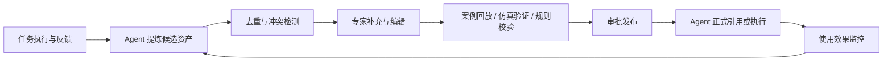
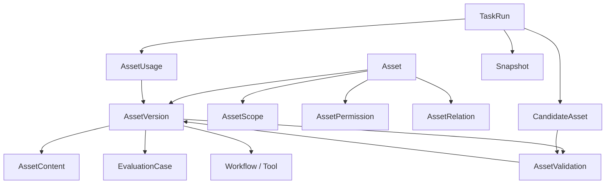

# 工业动态调度智能体资产管理模块

## 1. 项目背景

本项目面向工业场景下的动态调度智能体。产品形态类似 Codex、Hermes、Claude Code，具备交互式工作页面，用户可以围绕插单、设备异常、物料短缺、交期风险、计划调整等生产调度任务与智能体协作。

项目希望建设一个资产管理模块：

- 用户可以维护希望提供给智能体使用的资产。
- 智能体能够在任务执行过程中检索、引用并解释所使用的资产。
- 智能体能够将真实任务中验证过的知识、案例与能力提炼为候选资产。
- 候选资产经验证、审批与发布后，可以在后续调度任务中持续复用。

资产模块不应只是知识库或附件管理器，而应成为工业调度智能体的长期任务记忆、治理入口与能力沉淀闭环。

## 2. 核心判断：什么是工业 Agent 的资产

在工业场景的 LLM Agent 应用中，资产不是“用了哪个模型”，也不只是企业拥有的数据或文档。

真正有价值的资产是：

> 被嵌入真实工业流程、经过执行结果验证、包含安全边界与专家反馈、能够持续复用和扩展的任务能力。

对于动态调度智能体，这类能力具体表现为：

- 知道生产调度中有哪些对象、状态与约束。
- 理解在特定异常或业务目标下应采用什么判断路径。
- 能够调用正确的数据源、工具与工作流生成可执行方案。
- 清楚哪些建议可以参考、哪些规则必须遵守、哪些动作需要审批。
- 能将执行结果、用户纠正和复盘结论持续沉淀回来。

通用模型可以提供语言能力与推理能力，但难以复制企业自身的调度语境、约束规则、系统连接、真实案例、验证数据和现场信任。这些才是长期资产。

## 3. 资产的三层结构

| 层次 | 资产内容 | 作用 |
| --- | --- | --- |
| 基础资产 | 文档、数据、主数据语义、系统接口、设备模型、权限体系 | 让 Agent 能接入并理解现场 |
| 核心资产 | 可执行知识、规则约束、任务流程、工具链、安全规则、案例与评测集 | 让 Agent 能可靠完成调度任务 |
| 飞轮资产 | 真实反馈闭环、专家纠偏记录、执行结果、复制模板、信任与合规记录 | 让 Agent 越用越可靠、越易推广 |

## 4. 资产管理模块定位

资产管理模块应与对话交互、排程任务、计划执行反馈和审批治理紧密连接，承担以下职责：

| 职责 | 含义 |
| --- | --- |
| 资产接入 | 支持用户上传、录入、同步或引用资产 |
| 结构化管理 | 将文档、规则、案例、接口、工作流等形成统一可识别对象 |
| 智能体供给 | 在正确任务、时间、权限和场景下向 Agent 提供资产 |
| 反馈沉淀 | 将 Agent 发现的新规则、新案例、新解释转为候选资产 |
| 治理审计 | 管控版本、审批、权限、有效期、适用范围与引用链路 |
| 价值度量 | 评估资产是否提升排程质量、决策效率与业务结果 |

关键原则：

> 资产进入资产库，不代表可以直接影响正式调度决策。

资产需要经历登记、解析、验证、发布、使用、复盘、迭代或废止的生命周期。

## 5. 动态调度智能体需要管理的资产类型

### 5.1 业务基础与主数据资产

这类资产定义调度世界中的对象及其业务语义。

| 资产示例 | 调度用途 |
| --- | --- |
| 产线、设备、工位、模具、工装 | 形成可排程资源集合 |
| 产品、物料、BOM、工艺路线 | 识别订单路径与资源需求 |
| 班组、人员、技能矩阵、日历 | 判断产能和人员可分配性 |
| 客户、订单类别、交期等级 | 确定服务规则和优先级 |
| 仓库、库位、物流路径 | 识别供料与转运影响 |

ERP、MES 等系统中的源数据不一定由资产模块直接维护，但资产模块应维护智能体使用这些数据所需的语义映射、版本快照、可用范围、数据字典与使用说明。

### 5.2 规则、约束与策略资产

这是动态调度最核心的资产类型。

| 类型 | 示例 |
| --- | --- |
| 硬约束 | 设备不兼容、工序依赖、安全间隔、资质限制、不得跨班生产 |
| 软约束 | 尽量减少换型、优先利用指定产线、减少加班和跨车间流转 |
| 优先级规则 | 加急订单优先、重大客户插单规则、逾期订单升级规则 |
| 决策策略 | 设备故障后局部重排或全局重排、物料短缺时冻结订单策略 |
| 优化目标 | 准交率、换型成本、利用率、在制品、加班成本、能源成本权重 |

规则应支持三层表达：

| 表达层次 | 示例 |
| --- | --- |
| 人类可读描述 | 医疗类客户订单延迟风险超过 8 小时时，优先于普通订单安排 |
| 机器可执行表达 | 条件、优先级、适用订单、冲突处理、约束类型 |
| 生效配置 | 发布版本、作用工厂或产线、有效期、审批人与测试结果 |

关键规则只以文字存在时，可以用于辅助理解，却不应直接代替结构化校验或排程求解。

### 5.3 调度技能与工作流资产

工作流资产定义智能体如何完成具体任务，例如：

- 新订单纳入当日计划。
- 插单影响评估。
- 设备故障后的动态重排。
- 物料短缺影响分析。
- 订单交期风险巡检。
- 排程方案比选、审批和下发。

一个工作流资产可以包含：

| 字段 | 示例 |
| --- | --- |
| 触发条件 | 关键设备停机预计超过 30 分钟 |
| 输入要求 | 当前计划、恢复时间、在制品、订单交期 |
| 调用工具 | MES 查询、约束校验、求解器重排、通知服务 |
| 执行步骤 | 识别影响范围、生成方案、校验约束、提交审批 |
| 输出结果 | 受影响订单、推荐方案、代价变化、待执行动作 |
| 人工介入点 | 跨车间调拨或承诺交期修改需要确认 |
| 成功判断 | 新方案获批下发，且无硬约束违规 |

这类资产类似代码智能体中的 skills、tools 与 workflows，但必须增加生产影响、安全控制、审批与回滚信息。

### 5.4 工具、接口与数据源资产

智能体需要明确自己可以调用什么，以及如何安全调用，包括：

- ERP、MES、APS、WMS、QMS、EAM 等业务系统接口。
- 排程求解器、仿真器、规则校验器。
- 订单查询、库存查询、设备状态查询、计划写回、审批发起等工具。
- 字段语义、编码映射、刷新频率、错误处理和回滚规则。
- 权限范围、读写隔离、审批要求和审计要求。

工具能力建议分级：

| 级别 | 能力 |
| --- | --- |
| 读取类 | 查询订单、设备、物料、排程结果 |
| 分析类 | 模拟插单、计算影响、检查冲突 |
| 建议类 | 输出推荐方案但不执行 |
| 申请类 | 发起审批、生成计划变更单 |
| 执行类 | 下发新计划、调整优先级、更新业务系统 |

早期阶段应优先放开读取与分析能力，谨慎治理写回与执行能力。

### 5.5 案例与经验资产

案例是工业调度智能体的重要差异化资产，例如：

- 临时插单后的排程调整及其影响。
- 瓶颈设备故障后的重排方案。
- 物料延期导致的冻结和替代安排。
- 计划员否决 Agent 建议的原因。
- 多种调度方案的实际效果对比。

高质量案例不应只是聊天记录，而应包含：

| 内容 | 说明 |
| --- | --- |
| 事件背景 | 发生了什么异常或需求变化 |
| 状态快照 | 订单、设备、库存、人员和原始计划 |
| 约束条件 | 当时有效的规则与现实限制 |
| 候选方案 | Agent 与人工考虑过哪些方案 |
| 采用方案 | 最终采取了什么调整 |
| 判断理由 | 为什么选择该方案 |
| 执行结果 | 延期、换型、加班、成本、稳定性等影响 |
| 可复用结论 | 哪些条件下可复用该经验 |
| 证据链 | 来源记录、执行单据、审批人与评价结果 |

### 5.6 指标、目标与评估资产

动态调度不存在脱离业务目标的唯一最优方案。资产模块应管理企业在不同场景下关注的目标与评价口径：

- 准交率、延期小时数。
- 换型次数和换型耗时。
- 设备稼动率、瓶颈设备负荷。
- 在制品和库存占用。
- 加班时间、物流调拨成本、能源成本。
- 插单影响范围。
- 计划稳定性。
- Agent 建议采纳率、人工调整次数和接管率。

这些指标既可作为排程目标，也可用于评估某条策略或某个案例是否真正有效。

### 5.7 术语、口径与上下文资产

这类资产为智能体提供一致的语义基础，例如：

- “锁单”“冻结区”“急单”“尾单”“清线”等企业内部定义。
- 开机时间是否包含预热、换模或清洁时间。
- 不同业务系统的订单、设备、工序编码映射。
- 班次、工作日、节假日和交期承诺的计算口径。
- 计划员、车间主任、生产经理等角色的关注重点。

### 5.8 智能体运行与评测资产

此类资产用于研发、上线放行和持续改进智能体本身，包括：

- 高质量任务轨迹与成功调度任务。
- 人工纠正记录和被拒绝建议及原因。
- 高风险错误案例与回归测试案例。
- Prompt、技能、策略或模型配置的效果对比。

业务案例服务于决策复用；运行评测资产服务于 Agent 的验证和优化，两者应有关联，但不能混为一类。

## 6. 统一资产对象模型

产品界面可以向用户提供统一的“资产”概念，底层按不同资产类型提供专属字段与能力。

每项资产应至少包含以下通用信息：

| 信息组 | 核心字段 |
| --- | --- |
| 基础信息 | 名称、资产类型、摘要、标签、创建人、所属组织 |
| 适用范围 | 工厂、车间、产线、产品族、工艺、客户类别、业务场景 |
| 来源信息 | 用户上传、系统同步、专家录入、Agent 提炼、案例复盘 |
| 内容载体 | 文档、表格、结构化规则、接口定义、工作流、案例、数据集 |
| 治理状态 | 草稿、候选、验证中、待审批、已发布、停用、废止 |
| 版本管理 | 当前版本、变更说明、差异比较、历史版本、回滚 |
| 权限控制 | 可见、可编辑、可审批、Agent 可读取或执行的范围 |
| 时效信息 | 生效时间、失效时间、复核周期、数据刷新时间 |
| 质量信息 | 完整性、验证方式、可信等级、冲突状态、使用评价 |
| 关联关系 | 依赖资产、引用资产、工具、任务、案例、评测用例 |
| 审计信息 | 修改、发布、Agent 引用及影响计划决策的记录 |

### 6.1 规则资产示例

```yaml
名称: 瓶颈设备故障下的订单重排优先级
类型: 调度策略 / 软约束
适用范围: A 工厂 / 装配一车间 / L2 产品族
触发条件: 设备组 B 预计停机 > 120 分钟
规则内容:
  - 首先冻结已进入生产的在制订单
  - 未投产订单按承诺交期与客户等级重新计算优先级
  - 关键客户订单延期超过 4 小时则触发替代产线评估
冲突处理: 与禁止跨线生产的硬约束冲突时，硬约束优先
可信等级: 已验证
验证案例:
  - CASE-2026-0045
  - CASE-2026-0061
状态: 已发布
```

### 6.2 案例资产示例

```yaml
名称: 主瓶颈设备临时故障导致的当日计划重排
事件类型: 设备异常
状态快照: 关联计划快照、订单状态、设备状态、物料状态
推荐方案: Agent 输出的三个候选调度方案
采用方案: 方案 B，由计划员确认
最终结果: 延期订单 2 个，关键订单无延期，换型增加 1 次
经验提炼: 预计修复时间低于 3 小时时，不建议全局重排
沉淀候选: 生成策略规则候选 R-019
验证状态: 经两名计划专家确认
```

## 7. 资产与智能体的协同方式

### 7.1 用户向当前任务提供资产

在交互页面中，用户应能够：

- 在对话中选择并挂载资产。
- 为某次调度任务指定可使用的规则集、案例集或数据源。
- 上传文件作为当前任务上下文，并选择是否纳入资产库。
- 指定某项资产优先适用于当前工厂、产线或订单。
- 查看当前任务中 Agent 实际引用过哪些资产。

示例：

```text
用户：请评估这个急单今天插入后的影响。

挂载资产：
- 当日锁定计划 V32
- 急单优先级规则 V5
- L2 产线换型约束 V3
- 关键客户承诺策略 V2

Agent 输出：
- 已读取 4 项资产
- 急单违反冻结区策略，但满足关键客户升级条件
- 已生成两个可行方案，并列出规则依据与业务影响
```

### 7.2 Agent 自动检索与使用资产

Agent 应根据任务自动识别所需资产：

| 任务 | 应优先加载的资产 |
| --- | --- |
| 插单评估 | 当前计划、优先级规则、产线能力、换型约束、相似案例 |
| 设备故障重排 | 状态快照、替代设备能力、故障策略、冻结区规则、历史案例 |
| 交期风险分析 | 订单承诺规则、当前计划、物料齐套状态、指标口径 |
| 方案解释 | 求解目标配置、约束命中记录、资产引用证据 |

关键要求：

- 输出关键结论时展示引用来源与版本。
- 已发布规则优先于普通文档中的自然语言描述。
- 硬约束不可被历史案例或模型判断覆盖。
- 过期、冲突或未审批资产需要明显提示。
- 重要调度决策应保存当时使用的资产版本和现场状态快照。

### 7.3 Agent 提炼候选资产

Agent 不应将对话结论直接写入正式生产规则，而应生成候选资产。

适合生成候选资产的情形包括：

- 某种处理方式在多次相似异常中被采用。
- 计划员补充了此前未登记的规则。
- Agent 建议被人工修改，修改理由具有复用价值。
- 已有策略反复导致不理想结果，需要修订。
- 一次成功调度事件具备完整状态和执行结果，适合作为案例。
- 新术语、字段映射或系统口径获得确认。

候选资产应自动携带：

- 来源任务与原始对话。
- 触发事件、状态快照和最终结果。
- Agent 提炼出的规则、案例或经验。
- 支持证据、引用记录和建议适用范围。
- 与现有资产可能重复或冲突的提示。
- 推荐验证方式与审批责任人。

示例：

```text
Agent 发现：
最近 4 次“瓶颈设备预计停机低于 180 分钟”的事件中，
计划员均选择仅调整未开工订单，而未执行整线重排。

建议沉淀资产：
- 类型：调度策略候选
- 名称：短时瓶颈停机的局部重排策略
- 适用范围：A 工厂 / 装配车间
- 证据：事件 E123、E165、E203、E224
- 待确认：该策略是否适用于夜班和加急订单
```

### 7.4 人机共同验证与发布



不同类型资产需要不同验证方式：

| 资产类型 | 推荐验证方式 |
| --- | --- |
| 术语与口径 | 业务责任人确认 |
| 文档与知识 | 来源检查、专家确认 |
| 案例经验 | 结果完整性检查、计划员复核 |
| 软约束或策略 | 历史案例回放、方案对比 |
| 硬约束 | 专家审批、冲突校验、系统验证 |
| 工具接口 | 沙箱调用测试、权限审批、安全测试 |
| 执行动作 | 仿真验证、审批流、操作审计、逐步放量 |

## 8. 生命周期与 Agent 可用等级

资产应同时具备治理状态和智能体可用等级，避免“上传即生效”。

### 8.1 治理状态

| 状态 | 含义 |
| --- | --- |
| 草稿 | 尚未提交，可编辑 |
| 候选 | 用户或 Agent 新增，等待核验 |
| 验证中 | 正在专家评审、历史回放或仿真 |
| 待审批 | 验证通过，等待发布授权 |
| 已发布 | 成为正式有效资产 |
| 待复核 | 临近过期、低评价或出现冲突 |
| 已停用 | 暂时禁止使用，但保留历史引用 |
| 已废止 | 不再生效，仅供审计追溯 |

### 8.2 Agent 可用等级

| 等级 | Agent 行为 |
| --- | --- |
| 不可见 | 不可检索或使用 |
| 可参考 | 可作为上下文，但必须标记未验证 |
| 可引用 | 可作为解释和建议依据 |
| 可校验 | 可用于判断方案是否满足规则 |
| 可执行 | 可驱动流程、工具调用或正式计划变更 |

例如：

- 专家新上传的经验说明：`候选 + 可参考`。
- 发布后的硬约束：`已发布 + 可校验`。
- 经权限审批的计划写回工作流：`已发布 + 可执行`。

## 9. 页面与产品功能建议

资产模块不应只作为管理后台存在，还应嵌入对话工作区、任务执行记录和验证审批流程。

### 9.1 资产中心

| 页面或区域 | 核心功能 |
| --- | --- |
| 资产列表 | 按类型、工厂、产线、状态、可信等级、标签、来源筛选 |
| 资产详情 | 内容、范围、版本、关联资产、使用记录与效果 |
| 新建资产 | 文档上传、规则录入、案例导入、接口登记、工作流创建 |
| 版本比较 | 修改差异、发布说明、历史版本、回滚 |
| 关系视图 | 规则影响的任务、案例、工具和排程方案 |
| 冲突中心 | 重复规则、冲突约束、过期数据、异常引用 |
| 使用分析 | 引用频率、建议采纳、业务指标影响、问题反馈 |
| 权限配置 | 组织、岗位、工厂、资产类型维度的权限治理 |

除文件夹组织方式外，资产中心还应支持按以下方式组织：

- 插单评估、故障重排、物料短缺、交期风险等业务场景。
- 工厂、车间、产线、产品族等适用范围。
- Agent 最近建议沉淀、待我审批、效果存疑等工作队列。

### 9.2 对话工作区资产侧栏

这是用户最频繁接触资产的位置，应支持：

- 查看与挂载当前会话资产。
- 查看 Agent 自动检索的资产及检索原因。
- 查看资产版本、状态、范围和风险提示。
- 展开某项引用规则的原文、结构化条件及验证证据。
- 对结论执行“沉淀为案例”或“生成规则候选”。
- 在用户纠正 Agent 后引导沉淀纠正原因。
- 在调度方案中展示规则命中、冲突、豁免与审批要求。

示例呈现：

```text
方案 A：推荐

依据：
- 急单优先级规则 V5，第 3 条
- 冻结区策略 V2，第 2 条；本方案需要例外审批
- 相似案例 CASE-021、CASE-034

约束检查：
- 硬约束：全部通过
- 软约束：增加换型 1 次
- 风险：订单 O-882 预计延期 2.5 小时
```

### 9.3 候选资产与审批中心

用于处理 Agent 或用户提出、尚未生效的资产：

- 待确认候选列表。
- 来源任务回放、原始对话、状态快照和最终结果对照。
- Agent 提炼内容的人工编辑。
- 重复资产提示、资产合并和规则冲突提示。
- 验证方法选择、责任人分派与审批。
- 发布范围与生效时间设置。
- 发布后自动生成或关联回归测试案例。

### 9.4 任务与运行记录页面

每一次重要调度任务都应可审计追溯，记录：

- 用户目标与输入。
- 决策时的数据和计划快照。
- Agent 加载的资产及精确版本。
- 工具调用的输入输出。
- 生成的方案及约束检查结果。
- 用户的选择、修改或拒绝。
- 是否写回业务系统以及最终执行结果。
- 是否生成新资产或触发已有资产修订。

该页面应支持回答核心问题：为什么当时采用这个排程方案？

## 10. 检索、注入与执行机制

资产模块不应把所有内容都拼接到模型上下文中。不同资产需要不同的供给机制。

| 资产类型 | 提供给 Agent 的方式 |
| --- | --- |
| 文档、SOP、说明 | 分段索引和语义检索，并返回引用位置 |
| 术语、数据字典 | 按场景加载固定上下文或通过查询工具读取 |
| 主数据、实时状态 | 通过 API 或工具查询，不依赖静态向量库 |
| 规则与约束 | 结构化规则服务与可读解释并行提供 |
| 调度目标配置 | 参数化配置，由任务启动时加载 |
| 工具与工作流 | 工具注册、权限校验和流程编排 |
| 案例经验 | 基于事件特征检索相似条件、决策与结果 |
| 评测数据 | 用于离线回归与放行校验，不进入生产推理 |

可以形成四种服务通道：

1. 知识检索通道：文档、案例、术语。
2. 结构化配置通道：规则、约束、优化目标、权限。
3. 实时查询通道：订单、设备、物料和执行状态。
4. 工具执行通道：求解、仿真、审批和计划写回。

需要特别避免两类错误：

- 将实时生产状态当成静态 RAG 内容使用，导致基于过期状态决策。
- 将硬约束只作为文本提示词提供给模型，而不执行结构化校验。

## 11. 权限、安全与审计

资产可能影响真实生产计划，因此资产模块权限设计需要严于普通知识库。

### 11.1 权限控制对象

- 谁可以查看某工厂或车间的资产。
- 谁可以上传、编辑或提交候选资产。
- 谁可以验证、发布、停用或废止规则。
- Agent 能否读取、引用、校验或执行某项资产。
- Agent 能否触发审批、调用工具或写回正式系统。

### 11.2 风险分级

| 风险等级 | 资产示例 | 管控策略 |
| --- | --- | --- |
| 低 | 术语、说明文档、普通案例 | 基础审核后可参考 |
| 中 | 优先级策略、软约束、指标权重 | 专家确认与历史回放后可引用 |
| 高 | 硬约束、跨线策略、客户承诺规则 | 多方审批、版本控制、强制校验 |
| 极高 | 自动下发计划、修改系统数据的工具或工作流 | 权限隔离、仿真验证、人工审批、完整审计 |

### 11.3 审计记录要求

每次 Agent 输出关键调度方案时，应至少记录：

- 任务输入与数据快照标识。
- 使用的资产及精确版本。
- 约束和策略命中情况。
- 工具调用的输入输出。
- Agent 生成结果。
- 人工批准、修改或拒绝记录。
- 执行动作与后验结果。

## 12. 智能体沉淀资产的闭环机制

产品上应严格区分三个行为：

| 行为 | 说明 | 是否可自动 |
| --- | --- | --- |
| Agent 发现值得沉淀的内容 | 从对话、执行反馈或重复模式中发现候选 | 可以自动 |
| Agent 生成候选资产 | 提取结构、补充字段、推荐范围与证据 | 可以自动 |
| 资产正式影响调度 | 完成验证审批后发布并生效 | 默认不自动 |

### 12.1 候选资产来源

1. 对话型沉淀：用户在交流中补充规则或业务口径。
2. 执行型沉淀：实际采用的方案及效果形成案例。
3. 纠错型沉淀：人工持续修正 Agent 的判断，形成策略修订建议。
4. 分析型沉淀：历史任务数据表明某项策略在特定范围内效果不佳。

### 12.2 “验证后”的定义

| 候选资产 | 验证完成标准 |
| --- | --- |
| 术语或口径 | 责任业务人员确认 |
| 案例 | 任务状态、方案和结果记录完整，专家确认可复用 |
| 经验策略 | 多个历史案例支持，回放结果可接受，专家批准 |
| 约束规则 | 可执行表达完成，冲突检测通过，审批通过 |
| 工具或流程 | 测试环境验证，权限、降级、审计和审批配置完成 |

系统应展示证据充分度和验证过程，而不是笼统地显示“AI 已验证”。

## 13. 核心数据实体建议

| 实体 | 作用 |
| --- | --- |
| `Asset` | 资产主对象，记录类型、范围、状态与责任人 |
| `AssetVersion` | 每次资产内容与配置的不可变版本 |
| `AssetContent` | 文档、规则表达、案例结构或工具描述 |
| `AssetScope` | 工厂、车间、产线、产品、事件场景的适用范围 |
| `AssetRelation` | 依赖、引用、冲突、衍生、替代或验证关系 |
| `AssetPermission` | 用户与 Agent 的访问、编辑、校验和执行权限 |
| `AssetValidation` | 校验、回放、专家评审和审批记录 |
| `AssetUsage` | Agent 在任务中的引用、调用和采纳情况 |
| `TaskRun` | 一次动态调度任务的运行记录 |
| `Snapshot` | 决策时的计划、现场状态和输入快照 |
| `CandidateAsset` | 尚未正式发布的候选资产 |
| `EvaluationCase` | 对资产或 Agent 能力进行验证的测试案例 |
| `ToolDefinition` | Agent 可调用的数据源和执行能力定义 |
| `WorkflowDefinition` | 任务流程、审批点与降级机制定义 |

实体关系示意：



核心设计约束：

> 每一次任务运行必须引用不可变的资产版本，而不是只关联资产当前最新内容。

否则资产内容更新后，无法追溯历史调度决策当时为何成立。

## 14. MVP 建议

第一阶段不建议将所有资产类型一次性建设成复杂配置平台。可以围绕三个高价值调度任务建立闭环：

- 插单影响评估。
- 设备异常后的动态重排。
- 订单交期风险分析。

### 14.1 MVP 资产与能力范围

| 优先级 | 资产类型或能力 | MVP 支持范围 |
| --- | --- | --- |
| P0 | 文档或说明资产 | 上传、解析、检索、对话引用、版本管理 |
| P0 | 规则或约束资产 | 自然语言描述、结构化字段、审批状态、引用证据 |
| P0 | 案例资产 | 从任务沉淀案例、关联结果、相似案例检索 |
| P0 | 数据源或工具资产 | 登记现有查询或求解工具、显示权限与用途 |
| P0 | 任务引用与审计 | 记录任务使用的资产版本和关键依据 |
| P1 | 目标指标资产 | 配置调度目标权重与结果评估指标 |
| P1 | Agent 候选资产流程 | Agent 提取、人工确认、验证与发布 |
| P1 | 冲突检测 | 识别规则重复、适用范围重叠和基本冲突 |
| P2 | 工作流编排资产 | 将复杂处理流程配置为可调用能力 |
| P2 | 自动效果分析 | 基于执行反馈建议策略修订或废止 |

### 14.2 MVP 页面范围

1. 资产库：列表、筛选、搜索、新建和详情。
2. 规则与案例详情：结构内容、版本、范围、验证与发布。
3. 对话资产面板：挂载资产、自动引用展示和候选沉淀入口。
4. 候选资产中心：Agent 提炼、编辑、验证和发布。
5. 任务追溯页：输入、状态快照、引用资产版本、方案和人工反馈。

### 14.3 MVP 核心闭环


一期的关键成果指标不应只是资产数量，而应关注：

> 用户能否在一次真实调度任务中，看见 Agent 使用了哪些经过治理的资产，并将有价值的处理结果便捷沉淀回来。

## 15. 应避免的产品误区

### 15.1 将资产管理做成文件网盘

只有文件夹、标签、上传和搜索，无法支撑调度决策。资产必须带有范围、版本、治理状态、验证证据、任务引用与结果反馈。

### 15.2 允许 Agent 自动发布生产规则

Agent 可以发现和提炼候选资产，但影响真实调度的规则默认必须经过验证与审批。

### 15.3 将实时状态沉淀为静态知识

订单进度、设备状态、库存和当前计划必须通过实时接口或任务快照使用，不能依赖旧检索内容作出当前决策。

### 15.4 规则只保留自然语言表达

自然语言便于录入与沟通，但关键约束和策略必须逐步转换成可校验、可执行、可追溯的表达。

### 15.5 只关注引用次数而不关注业务效果

资产被大量引用不等于有效。需要结合方案采纳、执行结果、指标变化、人工纠错和风险事件评价资产价值。

### 15.6 忽略适用范围与版本

同一经验可能仅适用于特定工厂、产品或班组。每项资产都必须明确适用范围，历史任务必须保留使用版本。

## 16. 产品定义

完整定位：

> 面向工业动态调度智能体的资产治理与能力沉淀平台。它统一管理智能体在调度任务中可使用的知识、规则、案例、数据工具和工作流，通过版本、范围、权限、验证与审计机制，确保资产可控地参与决策；同时将真实任务中的专家反馈和执行结果沉淀为可复用、可评估、可持续演进的调度能力。

内部简述：

> 资产模块不是 Agent 的资料库，而是工业调度能力的长期记忆、治理入口和进化闭环。

## 17. 后续可继续拆解的议题

后续工作可以沿以下方向推进：

1. 信息架构与页面交互原型：菜单结构、页面布局、卡片字段、用户操作路径、对话侧栏与审批体验。
2. 数据模型与调用架构：数据库模型、资产版本、检索服务、规则服务、工具注册、TaskRun 审计和候选沉淀流程。
3. 三类首发场景设计：插单、设备故障、交期风险的端到端任务流程、输入资产和输出方案。
4. 规则表达与求解器集成：硬约束、软约束、策略与优化目标如何从自然语言进入可执行配置。
5. 资产验证与评价体系：历史回放、仿真验证、专家审批、上线指标和资产价值评估方法。
6. 权限与安全治理：组织范围、操作级权限、执行审批、风险分级和审计要求。
7. 资产归属与商业模式：企业、Agent 产品公司与实施方分别拥有、使用和共同沉淀哪些资产。

