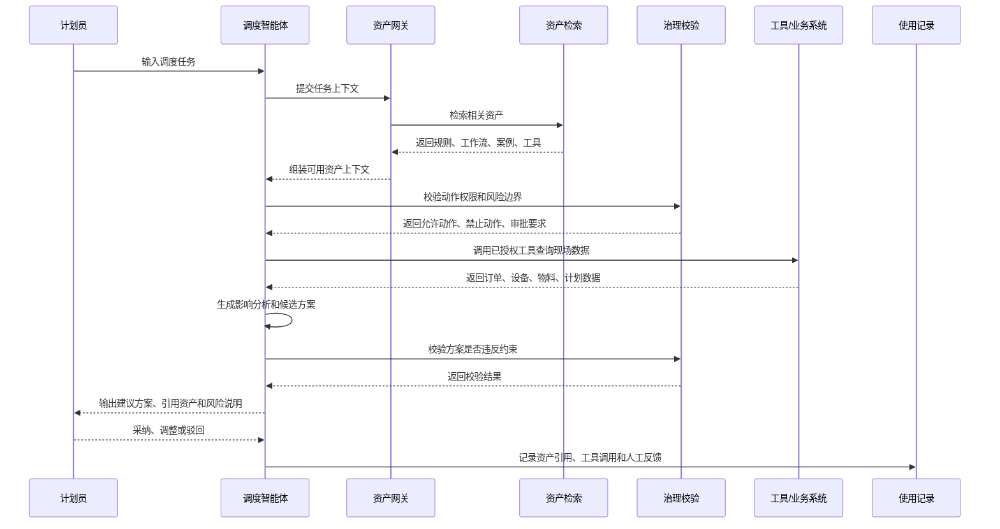
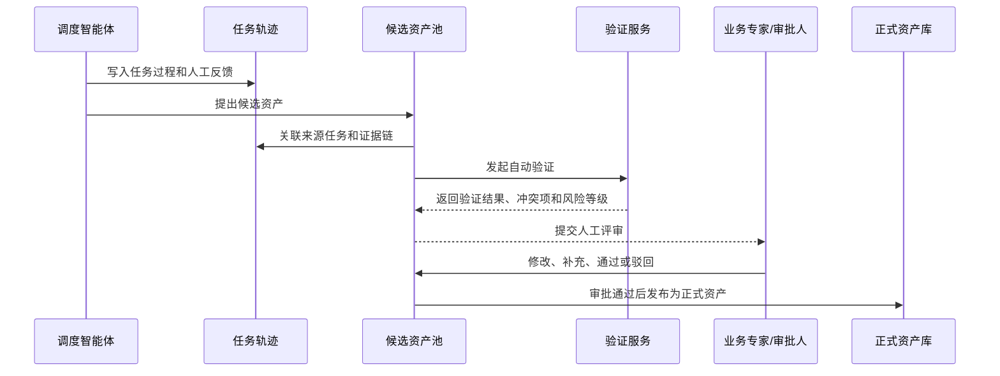

# 智能体资产管理系统设计文档

## 文档说明

本文档承接 `PRD.md` 中的产品需求，沉淀智能体资产管理模块的交互设计、页面结构、页面草图、数据模型、表结构和接口数据结构。

产品定位、用户角色、功能范围、MVP 和验收标准以 `PRD.md` 为准；产品架构、功能架构、技术架构以 `architecture.md` 为准。

## 1. 交互逻辑

### 1.1 智能体使用资产



### 1.2 智能体沉淀候选资产



### 1.3 人工创建资产

```text
新建资产
  -> 选择资产类型
  -> 填写业务描述
  -> AI 辅助结构化
  -> 人工确认字段
  -> 配置适用范围和治理边界
  -> 上传证据或测试样例
  -> 提交验证
  -> 验证通过后提交审批
  -> 审批通过后发布
```

### 1.4 资产版本更新

```text
已发布资产
  -> 创建新版本草稿
  -> 修改内容
  -> 对比旧版本差异
  -> 重新验证受影响场景
  -> 审批通过
  -> 新版本生效
  -> 旧版本归档，可按权限回滚
```

### 1.5 审批退回后重新提交

```text
待审批资产版本
  -> 审批人驳回并填写原因
  -> 系统写入 asset_operation_log
  -> 资产版本回到草稿或待补充状态
  -> 负责人修改内容、范围、权限或证据
  -> 重新提交验证
  -> 验证通过后重新提交审批
```

### 1.6 候选资产合并到已有资产

```text
候选资产
  -> 系统识别疑似重复资产
  -> 用户选择合并到已有资产
  -> 基于已有资产创建新版本草稿
  -> 候选证据转入资产证据链
  -> 写入 asset_relation(similar_to / supersedes)
  -> 提交验证和审批
  -> 审批通过后候选状态变为 converted
```

### 1.7 资产停用后的 Agent 缓存失效

```text
资产停用或废止
  -> 写入资产操作日志
  -> 更新资产状态
  -> 通知 Asset Gateway 刷新可用资产索引
  -> 通知 Skill Projection Service 移除或更新运行时投影
  -> Agent 后续任务不再检索或使用该资产
```

## 2. 页面信息架构

```text
智能体资产管理
├─ 资产工作台
├─ 资产台账
│  ├─ 资产列表
│  ├─ 资产详情
│  └─ 新建/编辑资产
├─ 候选资产池
│  ├─ 候选列表
│  └─ 候选详情/转正
├─ 验证与审批
│  ├─ 待验证
│  ├─ 待审批
│  └─ 审批记录
├─ Agent 使用记录
│  ├─ 任务引用记录
│  ├─ 工具调用记录
│  └─ 治理校验记录
├─ 价值分析
└─ 治理配置
   ├─ 权限配置
   ├─ 风险等级
   ├─ 审批流程
   └─ 生效范围字典
```

## 3. 页面草图

以下为低保真页面草图，用于表达信息布局。高保真原型已沉淀在 `prototype/` 目录中。

### 3.1 资产工作台

```text
┌──────────────────────────────────────────────────────────────────────┐
│ 智能体资产工作台                         [搜索资产] [新建资产]       │
├──────────────┬───────────────────────────────────────────────────────┤
│ 侧边导航     │ 指标卡片                                               │
│              │ ┌────────┐ ┌────────┐ ┌────────┐ ┌────────┐          │
│ 工作台       │ │资产总量│ │已发布  │ │待审批  │ │候选资产│          │
│ 资产台账     │ └────────┘ └────────┘ └────────┘ └────────┘          │
│ 候选资产     │                                                       │
│ 审批验证     │ ┌──────────────────────────┐ ┌────────────────────┐ │
│ 使用记录     │ │ 资产列表/高频资产          │ │ 候选资产队列        │ │
│ 价值分析     │ │ 类型 状态 版本 引用 负责人 │ │ 来源 风险 证据 操作 │ │
│ 治理配置     │ └──────────────────────────┘ └────────────────────┘ │
│              │                                                       │
│              │ ┌──────────────────────────────────────────────────┐ │
│              │ │ 风险提醒：即将过期、长期未维护、冲突待处理资产     │ │
│              │ └──────────────────────────────────────────────────┘ │
└──────────────┴───────────────────────────────────────────────────────┘
```

### 3.2 资产详情页

```text
┌──────────────────────────────────────────────────────────────────────┐
│ 资产详情：设备故障后局部重排工作流       [编辑] [新建版本] [停用]     │
├──────────────────────────────────────────────────────────────────────┤
│ 状态：已发布  版本：v1.3  风险：中  适用：苏州一厂/总装一线          │
├──────────────────────────────┬───────────────────────────────────────┤
│ 基础信息                     │ 治理信息                              │
│ - 类型：工作流资产            │ - 审批人                              │
│ - 负责人                      │ - 生效时间/有效期                     │
│ - 标签                        │ - Agent 可用权限                      │
├──────────────────────────────┴───────────────────────────────────────┤
│ 内容结构                                                             │
│ 触发条件 | 输入要求 | 执行步骤 | 调用工具 | 人工介入点 | 成功判断     │
├──────────────────────────────────────────────────────────────────────┤
│ Agent 使用记录                                                       │
│ 任务编号  引用原因  输出方案  采纳结果  人工反馈  执行效果           │
├──────────────────────────────────────────────────────────────────────┤
│ 证据链与版本                                                         │
│ 来源任务 | 验证样例 | 审批记录 | 历史版本 | 差异对比                 │
└──────────────────────────────────────────────────────────────────────┘
```

### 3.3 新建资产向导

```text
┌──────────────────────────────────────────────────────────────────────┐
│ 新建资产                                                             │
├──────────────────────────────────────────────────────────────────────┤
│ 步骤：① 类型选择 -> ② 业务描述 -> ③ AI结构化 -> ④ 治理配置 -> ⑤ 校验提交 │
├──────────────────────────────────────────────────────────────────────┤
│ 左侧：表单输入                                                       │
│ ┌──────────────────────────────────────────────────────────────────┐ │
│ │ 资产类型：规则约束 / 工作流 / 工具接口 / 案例经验 / 指标评估       │ │
│ │ 名称：                                                            │ │
│ │ 业务描述：                                                        │ │
│ │ 适用范围：工厂、车间、产线、产品族、业务场景                       │ │
│ │ 风险等级：低 / 中 / 高                                             │ │
│ └──────────────────────────────────────────────────────────────────┘ │
│                                                                      │
│ 右侧：AI 辅助结构化结果                                               │
│ ┌──────────────────────────────────────────────────────────────────┐ │
│ │ 条件、约束、步骤、工具、审批点、测试样例                           │ │
│ │ [采纳建议] [修改字段] [重新生成]                                   │ │
│ └──────────────────────────────────────────────────────────────────┘ │
│                                             [保存草稿] [提交验证]     │
└──────────────────────────────────────────────────────────────────────┘
```

### 3.4 候选资产池

```text
┌──────────────────────────────────────────────────────────────────────┐
│ 候选资产池                              [按类型筛选] [按风险筛选]     │
├──────────────────────────────────────────────────────────────────────┤
│ 候选列表                                                             │
│ ┌──────────────────────────────────────────────────────────────────┐ │
│ │ 标题 | 类型 | 来源任务 | 证据数 | 风险 | 推荐理由 | 状态 | 操作     │ │
│ │ 插单冻结低优先级尾单 | 规则 | 4 | 中 | 多次采纳 | 待验证 | 查看     │ │
│ └──────────────────────────────────────────────────────────────────┘ │
├──────────────────────────────────────────────────────────────────────┤
│ 候选详情                                                             │
│ ┌──────────────────────────────┬───────────────────────────────────┐ │
│ │ 智能体提炼内容                │ 来源证据链                         │ │
│ │ - 建议规则                    │ - 任务轨迹                         │ │
│ │ - 适用范围                    │ - 人工反馈                         │ │
│ │ - 风险提示                    │ - 执行结果                         │ │
│ └──────────────────────────────┴───────────────────────────────────┘ │
│                         [补充证据] [转为草稿] [驳回] [提交验证]       │
└──────────────────────────────────────────────────────────────────────┘
```

### 3.5 Agent 使用记录

```text
┌──────────────────────────────────────────────────────────────────────┐
│ Agent 使用记录                                                       │
├──────────────────────────────────────────────────────────────────────┤
│ 筛选：任务类型 / 智能体 / 资产类型 / 时间 / 采纳结果 / 风险等级        │
├──────────────────────────────────────────────────────────────────────┤
│ 任务列表                                                             │
│ ┌──────────────────────────────────────────────────────────────────┐ │
│ │ 任务编号 | 任务类型 | 引用资产 | 工具调用 | 治理结果 | 采纳结果     │ │
│ └──────────────────────────────────────────────────────────────────┘ │
├──────────────────────────────────────────────────────────────────────┤
│ 任务详情                                                             │
│ ┌──────────────────────────────┬───────────────────────────────────┐ │
│ │ 时间线                        │ 引用资产说明                       │ │
│ │ 1. 检索资产                    │ - 为什么引用                       │ │
│ │ 2. 读取规则                    │ - 影响了哪个判断                   │ │
│ │ 3. 调用工具                    │ - 是否触发审批                     │ │
│ │ 4. 校验方案                    │ - 人工反馈                         │ │
│ │ 5. 输出建议                    │                                   │ │
│ └──────────────────────────────┴───────────────────────────────────┘ │
└──────────────────────────────────────────────────────────────────────┘
```

### 3.6 价值分析

```text
┌──────────────────────────────────────────────────────────────────────┐
│ 资产价值分析                            [时间范围] [场景] [导出]      │
├──────────────────────────────────────────────────────────────────────┤
│ 核心指标                                                             │
│ ┌────────┐ ┌────────┐ ┌────────┐ ┌────────┐                         │
│ │引用次数│ │采纳率  │ │候选转正│ │拦截违规│                         │
│ └────────┘ └────────┘ └────────┘ └────────┘                         │
├──────────────────────────────┬───────────────────────────────────────┤
│ 引用趋势折线图                │ 资产类型贡献排行                     │
├──────────────────────────────┼───────────────────────────────────────┤
│ 场景贡献：插单/故障/物料短缺   │ 低价值资产：长期未用/频繁被纠正       │
└──────────────────────────────┴───────────────────────────────────────┘
```

## 4. 数据模型与表结构设计

### 4.1 设计原则

首期数据模型建议采用“统一资产主表 + 类型扩展表 + JSONB 配置”的方式。

这样既能保证资产列表、详情、审批、权限、引用记录等通用能力统一，又能允许规则、工作流、工具、案例、指标等资产拥有不同字段。

核心原则：

- `asset` 表只保存资产通用元数据。
- `asset_version` 表保存每个版本的内容快照。
- 不同资产类型的结构化字段优先放在类型扩展表中，变化较快的配置放在 `content_schema` 或 `content_json` 中。
- Agent 任务引用、工具调用、治理校验、人工反馈必须独立成表，避免只存在日志里。
- 候选资产与正式资产隔离，只有审批通过后才生成正式资产和正式版本。
- 所有关键动作都需要保留操作者、时间、前后状态和原因。
- 资产适用范围和权限默认按资产级配置管理；当新版本调整范围或权限时，需要记录版本快照，支持历史任务回放和审计。
- 审批对象采用多态引用，不做数据库外键约束；由业务服务校验对象存在性、对象状态和审批类型匹配关系。

### 4.2 核心实体关系

```mermaid
erDiagram
    asset ||--o{ asset_version : has
    asset ||--o{ asset_scope : applies_to
    asset ||--o{ asset_permission : controls
    asset ||--o{ asset_evidence : proven_by
    asset ||--o{ asset_relation : relates
    asset ||--o{ asset_operation_log : logs
    asset ||--o{ asset_retrieval_record : retrieved_by
    asset ||--o{ asset_usage_record : referenced_by
    asset ||--o{ validation_run : validated_by
    asset_version ||--o| rule_asset_detail : extends
    asset_version ||--o| workflow_asset_detail : extends
    asset_version ||--o| tool_asset_detail : extends
    asset_version ||--o| case_asset_detail : extends
    asset_version ||--o| metric_asset_detail : extends
    asset_candidate ||--o{ candidate_evidence : has
    asset_candidate ||--o{ validation_run : validated_by
    agent_task_trace ||--o{ asset_usage_record : records
    agent_task_trace ||--o{ asset_retrieval_record : retrieves
    agent_task_trace ||--o{ tool_call_record : invokes
    agent_task_trace ||--o{ policy_check_record : checks
    validation_run ||--o{ asset_validation_result : contains
    approval_instance ||--o{ approval_step : contains
```



### 4.3 枚举字典

| 枚举 | 值 | 说明 |
| --- | --- | --- |
| asset_type | `rule`、`workflow`、`tool`、`case`、`metric`、`term`、`dataset`、`skill` | 资产类型 |
| asset_status | `draft`、`pending_validation`、`validating`、`pending_approval`、`published`、`disabled`、`deprecated`、`rejected` | 正式资产状态；候选状态只存在于 `asset_candidate` |
| risk_level | `low`、`medium`、`high`、`critical` | 风险等级 |
| source_type | `manual`、`upload`、`system_sync`、`agent_trace`、`review_meeting`、`api_import` | 资产来源 |
| permission_action | `view`、`edit`、`approve`、`agent_read`、`agent_suggest`、`agent_apply`、`agent_execute` | 权限动作 |
| usage_role | `context`、`tool`、`policy`、`case_reference`、`metric_eval`、`skill_runtime` | Agent 使用资产的方式 |
| validation_status | `not_started`、`running`、`passed`、`failed`、`warning`、`cancelled` | 验证状态 |
| approval_status | `pending`、`approved`、`rejected`、`withdrawn`、`cancelled` | 审批状态 |
| task_result | `accepted`、`adjusted`、`rejected`、`pending`、`unknown` | 任务建议结果 |
| tool_level | `read`、`analyze`、`suggest`、`apply`、`execute` | 工具能力等级 |
| relation_type | `depends_on`、`uses_tool`、`references_case`、`evaluated_by`、`supersedes`、`conflicts_with`、`similar_to` | 资产关系类型 |
| operation_type | `create`、`update`、`submit_validation`、`submit_approval`、`publish`、`disable`、`deprecate`、`rollback`、`reject`、`convert_candidate` | 资产操作类型 |
| retrieval_status | `retrieved`、`selected`、`discarded` | 资产检索结果状态 |

### 4.4 资产主表

#### asset：资产主表

保存资产的通用信息，不直接保存具体业务内容。

| 字段 | 类型 | 必填 | 说明 |
| --- | --- | --- | --- |
| id | uuid | 是 | 资产唯一标识 |
| asset_code | varchar(64) | 是 | 资产编号，例如 `AST-RULE-202606-0001` |
| name | varchar(200) | 是 | 资产名称 |
| asset_type | varchar(32) | 是 | 资产类型 |
| summary | text | 否 | 资产摘要 |
| status | varchar(32) | 是 | 当前状态 |
| risk_level | varchar(16) | 是 | 风险等级 |
| owner_user_id | uuid | 是 | 负责人 |
| owner_org_id | uuid | 否 | 所属组织 |
| source_type | varchar(32) | 是 | 来源类型 |
| source_ref_id | varchar(128) | 否 | 来源对象 ID，例如任务编号、导入批次 |
| current_version_id | uuid | 否 | 当前生效版本 |
| latest_version_no | int | 是 | 最新版本号 |
| effective_from | timestamptz | 否 | 生效开始时间 |
| effective_to | timestamptz | 否 | 生效结束时间 |
| review_cycle_days | int | 否 | 复审周期 |
| last_reviewed_at | timestamptz | 否 | 最近复审时间 |
| last_used_at | timestamptz | 否 | 最近被 Agent 引用时间 |
| usage_count | int | 是 | 累计引用次数，冗余统计字段 |
| tags | jsonb | 否 | 标签数组 |
| created_by | uuid | 是 | 创建人 |
| created_at | timestamptz | 是 | 创建时间 |
| updated_by | uuid | 否 | 更新人 |
| updated_at | timestamptz | 是 | 更新时间 |
| deleted_at | timestamptz | 否 | 软删除时间 |

建议索引：

| 索引 | 字段 | 用途 |
| --- | --- | --- |
| idx_asset_type_status | asset_type, status | 资产列表筛选 |
| idx_asset_owner | owner_user_id | 按负责人筛选 |
| idx_asset_risk | risk_level | 风险资产筛选 |
| idx_asset_last_used | last_used_at | 低活跃资产分析 |
| idx_asset_tags_gin | tags | 标签检索 |

约束说明：

- `current_version_id` 只能指向当前资产下状态为 `published` 的版本。
- 候选资产不写入 `asset` 表，只有候选转正成功后才生成正式资产记录。

#### asset_version：资产版本表

保存每个版本的完整内容快照。

| 字段 | 类型 | 必填 | 说明 |
| --- | --- | --- | --- |
| id | uuid | 是 | 版本唯一标识 |
| asset_id | uuid | 是 | 资产 ID |
| version_no | int | 是 | 版本号 |
| version_name | varchar(64) | 否 | 版本名称，例如 `v1.2` |
| change_summary | text | 否 | 变更说明 |
| content_text | text | 否 | 人类可读内容 |
| content_json | jsonb | 是 | 类型相关的完整结构化内容 |
| content_schema | jsonb | 否 | 当前内容结构定义，便于动态表单渲染 |
| diff_from_version_id | uuid | 否 | 对比来源版本 |
| status | varchar(32) | 是 | 版本状态 |
| validation_status | varchar(32) | 是 | 验证状态 |
| published_at | timestamptz | 否 | 发布时间 |
| published_by | uuid | 否 | 发布人 |
| created_by | uuid | 是 | 创建人 |
| created_at | timestamptz | 是 | 创建时间 |

唯一约束：

| 约束 | 字段 |
| --- | --- |
| uk_asset_version_no | asset_id, version_no |

#### asset_scope：资产适用范围表

保存资产适用于哪些组织、工厂、车间、产线、产品族和业务场景。

| 字段 | 类型 | 必填 | 说明 |
| --- | --- | --- | --- |
| id | uuid | 是 | 唯一标识 |
| asset_id | uuid | 是 | 资产 ID |
| asset_version_id | uuid | 否 | 版本 ID；为空表示资产级范围，非空表示该版本的范围快照 |
| scope_type | varchar(32) | 是 | 范围类型：`factory`、`workshop`、`line`、`product_family`、`process`、`customer_type`、`scenario` |
| scope_code | varchar(128) | 是 | 范围编码 |
| scope_name | varchar(200) | 否 | 范围名称 |
| include_children | boolean | 是 | 是否包含下级范围 |
| priority | int | 是 | 匹配优先级 |
| created_at | timestamptz | 是 | 创建时间 |

#### asset_permission：资产权限表

控制用户和 Agent 对资产的可见、编辑、审批与运行时使用能力。

| 字段 | 类型 | 必填 | 说明 |
| --- | --- | --- | --- |
| id | uuid | 是 | 唯一标识 |
| asset_id | uuid | 是 | 资产 ID |
| asset_version_id | uuid | 否 | 版本 ID；为空表示资产级权限，非空表示该版本的权限快照 |
| subject_type | varchar(32) | 是 | 主体类型：`user`、`role`、`org`、`agent` |
| subject_id | varchar(128) | 是 | 主体 ID |
| action | varchar(32) | 是 | 权限动作 |
| effect | varchar(16) | 是 | `allow` 或 `deny` |
| condition_json | jsonb | 否 | 条件，例如仅某工厂、某风险等级以下可用 |
| created_by | uuid | 是 | 创建人 |
| created_at | timestamptz | 是 | 创建时间 |

#### asset_relation：资产关系表

保存资产之间的依赖、引用、冲突、替代和相似关系。

| 字段 | 类型 | 必填 | 说明 |
| --- | --- | --- | --- |
| id | uuid | 是 | 唯一标识 |
| source_asset_id | uuid | 是 | 源资产 ID |
| source_asset_version_id | uuid | 否 | 源资产版本 ID |
| target_asset_id | uuid | 是 | 目标资产 ID |
| target_asset_version_id | uuid | 否 | 目标资产版本 ID |
| relation_type | varchar(32) | 是 | 关系类型 |
| strength | numeric(5,2) | 否 | 关系强度或相似度 |
| description | text | 否 | 关系说明 |
| created_by | uuid | 是 | 创建人 |
| created_at | timestamptz | 是 | 创建时间 |

建议索引：

| 索引 | 字段 | 用途 |
| --- | --- | --- |
| idx_asset_relation_source | source_asset_id, relation_type | 查询资产依赖或引用 |
| idx_asset_relation_target | target_asset_id, relation_type | 反查被哪些资产引用 |

#### asset_operation_log：资产操作日志表

记录资产、资产版本和候选资产的关键状态变化与治理动作。

| 字段 | 类型 | 必填 | 说明 |
| --- | --- | --- | --- |
| id | uuid | 是 | 操作日志 ID |
| object_type | varchar(32) | 是 | `asset`、`asset_version`、`candidate` |
| object_id | uuid | 是 | 操作对象 ID |
| asset_id | uuid | 否 | 资产 ID，便于按资产聚合查询 |
| operation_type | varchar(32) | 是 | 操作类型 |
| from_status | varchar(32) | 否 | 操作前状态 |
| to_status | varchar(32) | 否 | 操作后状态 |
| reason | text | 否 | 操作原因 |
| diff_json | jsonb | 否 | 关键字段变更摘要 |
| operator_id | uuid | 否 | 操作人；系统或 Agent 操作时可为空 |
| operator_type | varchar(32) | 是 | `user`、`agent`、`system` |
| created_at | timestamptz | 是 | 操作时间 |

建议索引：

| 索引 | 字段 | 用途 |
| --- | --- | --- |
| idx_asset_operation_object | object_type, object_id, created_at | 查看对象操作时间线 |
| idx_asset_operation_asset | asset_id, created_at | 查看资产完整操作记录 |

#### asset_evidence：资产证据链表

保存资产来源、验证材料、任务记录、附件和专家确认。

| 字段 | 类型 | 必填 | 说明 |
| --- | --- | --- | --- |
| id | uuid | 是 | 唯一标识 |
| asset_id | uuid | 是 | 资产 ID |
| asset_version_id | uuid | 否 | 版本 ID |
| evidence_type | varchar(32) | 是 | `task_trace`、`file`、`expert_review`、`system_record`、`validation_case` |
| title | varchar(200) | 是 | 证据标题 |
| ref_id | varchar(128) | 否 | 关联对象 ID |
| ref_url | text | 否 | 附件或外部链接 |
| summary | text | 否 | 证据摘要 |
| confidence_score | numeric(5,2) | 否 | 可信度评分 |
| created_by | uuid | 是 | 创建人 |
| created_at | timestamptz | 是 | 创建时间 |

### 4.5 类型扩展表

#### rule_asset_detail：规则约束资产详情

| 字段 | 类型 | 必填 | 说明 |
| --- | --- | --- | --- |
| asset_version_id | uuid | 是 | 版本 ID，主键 |
| rule_category | varchar(32) | 是 | `hard_constraint`、`soft_constraint`、`priority`、`strategy` |
| trigger_condition | jsonb | 是 | 触发条件 |
| constraint_expression | jsonb | 是 | 机器可执行约束表达 |
| human_description | text | 是 | 人类可读说明 |
| priority | int | 是 | 规则优先级 |
| conflict_strategy | varchar(32) | 否 | 冲突处理方式 |
| violation_action | varchar(32) | 是 | 违反时动作：`block`、`warn`、`require_approval` |
| test_cases | jsonb | 否 | 测试样例 |

规则表达示例：

```json
{
  "when": {
    "order.priority": "urgent",
    "customer.level": ["A", "S"],
    "delay_hours": { "gte": 8 }
  },
  "then": {
    "schedule_priority_boost": 30,
    "require_check": ["material_available", "capacity_available"]
  },
  "unless": {
    "resource.locked": true
  }
}
```

#### workflow_asset_detail：工作流资产详情

| 字段 | 类型 | 必填 | 说明 |
| --- | --- | --- | --- |
| asset_version_id | uuid | 是 | 版本 ID，主键 |
| trigger_condition | jsonb | 是 | 触发条件 |
| input_requirements | jsonb | 是 | 输入要求 |
| steps | jsonb | 是 | 执行步骤 |
| tool_refs | jsonb | 否 | 可调用工具资产 |
| human_checkpoints | jsonb | 否 | 人工介入点 |
| output_schema | jsonb | 否 | 输出结构 |
| success_criteria | jsonb | 否 | 成功判断 |
| rollback_plan | text | 否 | 回滚方案 |

工作流步骤示例：

```json
[
  {
    "step_no": 1,
    "name": "识别影响范围",
    "action": "query_impacted_orders",
    "tool_asset_code": "AST-TOOL-MES-ORDER-QUERY",
    "required": true
  },
  {
    "step_no": 2,
    "name": "生成候选重排方案",
    "action": "run_reschedule_solver",
    "tool_asset_code": "AST-TOOL-APS-SOLVER",
    "required": true
  },
  {
    "step_no": 3,
    "name": "提交人工确认",
    "action": "request_human_approval",
    "required": true,
    "approver_role": "plan_supervisor"
  }
]
```

#### tool_asset_detail：工具接口资产详情

| 字段 | 类型 | 必填 | 说明 |
| --- | --- | --- | --- |
| asset_version_id | uuid | 是 | 版本 ID，主键 |
| tool_code | varchar(128) | 是 | 工具编码 |
| tool_level | varchar(32) | 是 | 工具能力等级 |
| system_name | varchar(64) | 是 | 所属系统，例如 MES、ERP、APS |
| endpoint_type | varchar(32) | 是 | `http`、`rpc`、`sql`、`message`、`internal_function` |
| endpoint_config | jsonb | 是 | 端点配置，敏感字段只保存密钥引用 |
| input_schema | jsonb | 是 | 入参结构 |
| output_schema | jsonb | 是 | 出参结构 |
| timeout_ms | int | 是 | 超时时间 |
| retry_policy | jsonb | 否 | 重试策略 |
| writeback_policy | jsonb | 否 | 写回限制 |
| audit_required | boolean | 是 | 是否强制审计 |

工具配置示例：

```json
{
  "method": "POST",
  "path": "/mes/api/device/status",
  "auth_ref": "secret:mes-prod-agent-readonly",
  "rate_limit": {
    "qps": 10,
    "burst": 30
  }
}
```

#### case_asset_detail：案例经验资产详情

| 字段 | 类型 | 必填 | 说明 |
| --- | --- | --- | --- |
| asset_version_id | uuid | 是 | 版本 ID，主键 |
| event_type | varchar(64) | 是 | 事件类型 |
| event_background | text | 是 | 事件背景 |
| state_snapshot | jsonb | 是 | 当时状态快照 |
| constraints_snapshot | jsonb | 否 | 当时约束快照 |
| candidate_plans | jsonb | 否 | 候选方案 |
| adopted_plan | jsonb | 是 | 最终采用方案 |
| decision_reason | text | 是 | 判断理由 |
| execution_result | jsonb | 否 | 执行结果 |
| reusable_conditions | jsonb | 否 | 复用条件 |

#### metric_asset_detail：指标评估资产详情

| 字段 | 类型 | 必填 | 说明 |
| --- | --- | --- | --- |
| asset_version_id | uuid | 是 | 版本 ID，主键 |
| metric_code | varchar(128) | 是 | 指标编码 |
| metric_name | varchar(200) | 是 | 指标名称 |
| calculation_formula | text | 是 | 计算公式 |
| data_sources | jsonb | 是 | 数据来源 |
| unit | varchar(32) | 否 | 单位 |
| target_direction | varchar(16) | 是 | `higher_better`、`lower_better`、`range` |
| target_value | numeric(18,4) | 否 | 目标值 |
| threshold_config | jsonb | 否 | 阈值配置 |

### 4.6 候选资产表

#### asset_candidate：候选资产主表

| 字段 | 类型 | 必填 | 说明 |
| --- | --- | --- | --- |
| id | uuid | 是 | 候选资产 ID |
| candidate_code | varchar(64) | 是 | 候选编号 |
| title | varchar(200) | 是 | 候选标题 |
| asset_type | varchar(32) | 是 | 建议资产类型 |
| summary | text | 否 | 候选摘要 |
| proposed_content_json | jsonb | 是 | 智能体或人工提炼出的结构化内容 |
| source_type | varchar(32) | 是 | 来源类型 |
| source_task_id | uuid | 否 | 来源任务 |
| evidence_count | int | 是 | 证据数量 |
| confidence_score | numeric(5,2) | 否 | 置信度 |
| risk_level | varchar(16) | 是 | 风险等级 |
| status | varchar(32) | 是 | `new`、`need_more_evidence`、`pending_validation`、`pending_review`、`converted`、`rejected` |
| duplicate_asset_id | uuid | 否 | 疑似重复资产 |
| converted_asset_id | uuid | 否 | 转正后的资产 ID |
| reject_reason | text | 否 | 驳回原因 |
| created_by_agent_id | varchar(128) | 否 | 提出候选的 Agent |
| created_by | uuid | 否 | 人工创建人 |
| created_at | timestamptz | 是 | 创建时间 |
| updated_at | timestamptz | 是 | 更新时间 |

#### candidate_evidence：候选资产证据表

| 字段 | 类型 | 必填 | 说明 |
| --- | --- | --- | --- |
| id | uuid | 是 | 唯一标识 |
| candidate_id | uuid | 是 | 候选资产 ID |
| evidence_type | varchar(32) | 是 | 证据类型 |
| ref_type | varchar(32) | 是 | 来源对象类型：`task_trace`、`usage_record`、`file`、`manual_note` |
| ref_id | varchar(128) | 否 | 来源对象 ID |
| excerpt | text | 否 | 证据摘录 |
| feedback_result | varchar(32) | 否 | 采纳、调整、驳回等 |
| weight | numeric(5,2) | 否 | 证据权重 |
| created_at | timestamptz | 是 | 创建时间 |

候选资产示例：

```json
{
  "candidate_code": "CAND-RULE-202606-0008",
  "title": "高价值急单插入时冻结低优先级尾单",
  "asset_type": "rule",
  "risk_level": "medium",
  "confidence_score": 86.5,
  "proposed_content_json": {
    "rule_category": "priority",
    "human_description": "当 S 级客户急单预计延期超过 8 小时时，优先冻结低优先级尾单，避免反复扰动主计划。",
    "scope": {
      "factory": "苏州一厂",
      "line": "总装一线"
    },
    "trigger_condition": {
      "customer_level": "S",
      "order_type": "urgent",
      "delay_hours": { "gte": 8 }
    },
    "violation_action": "require_approval"
  }
}
```

### 4.7 Agent 任务与审计表

#### agent_task_trace：Agent 任务轨迹表

| 字段 | 类型 | 必填 | 说明 |
| --- | --- | --- | --- |
| id | uuid | 是 | 任务轨迹 ID |
| task_code | varchar(64) | 是 | 任务编号 |
| session_id | varchar(128) | 否 | 对话会话 ID |
| parent_task_id | uuid | 否 | 父任务 ID，用于追踪子任务或子 Agent 执行 |
| agent_id | varchar(128) | 是 | Agent ID |
| task_type | varchar(64) | 是 | 任务类型，例如插单评估、故障重排 |
| user_id | uuid | 否 | 触发用户 |
| task_context | jsonb | 是 | 任务上下文 |
| input_text | text | 否 | 用户原始输入 |
| output_summary | text | 否 | 输出摘要 |
| result_status | varchar(32) | 是 | 任务结果 |
| business_result_json | jsonb | 否 | 业务执行结果 |
| trace_url | text | 否 | 外部可观测平台或任务详情链接 |
| started_at | timestamptz | 是 | 开始时间 |
| finished_at | timestamptz | 否 | 结束时间 |

任务上下文示例：

```json
{
  "factory": "苏州一厂",
  "workshop": "总装车间",
  "line": "总装一线",
  "scenario": "device_failure_reschedule",
  "device": {
    "code": "E-17",
    "status": "down",
    "estimated_down_minutes": 46
  },
  "time_window": {
    "from": "2026-06-18T08:00:00+08:00",
    "to": "2026-06-18T20:00:00+08:00"
  }
}
```

#### asset_retrieval_record：资产检索记录表

记录 Agent 在某次任务中检索到的资产，以及最终是否被选用。

| 字段 | 类型 | 必填 | 说明 |
| --- | --- | --- | --- |
| id | uuid | 是 | 检索记录 ID |
| task_trace_id | uuid | 是 | Agent 任务轨迹 ID |
| asset_id | uuid | 是 | 资产 ID |
| asset_version_id | uuid | 是 | 检索到的资产版本 |
| query_text | text | 否 | 检索查询文本 |
| rank_no | int | 是 | 检索排序 |
| retrieval_score | numeric(8,4) | 否 | 检索相关度 |
| retrieval_status | varchar(32) | 是 | `retrieved`、`selected`、`discarded` |
| discard_reason | text | 否 | 未选用原因 |
| matched_reason | text | 否 | 命中原因 |
| created_at | timestamptz | 是 | 创建时间 |

#### asset_usage_record：资产使用记录表

| 字段 | 类型 | 必填 | 说明 |
| --- | --- | --- | --- |
| id | uuid | 是 | 使用记录 ID |
| task_trace_id | uuid | 是 | Agent 任务轨迹 ID |
| retrieval_record_id | uuid | 否 | 对应检索记录；人工指定资产时可为空 |
| asset_id | uuid | 是 | 资产 ID |
| asset_version_id | uuid | 是 | 使用的资产版本 |
| usage_role | varchar(32) | 是 | 使用方式 |
| retrieval_score | numeric(8,4) | 否 | 检索相关度 |
| used_in_step | varchar(128) | 否 | 使用环节 |
| reason | text | 否 | Agent 引用原因 |
| influence_summary | text | 否 | 对决策的影响 |
| user_feedback | varchar(32) | 否 | 用户反馈 |
| created_at | timestamptz | 是 | 创建时间 |

#### tool_call_record：工具调用记录表

| 字段 | 类型 | 必填 | 说明 |
| --- | --- | --- | --- |
| id | uuid | 是 | 调用记录 ID |
| task_trace_id | uuid | 是 | 任务轨迹 ID |
| tool_asset_id | uuid | 是 | 工具资产 ID |
| tool_asset_version_id | uuid | 是 | 工具资产版本 |
| policy_check_id | uuid | 否 | 调用前治理校验记录 ID |
| approval_instance_id | uuid | 否 | 高风险调用对应审批实例 ID |
| idempotency_key | varchar(128) | 否 | 幂等键，避免重复写回或重复申请 |
| call_name | varchar(128) | 是 | 调用名称 |
| input_json | jsonb | 是 | 入参，敏感字段脱敏 |
| output_json | jsonb | 否 | 出参，敏感字段脱敏 |
| status | varchar(32) | 是 | `success`、`failed`、`timeout`、`blocked` |
| error_code | varchar(64) | 否 | 错误码 |
| error_message | text | 否 | 错误信息 |
| latency_ms | int | 否 | 耗时 |
| started_at | timestamptz | 是 | 开始时间 |
| finished_at | timestamptz | 否 | 结束时间 |

#### policy_check_record：治理校验记录表

| 字段 | 类型 | 必填 | 说明 |
| --- | --- | --- | --- |
| id | uuid | 是 | 校验记录 ID |
| task_trace_id | uuid | 是 | 任务轨迹 ID |
| asset_id | uuid | 否 | 相关资产 ID |
| action_type | varchar(64) | 是 | 需要校验的动作 |
| action_payload | jsonb | 是 | 动作上下文 |
| allowed | boolean | 是 | 是否允许 |
| risk_level | varchar(16) | 是 | 识别出的风险等级 |
| decision_reason | text | 否 | 校验原因 |
| required_approval_roles | jsonb | 否 | 需要审批的角色 |
| approval_instance_id | uuid | 否 | 已创建或关联的审批实例 ID |
| next_action | varchar(64) | 否 | 下一步动作，例如 `submit_approval`、`block`、`continue` |
| blocked_rules | jsonb | 否 | 命中的禁止规则 |
| created_at | timestamptz | 是 | 创建时间 |

治理校验返回示例：

```json
{
  "policy_check_id": "policy-check-uuid",
  "allowed": false,
  "risk_level": "high",
  "decision_reason": "跨车间调拨会影响已锁定计划，必须经过计划主管和生产经理审批。",
  "required_approval_roles": ["plan_supervisor", "production_manager"],
  "approval_instance_id": null,
  "next_action": "create_plan_change_request"
}
```

### 4.8 验证与审批表

#### validation_run：资产验证任务表

承载一次完整验证任务，验证对象可以是资产版本或候选资产。

| 字段 | 类型 | 必填 | 说明 |
| --- | --- | --- | --- |
| id | uuid | 是 | 验证任务 ID |
| object_type | varchar(32) | 是 | `asset_version`、`candidate` |
| object_id | uuid | 是 | 验证对象 ID |
| asset_id | uuid | 否 | 资产 ID，候选资产验证时为空 |
| candidate_id | uuid | 否 | 候选资产 ID，正式资产版本验证时为空 |
| status | varchar(32) | 是 | 验证状态 |
| overall_score | numeric(5,2) | 否 | 总体得分 |
| result_summary | text | 否 | 总体验证摘要 |
| created_by | uuid | 否 | 发起人 |
| started_at | timestamptz | 是 | 开始时间 |
| finished_at | timestamptz | 否 | 结束时间 |

约束说明：

- `object_type + object_id` 为多态引用，不做数据库外键，由业务服务校验对象存在性。
- 当 `object_type = asset_version` 时，必须填写 `asset_id`；当 `object_type = candidate` 时，必须填写 `candidate_id`。

#### asset_validation_result：资产验证结果明细表

| 字段 | 类型 | 必填 | 说明 |
| --- | --- | --- | --- |
| id | uuid | 是 | 验证结果 ID |
| validation_run_id | uuid | 是 | 验证任务 ID |
| validation_type | varchar(64) | 是 | `schema_check`、`scope_check`、`conflict_check`、`replay_test`、`permission_check` |
| status | varchar(32) | 是 | 验证状态 |
| score | numeric(5,2) | 否 | 验证得分 |
| result_summary | text | 否 | 验证摘要 |
| detail_json | jsonb | 否 | 验证详情 |
| created_at | timestamptz | 是 | 创建时间 |

#### approval_instance：审批实例表

| 字段 | 类型 | 必填 | 说明 |
| --- | --- | --- | --- |
| id | uuid | 是 | 审批实例 ID |
| object_type | varchar(32) | 是 | `asset`、`asset_version`、`candidate`、`tool_call` |
| object_id | uuid | 是 | 审批对象 ID |
| approval_type | varchar(64) | 是 | `publish`、`disable`、`high_risk_use`、`candidate_convert` |
| status | varchar(32) | 是 | 审批状态 |
| submitter_id | uuid | 是 | 提交人 |
| submitted_at | timestamptz | 是 | 提交时间 |
| completed_at | timestamptz | 否 | 完成时间 |
| current_step | int | 否 | 当前审批步骤 |
| reason | text | 否 | 提交原因 |

约束与索引说明：

- `object_type + object_id` 为多态引用，不做数据库外键。
- 业务服务必须在创建审批前校验对象存在、对象状态允许发起该审批、审批类型与对象类型匹配。
- 必须创建索引 `idx_approval_object(object_type, object_id)`，用于按对象查询审批记录。
- 建议创建索引 `idx_approval_status(status, submitted_at)`，用于待审批列表。

#### approval_step：审批步骤表

| 字段 | 类型 | 必填 | 说明 |
| --- | --- | --- | --- |
| id | uuid | 是 | 步骤 ID |
| approval_instance_id | uuid | 是 | 审批实例 ID |
| step_no | int | 是 | 步骤序号 |
| approver_type | varchar(32) | 是 | `user`、`role`、`org` |
| approver_id | varchar(128) | 是 | 审批人或审批角色 |
| status | varchar(32) | 是 | 审批状态 |
| comment | text | 否 | 审批意见 |
| acted_by | uuid | 否 | 实际处理人 |
| acted_at | timestamptz | 否 | 处理时间 |

### 4.9 价值度量表

#### asset_metric_daily：资产价值日汇总表

用于支撑价值分析页面，按天聚合资产引用、采纳、拦截等指标。

| 字段 | 类型 | 必填 | 说明 |
| --- | --- | --- | --- |
| id | uuid | 是 | 汇总 ID |
| stat_date | date | 是 | 统计日期 |
| asset_id | uuid | 是 | 资产 ID |
| asset_type | varchar(32) | 是 | 资产类型 |
| scenario | varchar(64) | 是 | 业务场景；无具体场景时写 `ALL` |
| factory_code | varchar(64) | 是 | 工厂；跨工厂或不限工厂时写 `ALL` |
| usage_count | int | 是 | 引用次数 |
| accepted_count | int | 是 | 采纳次数 |
| adjusted_count | int | 是 | 调整次数 |
| rejected_count | int | 是 | 驳回次数 |
| policy_block_count | int | 是 | 治理拦截次数 |
| candidate_generated_count | int | 是 | 生成候选数 |
| avg_retrieval_score | numeric(8,4) | 否 | 平均检索相关度 |
| created_at | timestamptz | 是 | 创建时间 |

唯一约束：

| 约束 | 字段 |
| --- | --- |
| uk_asset_metric_daily | stat_date, asset_id, scenario, factory_code |

说明：`scenario` 和 `factory_code` 不使用 `NULL` 参与唯一约束，避免 PostgreSQL 中 `NULL` 不相等导致重复汇总行。

### 4.10 前端页面数据结构

#### 资产列表行

```json
{
  "id": "asset-uuid",
  "asset_code": "AST-WF-202606-0003",
  "name": "设备故障后局部重排工作流",
  "asset_type": "workflow",
  "status": "published",
  "risk_level": "medium",
  "version_name": "v1.3",
  "owner_name": "张计划",
  "scope_text": "苏州一厂 / 总装一线",
  "usage_count": 128,
  "acceptance_rate": 0.74,
  "last_used_at": "2026-06-18T09:42:00+08:00",
  "tags": ["设备故障", "动态重排"]
}
```

#### 资产详情响应

```json
{
  "asset": {
    "id": "asset-uuid",
    "asset_code": "AST-WF-202606-0003",
    "name": "设备故障后局部重排工作流",
    "asset_type": "workflow",
    "status": "published",
    "risk_level": "medium",
    "summary": "设备短时故障时，指导智能体识别影响范围并生成局部重排方案。"
  },
  "current_version": {
    "id": "version-uuid",
    "version_name": "v1.3",
    "content_text": "当关键设备预计停机超过 30 分钟时，先进行影响范围识别，再判断局部重排或全局重排。",
    "content_json": {
      "trigger_condition": {
        "device_status": "down",
        "estimated_down_minutes": { "gte": 30 }
      },
      "steps": []
    }
  },
  "scopes": [
    {
      "scope_type": "line",
      "scope_code": "LINE-A1",
      "scope_name": "总装一线"
    }
  ],
  "governance": {
    "permissions": ["agent_read", "agent_suggest", "agent_apply"],
    "approval_required_actions": ["plan_writeback", "cross_workshop_transfer"],
    "effective_from": "2026-06-01T00:00:00+08:00",
    "effective_to": null
  },
  "usage_summary": {
    "usage_count": 128,
    "accepted_count": 95,
    "adjusted_count": 21,
    "rejected_count": 12
  }
}
```

#### 新建资产提交结构

```json
{
  "name": "高价值急单插入优先级规则",
  "asset_type": "rule",
  "summary": "S 级客户急单延期风险超过阈值时提高排程优先级。",
  "risk_level": "medium",
  "source_type": "manual",
  "scopes": [
    {
      "scope_type": "factory",
      "scope_code": "SZ01",
      "include_children": true
    }
  ],
  "content_text": "S 级客户急单预计延期超过 8 小时时，应优先评估插入计划。",
  "content_json": {
    "rule_category": "priority",
    "trigger_condition": {
      "customer_level": "S",
      "order_type": "urgent",
      "delay_hours": { "gte": 8 }
    },
    "constraint_expression": {
      "priority_boost": 30
    },
    "violation_action": "require_approval"
  },
  "permissions": [
    {
      "subject_type": "agent",
      "subject_id": "dispatch-agent",
      "action": "agent_read",
      "effect": "allow"
    }
  ]
}
```

### 4.11 Asset Gateway 接口数据结构

#### search_assets

请求：

```json
{
  "agent_id": "dispatch-agent",
  "task_type": "device_failure_reschedule",
  "query": "设备 E-17 故障，预计停机 46 分钟，评估是否需要重排",
  "context": {
    "factory": "SZ01",
    "line": "LINE-A1",
    "scenario": "device_failure"
  },
  "asset_types": ["rule", "workflow", "tool", "case"],
  "limit": 10
}
```

响应：

```json
{
  "search_trace_id": "search-trace-uuid",
  "items": [
    {
      "retrieval_record_id": "retrieval-record-uuid",
      "asset_id": "asset-uuid",
      "asset_version_id": "version-uuid",
      "asset_code": "AST-WF-202606-0003",
      "name": "设备故障后局部重排工作流",
      "asset_type": "workflow",
      "usage_role": "context",
      "rank_no": 1,
      "score": 0.9132,
      "retrieval_status": "retrieved",
      "matched_reason": "任务场景、产线范围和故障时长均匹配"
    }
  ]
}
```

#### get_asset

请求：

```json
{
  "agent_id": "dispatch-agent",
  "asset_id": "asset-uuid",
  "version_policy": "current_published"
}
```

响应返回资产详情、当前版本内容、权限边界、适用范围和证据摘要。

#### check_policy

请求：

```json
{
  "agent_id": "dispatch-agent",
  "task_trace_id": "task-uuid",
  "action_type": "plan_writeback",
  "action_payload": {
    "factory": "SZ01",
    "line": "LINE-A1",
    "change_scope": "same_line",
    "affected_orders": 8
  }
}
```

响应：

```json
{
  "policy_check_id": "policy-check-uuid",
  "allowed": false,
  "risk_level": "high",
  "reason": "计划写回属于高风险动作，需要计划主管审批。",
  "required_approval_roles": ["plan_supervisor"],
  "approval_instance_id": null,
  "next_action": "submit_approval"
}
```

#### record_usage

请求：

```json
{
  "task_trace_id": "task-uuid",
  "records": [
    {
      "retrieval_record_id": "retrieval-record-uuid",
      "asset_id": "asset-uuid",
      "asset_version_id": "version-uuid",
      "usage_role": "policy",
      "used_in_step": "方案约束校验",
      "reason": "校验重排方案是否违反设备兼容规则",
      "influence_summary": "阻止了将订单切换到不兼容设备的方案"
    }
  ]
}
```

#### propose_candidate

请求：

```json
{
  "agent_id": "dispatch-agent",
  "task_trace_id": "task-uuid",
  "asset_type": "case",
  "title": "设备 E-17 短时停机后的局部重排案例",
  "summary": "该案例中局部重排比全局重排减少 2 次换型，且未影响 S 级客户交期。",
  "risk_level": "low",
  "proposed_content_json": {
    "event_type": "device_failure",
    "reusable_conditions": {
      "estimated_down_minutes": { "lte": 60 },
      "affected_orders": { "lte": 10 }
    }
  },
  "evidence_refs": [
    {
      "evidence_type": "task_trace",
      "ref_type": "task_trace",
      "ref_id": "TASK-20260618-0007"
    }
  ]
}
```
