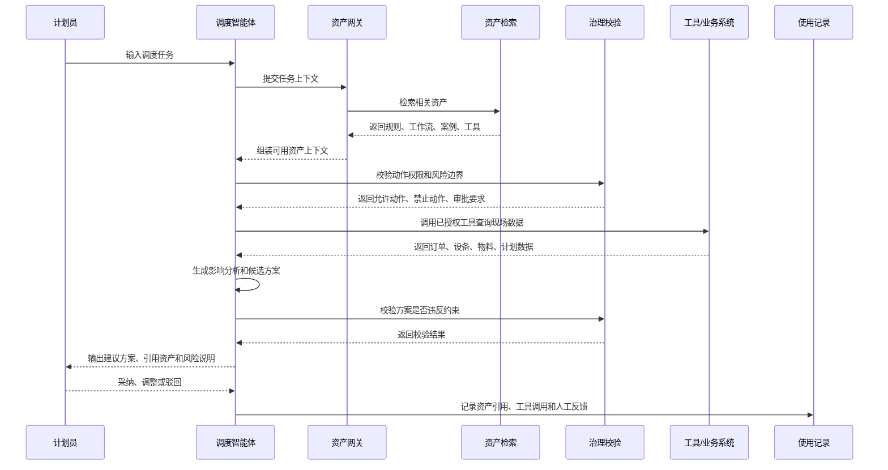
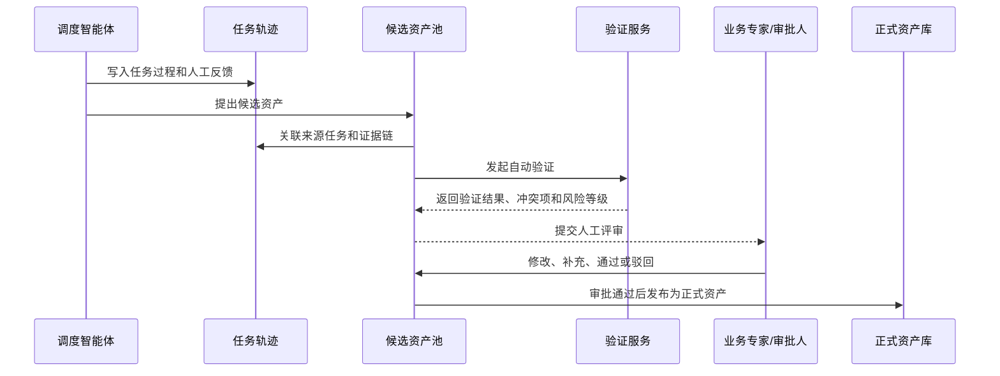
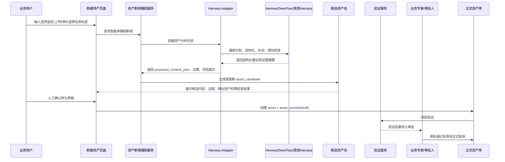

# 智能体资产管理系统设计文档

## 文档说明

本文档承接 `PRD.md` 中的产品需求，沉淀智能体资产管理模块的交互设计、页面结构、页面草图、数据模型、表结构和接口数据结构。

产品定位、用户角色、功能范围、MVP 和验收标准以 `PRD.md` 为准；产品架构、功能架构、技术架构以 `architecture.md` 为准。

## 1. 交互逻辑

### 1.1 智能体使用资产



### 1.2 智能体沉淀候选资产



### 1.3 智能体辅助新增资产

资产新增支持由智能体辅助完成，但智能体只负责起草、结构化、补全、预校验和生成说明，不能绕过人工确认、验证、审批直接发布正式资产。



推荐闭环：

```text
自然语言描述 / 上传材料 / 运行日志 / SOP / 历史任务 / 人工反馈
  -> 智能体辅助识别候选资产
  -> 生成 asset_candidate
  -> 补充 candidate_evidence
  -> 生成 proposed_content_json / content_text / content_schema 建议
  -> 相似资产检查
  -> 治理策略预检查
  -> 人工确认转为资产草稿
  -> 生成 asset + asset_version(draft)
  -> 验证
  -> 审批
  -> 发布正式版本
```

边界要求：

- 智能体可以辅助生成候选资产或正式资产草稿，但不能直接发布正式资产。
- 智能体可以推荐适用范围、风险等级和权限边界，但扩大范围、授予工具执行权限必须由人工确认。
- 智能体可以生成审批说明和风险提示，但高风险规则、工具、工作流的最终业务责任归人工审批人。
- Harness 只作为任务编排和智能体执行层，不能成为资产库的权威来源。
- 资产系统必须记录 Harness 运行轨迹、输入输出摘要、工具调用、证据来源和人工确认动作。

### 1.4 人工创建资产

```text
新建资产
  -> 选择资产类型
  -> 填写业务描述
  -> AI 辅助结构化
  -> 人工确认字段
  -> 配置适用范围和治理边界
  -> 上传证据或测试样例
  -> 提交验证
  -> 验证通过后提交审批
  -> 审批通过后发布
```

### 1.5 资产版本更新

```text
已发布资产
  -> 创建新版本草稿
  -> 修改内容
  -> 对比旧版本差异
  -> 重新验证受影响场景
  -> 审批通过
  -> 新版本生效
  -> 旧版本归档，可按权限回滚
```

### 1.6 审批退回后重新提交

```text
待审批资产版本
  -> 审批人驳回并填写原因
  -> 系统写入 asset_operation_log
  -> 资产版本回到草稿或待补充状态
  -> 负责人修改内容、范围、权限或证据
  -> 重新提交验证
  -> 验证通过后重新提交审批
```

### 1.7 候选资产合并到已有资产

```text
候选资产
  -> 系统识别疑似重复资产
  -> 用户选择合并到已有资产
  -> 基于已有资产创建新版本草稿
  -> 候选证据转入资产证据链
  -> 写入 asset_relation(similar_to / supersedes)
  -> 提交验证和审批
  -> 审批通过后候选状态变为 converted
```

### 1.8 资产停用后的 Agent 缓存失效

```text
资产停用或废止
  -> 写入资产操作日志
  -> 更新资产状态
  -> 通知 Asset Gateway 刷新可用资产索引
  -> 通知 Skill Projection Service 移除或更新运行时投影
  -> Agent 后续任务不再检索或使用该资产
```

## 2. 页面信息架构

```text
智能体资产管理
├─ 资产工作台
├─ 资产台账
│  ├─ 资产列表
│  ├─ 资产详情
│  └─ 新建/编辑资产
├─ 候选资产池
│  ├─ 候选列表
│  └─ 候选详情/转正
├─ 验证与审批
│  ├─ 待验证
│  ├─ 待审批
│  └─ 审批记录
├─ Agent 使用记录
│  ├─ 任务引用记录
│  ├─ 工具调用记录
│  └─ 治理校验记录
├─ 价值分析
└─ 治理配置
   ├─ 权限配置
   ├─ 风险等级
   ├─ 审批流程
   └─ 生效范围字典
```

## 3. 页面草图

以下为低保真页面草图，用于表达信息布局。高保真原型已沉淀在 `prototype/` 目录中。

### 3.1 资产工作台

```text
┌──────────────────────────────────────────────────────────────────────┐
│ 智能体资产工作台                         [搜索资产] [新建资产]       │
├──────────────┬───────────────────────────────────────────────────────┤
│ 侧边导航     │ 指标卡片                                               │
│              │ ┌────────┐ ┌────────┐ ┌────────┐ ┌────────┐          │
│ 工作台       │ │资产总量│ │已发布  │ │待审批  │ │候选资产│          │
│ 资产台账     │ └────────┘ └────────┘ └────────┘ └────────┘          │
│ 候选资产     │                                                       │
│ 审批验证     │ ┌──────────────────────────┐ ┌────────────────────┐ │
│ 使用记录     │ │ 资产列表/高频资产          │ │ 候选资产队列        │ │
│ 价值分析     │ │ 类型 状态 版本 引用 负责人 │ │ 来源 风险 证据 操作 │ │
│ 治理配置     │ └──────────────────────────┘ └────────────────────┘ │
│              │                                                       │
│              │ ┌──────────────────────────────────────────────────┐ │
│              │ │ 风险提醒：即将过期、长期未维护、冲突待处理资产     │ │
│              │ └──────────────────────────────────────────────────┘ │
└──────────────┴───────────────────────────────────────────────────────┘
```

### 3.2 资产详情页

```text
┌──────────────────────────────────────────────────────────────────────┐
│ 资产详情：设备故障后局部重排工作流       [编辑] [新建版本] [停用]     │
├──────────────────────────────────────────────────────────────────────┤
│ 状态：已发布  版本：v1.3  风险：中  适用：苏州一厂/总装一线          │
├──────────────────────────────┬───────────────────────────────────────┤
│ 基础信息                     │ 治理信息                              │
│ - 类型：工作流资产            │ - 审批人                              │
│ - 负责人                      │ - 生效时间/有效期                     │
│ - 标签                        │ - Agent 可用权限                      │
├──────────────────────────────┴───────────────────────────────────────┤
│ 内容结构                                                             │
│ 触发条件 | 输入要求 | 执行步骤 | 调用工具 | 人工介入点 | 成功判断     │
├──────────────────────────────────────────────────────────────────────┤
│ Agent 使用记录                                                       │
│ 任务编号  引用原因  输出方案  采纳结果  人工反馈  执行效果           │
├──────────────────────────────────────────────────────────────────────┤
│ 证据链与版本                                                         │
│ 来源任务 | 验证样例 | 审批记录 | 历史版本 | 差异对比                 │
└──────────────────────────────────────────────────────────────────────┘
```

### 3.3 新建资产向导

```text
┌──────────────────────────────────────────────────────────────────────┐
│ 新建资产                                                             │
├──────────────────────────────────────────────────────────────────────┤
│ 步骤：① 类型选择 -> ② 业务描述 -> ③ AI结构化 -> ④ 治理配置 -> ⑤ 校验提交 │
├──────────────────────────────────────────────────────────────────────┤
│ 左侧：表单输入                                                       │
│ ┌──────────────────────────────────────────────────────────────────┐ │
│ │ 资产类型：规则约束 / 工作流 / 工具接口 / 案例经验 / 指标评估       │ │
│ │ 名称：                                                            │ │
│ │ 业务描述：                                                        │ │
│ │ 适用范围：工厂、车间、产线、产品族、业务场景                       │ │
│ │ 风险等级：低 / 中 / 高                                             │ │
│ └──────────────────────────────────────────────────────────────────┘ │
│                                                                      │
│ 右侧：AI 辅助结构化结果                                               │
│ ┌──────────────────────────────────────────────────────────────────┐ │
│ │ 条件、约束、步骤、工具、审批点、测试样例                           │ │
│ │ [采纳建议] [修改字段] [重新生成]                                   │ │
│ └──────────────────────────────────────────────────────────────────┘ │
│                                             [保存草稿] [提交验证]     │
└──────────────────────────────────────────────────────────────────────┘
```

### 3.4 候选资产池

```text
┌──────────────────────────────────────────────────────────────────────┐
│ 候选资产池                              [按类型筛选] [按风险筛选]     │
├──────────────────────────────────────────────────────────────────────┤
│ 候选列表                                                             │
│ ┌──────────────────────────────────────────────────────────────────┐ │
│ │ 标题 | 类型 | 来源任务 | 证据数 | 风险 | 推荐理由 | 状态 | 操作     │ │
│ │ 插单冻结低优先级尾单 | 规则 | 4 | 中 | 多次采纳 | 待验证 | 查看     │ │
│ └──────────────────────────────────────────────────────────────────┘ │
├──────────────────────────────────────────────────────────────────────┤
│ 候选详情                                                             │
│ ┌──────────────────────────────┬───────────────────────────────────┐ │
│ │ 智能体提炼内容                │ 来源证据链                         │ │
│ │ - 建议规则                    │ - 任务轨迹                         │ │
│ │ - 适用范围                    │ - 人工反馈                         │ │
│ │ - 风险提示                    │ - 执行结果                         │ │
│ └──────────────────────────────┴───────────────────────────────────┘ │
│                         [补充证据] [转为草稿] [驳回] [提交验证]       │
└──────────────────────────────────────────────────────────────────────┘
```

### 3.5 Agent 使用记录

```text
┌──────────────────────────────────────────────────────────────────────┐
│ Agent 使用记录                                                       │
├──────────────────────────────────────────────────────────────────────┤
│ 筛选：任务类型 / 智能体 / 资产类型 / 时间 / 采纳结果 / 风险等级        │
├──────────────────────────────────────────────────────────────────────┤
│ 任务列表                                                             │
│ ┌──────────────────────────────────────────────────────────────────┐ │
│ │ 任务编号 | 任务类型 | 引用资产 | 工具调用 | 治理结果 | 采纳结果     │ │
│ └──────────────────────────────────────────────────────────────────┘ │
├──────────────────────────────────────────────────────────────────────┤
│ 任务详情                                                             │
│ ┌──────────────────────────────┬───────────────────────────────────┐ │
│ │ 时间线                        │ 引用资产说明                       │ │
│ │ 1. 检索资产                    │ - 为什么引用                       │ │
│ │ 2. 读取规则                    │ - 影响了哪个判断                   │ │
│ │ 3. 调用工具                    │ - 是否触发审批                     │ │
│ │ 4. 校验方案                    │ - 人工反馈                         │ │
│ │ 5. 输出建议                    │                                   │ │
│ └──────────────────────────────┴───────────────────────────────────┘ │
└──────────────────────────────────────────────────────────────────────┘
```

### 3.6 价值分析

```text
┌──────────────────────────────────────────────────────────────────────┐
│ 资产价值分析                            [时间范围] [场景] [导出]      │
├──────────────────────────────────────────────────────────────────────┤
│ 核心指标                                                             │
│ ┌────────┐ ┌────────┐ ┌────────┐ ┌────────┐                         │
│ │引用次数│ │采纳率  │ │候选转正│ │拦截违规│                         │
│ └────────┘ └────────┘ └────────┘ └────────┘                         │
├──────────────────────────────┬───────────────────────────────────────┤
│ 引用趋势折线图                │ 资产类型贡献排行                     │
├──────────────────────────────┼───────────────────────────────────────┤
│ 场景贡献：插单/故障/物料短缺   │ 低价值资产：长期未用/频繁被纠正       │
└──────────────────────────────┴───────────────────────────────────────┘
```

## 4. 数据模型与表结构设计

### 4.1 设计原则

首期数据模型建议采用“统一资产主表 + 类型扩展表 + JSONB 配置”的方式。

这样既能保证资产列表、详情、审批、权限、引用记录等通用能力统一，又能允许规则、工作流、工具、案例、指标等资产拥有不同字段。

核心原则：

- `asset` 表只保存资产通用元数据。
- `asset_version` 表保存每个版本的内容快照。
- 不同资产类型的结构化字段优先放在类型扩展表中，变化较快的配置放在 `content_schema` 或 `content_json` 中。
- Agent 任务引用、工具调用、治理校验、人工反馈必须独立成表，避免只存在日志里。
- 候选资产与正式资产隔离，只有审批通过后才生成正式资产和正式版本。
- 所有关键动作都需要保留操作者、时间、前后状态和原因。
- 资产适用范围和权限默认按资产级配置管理；当新版本调整范围或权限时，需要记录版本快照，支持历史任务回放和审计。
- 审批对象采用多态引用，不做数据库外键约束；由业务服务校验对象存在性、对象状态和审批类型匹配关系。
- 治理策略与治理校验结果分离：`governance_policy` 定义要检查什么，`policy_check_record` 记录一次校验结果，`policy_check_hit` 记录本次命中的策略明细。

### 4.2 核心实体关系

```mermaid
erDiagram
    asset ||--o{ asset_version : has
    asset ||--o{ asset_scope : applies_to
    asset ||--o{ asset_permission : controls
    asset ||--o{ asset_evidence : proven_by
    asset ||--o{ asset_relation : relates
    asset ||--o{ asset_operation_log : logs
    asset ||--o{ asset_retrieval_record : retrieved_by
    asset ||--o{ asset_usage_record : referenced_by
    asset ||--o{ validation_run : validated_by
    asset ||--o{ governance_policy : governed_by
    asset_version ||--o| rule_asset_detail : extends
    asset_version ||--o| workflow_asset_detail : extends
    asset_version ||--o| tool_asset_detail : extends
    asset_version ||--o| case_asset_detail : extends
    asset_version ||--o| metric_asset_detail : extends
    asset_candidate ||--o{ candidate_evidence : has
    asset_candidate ||--o{ validation_run : validated_by
    agent_task_trace ||--o{ asset_usage_record : records
    agent_task_trace ||--o{ asset_retrieval_record : retrieves
    agent_task_trace ||--o{ tool_call_record : invokes
    agent_task_trace ||--o{ policy_check_record : checks
    policy_check_record ||--o{ policy_check_hit : hits
    governance_policy ||--o{ policy_check_hit : matched_by
    validation_run ||--o{ asset_validation_result : contains
    approval_instance ||--o{ approval_step : contains
    scope_node ||--o{ scope_closure : ancestor
    scope_node ||--o{ scope_closure : descendant
```



### 4.3 枚举字典

| 枚举 | 值 | 说明 |
| --- | --- | --- |
| asset_type | `rule`、`workflow`、`tool`、`case`、`metric`、`term`、`dataset`、`skill` | 资产类型 |
| asset_status | `draft`、`pending_validation`、`validating`、`pending_approval`、`published`、`disabled`、`deprecated`、`rejected` | 正式资产状态；候选状态只存在于 `asset_candidate` |
| asset_version_status | `draft`、`pending_validation`、`validating`、`validation_failed`、`pending_approval`、`approved`、`published`、`archived`、`rejected`、`withdrawn` | 资产版本状态；用于描述单个版本从草稿到发布、归档或撤回的生命周期 |
| risk_level | `low`、`medium`、`high`、`critical` | 风险等级 |
| source_type | `manual`、`upload`、`system_sync`、`agent_trace`、`review_meeting`、`api_import` | 资产来源 |
| permission_action | `view`、`edit`、`approve`、`agent_read`、`agent_suggest`、`agent_apply`、`agent_execute` | 权限动作 |
| scope_type | `org`、`factory`、`workshop`、`line`、`workstation`、`equipment`、`product_family`、`product`、`process`、`customer_type`、`scenario` | 资产适用范围类型 |
| evidence_type | `task_trace`、`asset_usage`、`tool_call`、`policy_check`、`expert_review`、`approval_record`、`system_record`、`validation_case`、`file`、`manual_note`、`external_reference` | 证据业务类型 |
| evidence_ref_type | `task_trace`、`usage_record`、`tool_call`、`policy_check`、`validation_run`、`approval_instance`、`file`、`system_record`、`external_url`、`manual_note` | 证据引用对象类型 |
| usage_role | `context`、`tool`、`policy`、`case_reference`、`metric_eval`、`skill_runtime` | Agent 使用资产的方式 |
| validation_status | `not_started`、`running`、`passed`、`failed`、`warning`、`cancelled` | 验证状态 |
| approval_status | `pending`、`approved`、`rejected`、`withdrawn`、`cancelled` | 审批状态 |
| task_result | `accepted`、`adjusted`、`rejected`、`pending`、`unknown` | 任务建议结果 |
| tool_level | `read`、`analyze`、`suggest`、`apply`、`execute` | 工具能力等级 |
| tool_endpoint_type | `http`、`rpc`、`sql`、`message`、`internal_function`、`python_script`、`shell_command` | 工具端点类型 |
| governance_policy_type | `permission`、`scope`、`tool_call`、`writeback`、`approval`、`risk`、`data_access`、`human_checkpoint` | 治理策略类型 |
| governance_effect | `allow`、`deny`、`require_approval`、`warn` | 治理策略效果 |
| relation_type | `depends_on`、`uses_tool`、`references_case`、`evaluated_by`、`supersedes`、`conflicts_with`、`similar_to` | 资产关系类型 |
| operation_type | `create`、`update`、`submit_validation`、`submit_approval`、`publish`、`disable`、`deprecate`、`rollback`、`reject`、`convert_candidate` | 资产操作类型 |
| retrieval_status | `retrieved`、`selected`、`discarded` | 资产检索结果状态 |

### 4.4 资产主表

#### asset：资产主表

该表是正式资产库的主入口，用于承载所有资产类型的统一身份、生命周期状态、负责人、风险等级、当前生效版本和基础运营统计。它不直接保存规则、工作流、工具接口等具体内容，而是作为列表检索、权限判断、版本定位、治理状态流转和价值分析的统一锚点。候选资产在审批转正前不进入该表，避免未验证内容影响正式资产库。

| 字段 | 类型 | 必填 | 说明 |
| --- | --- | --- | --- |
| id | uuid | 是 | 资产唯一标识 |
| asset_code | varchar(64) | 是 | 资产编号，例如 `AST-RULE-202606-0001` |
| name | varchar(200) | 是 | 资产名称 |
| asset_type | varchar(32) | 是 | 资产类型 |
| summary | text | 否 | 资产摘要 |
| status | varchar(32) | 是 | 当前状态 |
| risk_level | varchar(16) | 是 | 风险等级 |
| owner_user_id | uuid | 是 | 负责人 |
| owner_org_id | uuid | 否 | 所属组织 |
| source_type | varchar(32) | 是 | 来源类型 |
| source_ref_id | varchar(128) | 否 | 来源对象 ID，例如任务编号、导入批次 |
| current_version_id | uuid | 否 | 当前生效版本 |
| latest_version_no | int | 是 | 最新版本号 |
| effective_from | timestamptz | 否 | 生效开始时间 |
| effective_to | timestamptz | 否 | 生效结束时间 |
| review_cycle_days | int | 否 | 复审周期 |
| last_reviewed_at | timestamptz | 否 | 最近复审时间 |
| last_used_at | timestamptz | 否 | 最近被 Agent 引用时间 |
| usage_count | int | 是 | 累计引用次数，冗余统计字段 |
| tags | jsonb | 否 | 标签数组 |
| created_by | uuid | 是 | 创建人 |
| created_at | timestamptz | 是 | 创建时间 |
| updated_by | uuid | 否 | 更新人 |
| updated_at | timestamptz | 是 | 更新时间 |
| deleted_at | timestamptz | 否 | 软删除时间 |

建议索引：

| 索引 | 字段 | 用途 |
| --- | --- | --- |
| idx_asset_type_status | asset_type, status | 资产列表筛选 |
| idx_asset_owner | owner_user_id | 按负责人筛选 |
| idx_asset_risk | risk_level | 风险资产筛选 |
| idx_asset_last_used | last_used_at | 低活跃资产分析 |
| idx_asset_tags_gin | tags | 标签检索 |

约束说明：

- `current_version_id` 只能指向当前资产下状态为 `published` 的版本。
- 候选资产不写入 `asset` 表，只有候选转正成功后才生成正式资产记录。

#### asset_version：资产版本表

该表保存资产每一次变更后的内容快照，是资产可审计、可回滚、可复盘的核心表。正式任务中 Agent 实际使用的是某个确定版本，而不是抽象资产本身，因此任务引用、验证结果、发布记录和类型扩展表都应尽量关联到版本。新建或编辑已发布资产时，应生成新的版本草稿，验证和审批通过后再成为当前生效版本。

| 字段 | 类型 | 必填 | 说明 |
| --- | --- | --- | --- |
| id | uuid | 是 | 版本唯一标识 |
| asset_id | uuid | 是 | 资产 ID |
| version_no | int | 是 | 版本号 |
| version_name | varchar(64) | 否 | 版本名称，例如 `v1.2` |
| change_summary | text | 否 | 变更说明 |
| content_text | text | 否 | 人类可读内容 |
| content_json | jsonb | 是 | 类型相关的完整结构化内容 |
| content_schema | jsonb | 否 | 当前内容结构定义，便于动态表单渲染 |
| diff_from_version_id | uuid | 否 | 对比来源版本 |
| status | varchar(32) | 是 | 版本状态 |
| validation_status | varchar(32) | 是 | 验证状态 |
| published_at | timestamptz | 否 | 发布时间 |
| published_by | uuid | 否 | 发布人 |
| created_by | uuid | 是 | 创建人 |
| created_at | timestamptz | 是 | 创建时间 |

唯一约束：

| 约束 | 字段 |
| --- | --- |
| uk_asset_version_no | asset_id, version_no |

状态说明：

- `draft`：版本草稿，允许编辑，不可被 Agent 正式使用。
- `pending_validation`：已提交验证，等待验证任务开始。
- `validating`：验证中。
- `validation_failed`：验证未通过，需要修改后重新提交。
- `pending_approval`：验证通过，等待人工审批。
- `approved`：审批通过但尚未正式发布，通常用于预约生效或发布前确认。
- `published`：当前或曾经正式发布过的版本；只有 `published` 版本可以成为 `asset.current_version_id`。
- `archived`：历史发布版本，已被新版本替代，仍可用于审计和任务回放。
- `rejected`：审批驳回，不可发布。
- `withdrawn`：提交人主动撤回，不再继续当前发布流程。

`asset.status` 描述资产整体是否可用，`asset_version.status` 描述某个版本所处的发布流程。一个资产可以有多个版本，但同一时间原则上只能有一个当前生效版本。

#### scope_node：范围节点表

该表用于维护资产适用范围可选择的业务对象节点，例如组织、工厂、车间、产线、工位、设备、产品族、产品、工艺、客户类型和业务场景。它为 `asset_scope.scope_type + scope_code` 提供标准字典来源，避免范围编码只存在于资产表中而无法校验。若企业已有统一主数据或组织/资源层级服务，本表可以作为本模块的只读同步快照；若首期没有外部服务，则本表承担本地范围字典职责。

| 字段 | 类型 | 必填 | 说明 |
| --- | --- | --- | --- |
| id | uuid | 是 | 范围节点 ID |
| scope_type | varchar(32) | 是 | 范围类型，取值见 `scope_type` 枚举 |
| scope_code | varchar(128) | 是 | 范围编码 |
| scope_name | varchar(200) | 是 | 范围名称 |
| parent_id | uuid | 否 | 直接父节点 ID |
| source_system | varchar(64) | 否 | 来源系统，例如 ERP、MES、APS、MDM |
| source_ref_id | varchar(128) | 否 | 来源系统对象 ID |
| enabled | boolean | 是 | 是否启用 |
| created_at | timestamptz | 是 | 创建时间 |
| updated_at | timestamptz | 是 | 更新时间 |

唯一约束：

| 约束 | 字段 |
| --- | --- |
| uk_scope_node_type_code | scope_type, scope_code |

#### scope_closure：范围层级闭包表

该表用于维护范围节点之间的祖先和后代关系，支撑 `asset_scope.include_children = true` 时快速判断某个任务上下文是否落在资产适用范围内。仅有 `asset_scope` 表无法知道“苏州一厂是否包含总装车间、总装一线、设备 E-17”，因此需要通过本表或外部层级服务维护上下级关系。使用闭包表而不是只依赖 `parent_id`，是为了提升多层级范围匹配、权限判断和批量检索性能。

| 字段 | 类型 | 必填 | 说明 |
| --- | --- | --- | --- |
| ancestor_id | uuid | 是 | 祖先范围节点 ID |
| descendant_id | uuid | 是 | 后代范围节点 ID |
| depth | int | 是 | 层级深度；0 表示节点自身，1 表示直接子级 |
| created_at | timestamptz | 是 | 创建时间 |

唯一约束：

| 约束 | 字段 |
| --- | --- |
| pk_scope_closure | ancestor_id, descendant_id |

#### asset_scope：资产适用范围表

该表用于描述资产可以在哪些业务范围内生效，例如工厂、车间、产线、产品族、工艺、客户类型或调度场景。Asset Gateway 在检索资产、组装上下文和执行治理校验时，需要先根据任务上下文匹配该表，避免 Agent 在错误场景下使用资产。默认按资产级范围管理；当某个版本的适用范围发生变化时，可通过 `asset_version_id` 固化版本级范围快照。

| 字段 | 类型 | 必填 | 说明 |
| --- | --- | --- | --- |
| id | uuid | 是 | 唯一标识 |
| asset_id | uuid | 是 | 资产 ID |
| asset_version_id | uuid | 否 | 版本 ID；为空表示资产级范围，非空表示该版本的范围快照 |
| scope_type | varchar(32) | 是 | 范围类型，取值见 `scope_type` 枚举 |
| scope_code | varchar(128) | 是 | 范围编码 |
| scope_name | varchar(200) | 否 | 范围名称 |
| include_children | boolean | 是 | 是否包含下级范围 |
| priority | int | 是 | 匹配优先级 |
| created_at | timestamptz | 是 | 创建时间 |

范围匹配说明：

- 当 `include_children = false` 时，只匹配 `scope_type + scope_code` 对应的范围节点本身。
- 当 `include_children = true` 时，需要通过 `scope_node` 和 `scope_closure` 判断任务上下文中的范围节点是否为该范围节点的后代。
- 如果范围层级由企业 MDM、MES、APS 或组织资源服务统一维护，本模块可以不落 `scope_node` / `scope_closure` 实体表，但必须在 Asset Gateway 中接入等价的层级查询能力。
- `asset_scope` 只表达资产声明的适用范围，不负责维护范围上下级关系。

#### asset_permission：资产权限表

该表用于控制不同用户、角色、组织或 Agent 对资产的操作边界，包括人工可见、可编辑、可审批，以及 Agent 是否可读取、建议、申请或执行。它是资产治理的关键入口，尤其用于区分“人可以查看”和“Agent 可以用于正式任务”的权限差异。默认按资产级权限管理；当新版本调整 Agent 可用等级或审批边界时，可记录版本级权限快照。

| 字段 | 类型 | 必填 | 说明 |
| --- | --- | --- | --- |
| id | uuid | 是 | 唯一标识 |
| asset_id | uuid | 是 | 资产 ID |
| asset_version_id | uuid | 否 | 版本 ID；为空表示资产级权限，非空表示该版本的权限快照 |
| subject_type | varchar(32) | 是 | 主体类型：`user`、`role`、`org`、`agent` |
| subject_id | varchar(128) | 是 | 主体 ID |
| action | varchar(32) | 是 | 权限动作 |
| effect | varchar(16) | 是 | `allow` 或 `deny` |
| condition_json | jsonb | 否 | 条件，例如仅某工厂、某风险等级以下可用 |
| created_by | uuid | 是 | 创建人 |
| created_at | timestamptz | 是 | 创建时间 |

权限主体说明：

- `subject_type + subject_id` 用于统一表达“权限授予给谁”。
- `subject_type = user` 时，`subject_id` 为具体用户 ID。
- `subject_type = role` 时，`subject_id` 为角色编码，例如 `plan_supervisor`。
- `subject_type = org` 时，`subject_id` 为组织或范围编码，例如 `factory-SZ01`。
- `subject_type = agent` 时，`subject_id` 为 Agent 标识，例如 `dispatch-agent`。
- 权限判断时，系统需要展开当前用户或 Agent 所属的用户、角色、组织、Agent 主体集合，再匹配 `action` 和 `effect`；若同时命中 `allow` 和 `deny`，建议按 `deny` 优先处理。

#### asset_relation：资产关系表

该表用于建立资产之间的显式关系，解决资产不是孤立对象的问题。例如工作流会引用工具接口，案例会引用规则，指标会评估某类工作流，新规则可能替代旧规则，也可能与既有规则存在冲突。该表可支撑影响分析、候选资产合并、资产下线前依赖检查、相似资产去重和知识图谱式浏览。

| 字段 | 类型 | 必填 | 说明 |
| --- | --- | --- | --- |
| id | uuid | 是 | 唯一标识 |
| source_asset_id | uuid | 是 | 源资产 ID |
| source_asset_version_id | uuid | 否 | 源资产版本 ID |
| target_asset_id | uuid | 是 | 目标资产 ID |
| target_asset_version_id | uuid | 否 | 目标资产版本 ID |
| relation_type | varchar(32) | 是 | 关系类型 |
| strength | numeric(5,2) | 否 | 关系强度或相似度 |
| description | text | 否 | 关系说明 |
| created_by | uuid | 是 | 创建人 |
| created_at | timestamptz | 是 | 创建时间 |

建议索引：

| 索引 | 字段 | 用途 |
| --- | --- | --- |
| idx_asset_relation_source | source_asset_id, relation_type | 查询资产依赖或引用 |
| idx_asset_relation_target | target_asset_id, relation_type | 反查被哪些资产引用 |

#### asset_operation_log：资产操作日志表

该表用于记录资产生命周期中的关键操作，例如创建、编辑、提交验证、提交审批、发布、停用、废止、回滚、驳回和候选转正。它补足 `asset.status` 与 `asset_version.status` 只能表示当前状态的问题，保留状态前后变化、操作者、原因和关键差异。审计、问题追责、版本复盘和审批退回后重提都需要依赖该表。

| 字段 | 类型 | 必填 | 说明 |
| --- | --- | --- | --- |
| id | uuid | 是 | 操作日志 ID |
| object_type | varchar(32) | 是 | `asset`、`asset_version`、`candidate` |
| object_id | uuid | 是 | 操作对象 ID |
| asset_id | uuid | 否 | 资产 ID，便于按资产聚合查询 |
| operation_type | varchar(32) | 是 | 操作类型 |
| from_status | varchar(32) | 否 | 操作前状态 |
| to_status | varchar(32) | 否 | 操作后状态 |
| reason | text | 否 | 操作原因 |
| diff_json | jsonb | 否 | 关键字段变更摘要 |
| operator_id | uuid | 否 | 操作人；系统或 Agent 操作时可为空 |
| operator_type | varchar(32) | 是 | `user`、`agent`、`system` |
| created_at | timestamptz | 是 | 操作时间 |

对象归属说明：

- `object_id` 表示本次操作直接作用的对象，是操作日志的精确指针。
- `asset_id` 表示该日志最终归属到哪一个正式资产，主要用于资产详情页聚合完整时间线。
- 当 `object_type = asset` 时，`object_id` 和 `asset_id` 通常相同。
- 当 `object_type = asset_version` 时，`object_id` 是版本 ID，`asset_id` 是该版本所属资产 ID。
- 当 `object_type = candidate` 时，若候选已转正，`asset_id` 可填转正后的资产 ID；若候选未转正，`asset_id` 可为空。

建议索引：

| 索引 | 字段 | 用途 |
| --- | --- | --- |
| idx_asset_operation_object | object_type, object_id, created_at | 查看对象操作时间线 |
| idx_asset_operation_asset | asset_id, created_at | 查看资产完整操作记录 |

#### asset_evidence：资产证据链表

该表用于保存正式资产的证据链，说明资产为什么可信、来自哪里、经过哪些验证或专家确认。证据可以来自任务轨迹、资产使用记录、工具调用、治理校验、验证任务、审批记录、系统记录、上传文件或外部链接。资产详情页中的“证据链”区域、审批人判断资产是否可发布、以及后续复盘某条规则为何生效，都需要依赖该表。

| 字段 | 类型 | 必填 | 说明 |
| --- | --- | --- | --- |
| id | uuid | 是 | 唯一标识 |
| asset_id | uuid | 是 | 资产 ID |
| asset_version_id | uuid | 否 | 版本 ID |
| evidence_type | varchar(32) | 是 | 证据业务类型，取值见 `evidence_type` 枚举 |
| title | varchar(200) | 是 | 证据标题 |
| ref_type | varchar(32) | 是 | 引用对象类型，取值见 `evidence_ref_type` 枚举 |
| ref_id | varchar(128) | 否 | 关联对象 ID |
| ref_url | text | 否 | 附件或外部链接 |
| summary | text | 否 | 证据摘要 |
| confidence_score | numeric(5,2) | 否 | 可信度评分 |
| created_by | uuid | 是 | 创建人 |
| created_at | timestamptz | 是 | 创建时间 |

说明：

- `evidence_type` 表示证据的业务分类，例如任务轨迹证据、专家评审证据、系统记录证据。
- `ref_type` 表示 `ref_id` 指向哪类对象，例如 `task_trace`、`validation_run`、`approval_instance` 或 `file`。
- `ref_id` 用于结构化关联内部或外部对象；`ref_url` 用于跳转访问文件、页面或外部系统链接。
- 当证据仅为人工备注且没有可关联对象时，`ref_type` 可写 `manual_note`，`ref_id` 可为空。

### 4.5 类型扩展表

#### rule_asset_detail：规则约束资产详情

该表保存规则类资产的结构化表达，用于描述调度中的硬约束、软约束、优先级规则和策略边界。它将人类可读说明、触发条件、机器可执行表达、冲突处理和违反后的动作拆开存储，方便 Agent 理解规则，也方便规则校验器执行。规则资产通常会参与 `check_policy`、方案校验和高风险动作拦截。

| 字段 | 类型 | 必填 | 说明 |
| --- | --- | --- | --- |
| asset_version_id | uuid | 是 | 版本 ID，主键 |
| rule_category | varchar(32) | 是 | `hard_constraint`、`soft_constraint`、`priority`、`strategy` |
| trigger_condition | jsonb | 是 | 触发条件 |
| constraint_expression | jsonb | 是 | 机器可执行约束表达 |
| human_description | text | 是 | 人类可读说明 |
| priority | int | 是 | 规则优先级 |
| conflict_strategy | varchar(32) | 否 | 冲突处理方式 |
| violation_action | varchar(32) | 是 | 违反时动作：`block`、`warn`、`require_approval` |
| test_cases | jsonb | 否 | 测试样例 |

规则表达示例：

```json
{
  "when": {
    "order.priority": "urgent",
    "customer.level": ["A", "S"],
    "delay_hours": { "gte": 8 }
  },
  "then": {
    "schedule_priority_boost": 30,
    "require_check": ["material_available", "capacity_available"]
  },
  "unless": {
    "resource.locked": true
  }
}
```

#### workflow_asset_detail：工作流资产详情

该表保存工作流类资产的任务处理步骤，用于定义 Agent 在某类调度场景下应该如何行动。它描述触发条件、输入要求、执行步骤、可调用工具、人工介入点、输出结构和成功判断。工作流资产是把规则、工具、案例和审批点串起来的编排层，适用于设备故障重排、插单评估、物料短缺分析等场景。

| 字段 | 类型 | 必填 | 说明 |
| --- | --- | --- | --- |
| asset_version_id | uuid | 是 | 版本 ID，主键 |
| trigger_condition | jsonb | 是 | 触发条件 |
| input_requirements | jsonb | 是 | 输入要求 |
| steps | jsonb | 是 | 执行步骤 |
| tool_refs | jsonb | 否 | 可调用工具资产 |
| human_checkpoints | jsonb | 否 | 人工介入点 |
| output_schema | jsonb | 否 | 输出结构 |
| success_criteria | jsonb | 否 | 成功判断 |
| rollback_plan | text | 否 | 回滚方案 |

工作流步骤示例：

```json
[
  {
    "step_no": 1,
    "name": "识别影响范围",
    "action": "query_impacted_orders",
    "tool_asset_code": "AST-TOOL-MES-ORDER-QUERY",
    "required": true
  },
  {
    "step_no": 2,
    "name": "生成候选重排方案",
    "action": "run_reschedule_solver",
    "tool_asset_code": "AST-TOOL-APS-SOLVER",
    "required": true
  },
  {
    "step_no": 3,
    "name": "提交人工确认",
    "action": "request_human_approval",
    "required": true,
    "approver_role": "plan_supervisor"
  }
]
```

#### tool_asset_detail：工具接口资产详情

该表保存 Agent 可调用工具或业务系统接口的治理信息，包括所属系统、接口类型、入参出参、超时重试、写回限制和审计要求。工具既可以是 HTTP/RPC/SQL/消息等系统接口，也可以是平台托管的 Python 脚本、内部函数或受控命令。它不是直接保存密钥或敏感连接信息，而是保存密钥引用、脚本引用和调用策略。Agent 调用 MES、ERP、APS、规则校验器、Python 分析脚本或审批服务前，应通过该表确认工具等级、运行环境和调用边界。

| 字段 | 类型 | 必填 | 说明 |
| --- | --- | --- | --- |
| asset_version_id | uuid | 是 | 版本 ID，主键 |
| tool_code | varchar(128) | 是 | 工具编码 |
| tool_level | varchar(32) | 是 | 工具能力等级 |
| system_name | varchar(64) | 是 | 所属系统，例如 MES、ERP、APS |
| endpoint_type | varchar(32) | 是 | 工具端点类型，取值见 `tool_endpoint_type` 枚举 |
| endpoint_config | jsonb | 是 | 端点配置；敏感字段只保存密钥引用，脚本类工具只保存脚本资产引用或受控路径 |
| input_schema | jsonb | 是 | 入参结构 |
| output_schema | jsonb | 是 | 出参结构 |
| timeout_ms | int | 是 | 超时时间 |
| retry_policy | jsonb | 否 | 重试策略 |
| writeback_policy | jsonb | 否 | 写回限制 |
| audit_required | boolean | 是 | 是否强制审计 |

HTTP 工具配置示例：

```json
{
  "method": "POST",
  "path": "/mes/api/device/status",
  "auth_ref": "secret:mes-prod-agent-readonly",
  "rate_limit": {
    "qps": 10,
    "burst": 30
  }
}
```

Python 脚本工具配置示例：

```json
{
  "script_ref_type": "asset_file",
  "script_ref_id": "file-uuid-reschedule-impact-py",
  "entrypoint": "main",
  "runtime": "python3.11",
  "dependency_profile": "dispatch-analysis-v1",
  "sandbox": {
    "network": "deny",
    "filesystem": "read_only",
    "allowed_mounts": ["task_context", "tmp_output"],
    "max_memory_mb": 512,
    "max_cpu_seconds": 30
  },
  "input_mode": "json",
  "output_mode": "json"
}
```

脚本类工具说明：

- `python_script` 适用于影响分析、规则校验、数据清洗、指标计算等可由脚本完成的能力。
- 脚本文件本身建议由文件资产、对象存储或 Skill Projection Service 管理，`endpoint_config` 只保存引用，不直接存放大段脚本源码。
- 脚本执行必须经过沙箱、依赖白名单、超时和资源限制控制；涉及写回或外部网络访问时，应通过 `tool_level`、`writeback_policy` 和 `check_policy` 额外治理。
- 输入输出必须受 `input_schema` 和 `output_schema` 约束，避免 Agent 传入任意结构或脚本返回不可解析内容。

#### case_asset_detail：案例经验资产详情

该表保存历史调度案例的结构化复盘信息，包括事件背景、当时状态快照、约束条件、候选方案、最终采用方案、判断理由、执行结果和复用条件。它用于让 Agent 在相似任务中参考已经验证过的经验，而不是只依赖抽象规则。案例资产也可作为候选规则、评测样例和专家复盘材料的来源。

| 字段 | 类型 | 必填 | 说明 |
| --- | --- | --- | --- |
| asset_version_id | uuid | 是 | 版本 ID，主键 |
| event_type | varchar(64) | 是 | 事件类型 |
| event_background | text | 是 | 事件背景 |
| state_snapshot | jsonb | 是 | 当时状态快照 |
| constraints_snapshot | jsonb | 否 | 当时约束快照 |
| candidate_plans | jsonb | 否 | 候选方案 |
| adopted_plan | jsonb | 是 | 最终采用方案 |
| decision_reason | text | 是 | 判断理由 |
| execution_result | jsonb | 否 | 执行结果 |
| reusable_conditions | jsonb | 否 | 复用条件 |

#### metric_asset_detail：指标评估资产详情

该表保存指标类资产的评价口径和计算定义，用于统一准交率、延期小时、换型次数、采纳率、计划稳定性等指标的含义。指标既可以作为排程方案的优化目标，也可以作为资产价值分析的统计口径。将指标作为资产管理，可以避免不同系统或不同团队对同一指标理解不一致。

| 字段 | 类型 | 必填 | 说明 |
| --- | --- | --- | --- |
| asset_version_id | uuid | 是 | 版本 ID，主键 |
| metric_code | varchar(128) | 是 | 指标编码 |
| metric_name | varchar(200) | 是 | 指标名称 |
| calculation_formula | text | 是 | 计算公式 |
| data_sources | jsonb | 是 | 数据来源 |
| unit | varchar(32) | 否 | 单位 |
| target_direction | varchar(16) | 是 | `higher_better`、`lower_better`、`range` |
| target_value | numeric(18,4) | 否 | 目标值 |
| threshold_config | jsonb | 否 | 阈值配置 |

### 4.6 候选资产表

#### asset_candidate：候选资产主表

该表承接 Agent 或人工从真实任务中提炼出来、但尚未进入正式资产库的候选资产。它与 `asset` 表隔离，确保未验证的规则、案例、工作流不会直接影响正式调度任务。候选资产会记录推荐内容、来源任务、证据数量、置信度、风险等级和处理状态，后续可被驳回、补充证据、合并到已有资产或转正为正式资产。

| 字段 | 类型 | 必填 | 说明 |
| --- | --- | --- | --- |
| id | uuid | 是 | 候选资产 ID |
| candidate_code | varchar(64) | 是 | 候选编号 |
| title | varchar(200) | 是 | 候选标题 |
| asset_type | varchar(32) | 是 | 建议资产类型 |
| summary | text | 否 | 候选摘要 |
| proposed_content_json | jsonb | 是 | 智能体或人工提炼出的结构化内容 |
| source_type | varchar(32) | 是 | 来源类型 |
| source_task_id | uuid | 否 | 来源任务 |
| evidence_count | int | 是 | 证据数量 |
| confidence_score | numeric(5,2) | 否 | 置信度 |
| risk_level | varchar(16) | 是 | 风险等级 |
| status | varchar(32) | 是 | `new`、`need_more_evidence`、`pending_validation`、`pending_review`、`converted`、`rejected` |
| duplicate_asset_id | uuid | 否 | 疑似重复资产 |
| converted_asset_id | uuid | 否 | 转正后的资产 ID |
| reject_reason | text | 否 | 驳回原因 |
| created_by_agent_id | varchar(128) | 否 | 提出候选的 Agent |
| created_by | uuid | 否 | 人工创建人 |
| created_at | timestamptz | 是 | 创建时间 |
| updated_at | timestamptz | 是 | 更新时间 |

候选版本设计说明：

- 首期候选资产不单独设计版本表和类型扩展表，采用 `proposed_content_json` 承载候选阶段的结构化内容。
- 原因是候选资产主要是待评审提案，不进入 Agent 正式运行时资产供给；通过评审后会转成正式 `asset`、`asset_version` 和对应类型扩展表，再进入版本治理。
- 若后续出现候选资产多人多轮编辑、AI 多次重写、候选差异对比或长期挂起评审等场景，可增加轻量的 `asset_candidate_revision` 表记录候选修订历史。
- 不建议首期复制正式资产的完整版本表和类型扩展表给候选资产，避免候选池模型过重。

#### candidate_evidence：候选资产证据表

该表保存候选资产的来源证据，用于回答“为什么这个候选资产值得被转正”。证据可以来自任务轨迹、资产使用记录、文件、人工备注或用户反馈。候选评审时，业务专家需要根据这些证据判断候选内容是否具有复用价值；候选转正后，部分证据可迁移到 `asset_evidence`，形成正式资产证据链。

| 字段 | 类型 | 必填 | 说明 |
| --- | --- | --- | --- |
| id | uuid | 是 | 唯一标识 |
| candidate_id | uuid | 是 | 候选资产 ID |
| evidence_type | varchar(32) | 是 | 证据业务类型，取值见 `evidence_type` 枚举 |
| ref_type | varchar(32) | 是 | 来源对象类型：`task_trace`、`usage_record`、`file`、`manual_note` |
| ref_id | varchar(128) | 否 | 来源对象 ID |
| excerpt | text | 否 | 证据摘录 |
| feedback_result | varchar(32) | 否 | 采纳、调整、驳回等 |
| weight | numeric(5,2) | 否 | 证据权重 |
| created_at | timestamptz | 是 | 创建时间 |

候选资产示例：

```json
{
  "candidate_code": "CAND-RULE-202606-0008",
  "title": "高价值急单插入时冻结低优先级尾单",
  "asset_type": "rule",
  "risk_level": "medium",
  "confidence_score": 86.5,
  "proposed_content_json": {
    "rule_category": "priority",
    "human_description": "当 S 级客户急单预计延期超过 8 小时时，优先冻结低优先级尾单，避免反复扰动主计划。",
    "scope": {
      "factory": "苏州一厂",
      "line": "总装一线"
    },
    "trigger_condition": {
      "customer_level": "S",
      "order_type": "urgent",
      "delay_hours": { "gte": 8 }
    },
    "violation_action": "require_approval"
  }
}
```

### 4.7 Agent 任务与审计表

#### agent_task_trace：Agent 任务轨迹表

该表记录 Agent 执行一次调度任务的主轨迹，是连接用户输入、任务上下文、资产检索、工具调用、治理校验、输出方案和业务结果的中心表。它不保存全部推理细节，但保存足够的审计锚点，方便回放任务、分析资产使用效果、定位错误建议来源，并为候选资产沉淀提供来源依据。

| 字段 | 类型 | 必填 | 说明 |
| --- | --- | --- | --- |
| id | uuid | 是 | 任务轨迹 ID |
| task_code | varchar(64) | 是 | 任务编号 |
| session_id | varchar(128) | 否 | 对话会话 ID |
| parent_task_id | uuid | 否 | 父任务 ID，用于追踪子任务或子 Agent 执行 |
| agent_id | varchar(128) | 是 | Agent ID |
| task_type | varchar(64) | 是 | 任务类型，例如插单评估、故障重排 |
| user_id | uuid | 否 | 触发用户 |
| task_context | jsonb | 是 | 任务上下文 |
| input_text | text | 否 | 用户原始输入 |
| output_summary | text | 否 | 输出摘要 |
| result_status | varchar(32) | 是 | 任务结果 |
| business_result_json | jsonb | 否 | 业务执行结果 |
| trace_url | text | 否 | 外部可观测平台或任务详情链接 |
| started_at | timestamptz | 是 | 开始时间 |
| finished_at | timestamptz | 否 | 结束时间 |

任务上下文示例：

```json
{
  "factory": "苏州一厂",
  "workshop": "总装车间",
  "line": "总装一线",
  "scenario": "device_failure_reschedule",
  "device": {
    "code": "E-17",
    "status": "down",
    "estimated_down_minutes": 46
  },
  "time_window": {
    "from": "2026-06-18T08:00:00+08:00",
    "to": "2026-06-18T20:00:00+08:00"
  }
}
```

#### asset_retrieval_record：资产检索记录表

该表记录 Agent 在某次任务中检索到了哪些资产、排序如何、相关度多少、最终是否被选用。它用于区分“资产没有被检索到”“检索到了但没有被选用”“被选用并影响了决策”三种情况。该表对检索质量评估、资产冷启动分析、低价值资产识别和 RAG/资产召回优化很重要。

| 字段 | 类型 | 必填 | 说明 |
| --- | --- | --- | --- |
| id | uuid | 是 | 检索记录 ID |
| task_trace_id | uuid | 是 | Agent 任务轨迹 ID |
| asset_id | uuid | 是 | 资产 ID |
| asset_version_id | uuid | 是 | 检索到的资产版本 |
| query_text | text | 否 | 检索查询文本 |
| rank_no | int | 是 | 检索排序 |
| retrieval_score | numeric(8,4) | 否 | 检索相关度 |
| retrieval_status | varchar(32) | 是 | `retrieved`、`selected`、`discarded` |
| discard_reason | text | 否 | 未选用原因 |
| matched_reason | text | 否 | 命中原因 |
| created_at | timestamptz | 是 | 创建时间 |

#### asset_usage_record：资产使用记录表

该表记录 Agent 在任务中实际使用了哪些资产，以及这些资产在决策中扮演什么角色。它与 `asset_retrieval_record` 不同，前者记录“候选召回”，本表记录“实际引用”。资产价值分析中的引用次数、采纳率、人工反馈和资产对方案的影响，都应从该表及任务结果中汇总。

| 字段 | 类型 | 必填 | 说明 |
| --- | --- | --- | --- |
| id | uuid | 是 | 使用记录 ID |
| task_trace_id | uuid | 是 | Agent 任务轨迹 ID |
| retrieval_record_id | uuid | 否 | 对应检索记录；人工指定资产时可为空 |
| asset_id | uuid | 是 | 资产 ID |
| asset_version_id | uuid | 是 | 使用的资产版本 |
| usage_role | varchar(32) | 是 | 使用方式 |
| retrieval_score | numeric(8,4) | 否 | 检索相关度 |
| used_in_step | varchar(128) | 否 | 使用环节 |
| reason | text | 否 | Agent 引用原因 |
| influence_summary | text | 否 | 对决策的影响 |
| user_feedback | varchar(32) | 否 | 用户反馈 |
| created_at | timestamptz | 是 | 创建时间 |

#### tool_call_record：工具调用记录表

该表记录 Agent 对工具资产或业务系统接口的每一次调用，包括入参、出参、状态、耗时、错误信息、幂等键，以及调用前的治理校验和审批关联。它用于审计 Agent 是否越权调用、定位接口失败原因、追踪高风险写回动作，并支持后续对工具稳定性和价值进行分析。

| 字段 | 类型 | 必填 | 说明 |
| --- | --- | --- | --- |
| id | uuid | 是 | 调用记录 ID |
| task_trace_id | uuid | 是 | 任务轨迹 ID |
| tool_asset_id | uuid | 是 | 工具资产 ID |
| tool_asset_version_id | uuid | 是 | 工具资产版本 |
| policy_check_id | uuid | 否 | 调用前治理校验记录 ID |
| approval_instance_id | uuid | 否 | 高风险调用对应审批实例 ID |
| idempotency_key | varchar(128) | 否 | 幂等键，避免重复写回或重复申请 |
| call_name | varchar(128) | 是 | 调用名称 |
| input_json | jsonb | 是 | 入参，敏感字段脱敏 |
| output_json | jsonb | 否 | 出参，敏感字段脱敏 |
| status | varchar(32) | 是 | `success`、`failed`、`timeout`、`blocked` |
| error_code | varchar(64) | 否 | 错误码 |
| error_message | text | 否 | 错误信息 |
| latency_ms | int | 否 | 耗时 |
| started_at | timestamptz | 是 | 开始时间 |
| finished_at | timestamptz | 否 | 结束时间 |

#### governance_policy：治理策略表

该表定义运行时治理检查项，用于表达“什么动作在什么条件下允许、拒绝、警告或需要审批”。它可以是全局策略，也可以绑定到某个资产或某个资产版本，例如工具写回策略、跨车间调拨审批策略、敏感数据访问策略、工作流人工确认策略。该表与 `asset` / `asset_version` 是可选关联关系，不强制归属于资产版本，以便支持全局策略和跨资产策略。

| 字段 | 类型 | 必填 | 说明 |
| --- | --- | --- | --- |
| id | uuid | 是 | 治理策略 ID |
| policy_code | varchar(128) | 是 | 策略编码 |
| name | varchar(200) | 是 | 策略名称 |
| policy_type | varchar(32) | 是 | 策略类型，取值见 `governance_policy_type` 枚举 |
| action_type | varchar(64) | 是 | 适用动作类型，例如 `tool_call`、`plan_writeback`、`cross_workshop_transfer` |
| condition_json | jsonb | 否 | 触发条件 |
| effect | varchar(32) | 是 | 策略效果，取值见 `governance_effect` 枚举 |
| risk_level | varchar(16) | 否 | 命中后的风险等级 |
| required_approval_roles | jsonb | 否 | 需要审批的角色 |
| scope_json | jsonb | 否 | 策略适用范围 |
| linked_asset_id | uuid | 否 | 绑定资产 ID；为空表示不绑定具体资产 |
| linked_asset_version_id | uuid | 否 | 绑定资产版本 ID；为空表示不绑定具体版本 |
| priority | int | 是 | 策略优先级 |
| enabled | boolean | 是 | 是否启用 |
| effective_from | timestamptz | 否 | 生效开始时间 |
| effective_to | timestamptz | 否 | 生效结束时间 |
| created_by | uuid | 是 | 创建人 |
| created_at | timestamptz | 是 | 创建时间 |
| updated_at | timestamptz | 是 | 更新时间 |

关系说明：

- `linked_asset_id` 和 `linked_asset_version_id` 都为空时，表示全局策略。
- `linked_asset_id` 有值、`linked_asset_version_id` 为空时，表示绑定某个资产，默认适用于该资产所有版本。
- `linked_asset_id` 和 `linked_asset_version_id` 都有值时，表示绑定某个资产的指定版本。
- 不建议出现 `linked_asset_id` 为空但 `linked_asset_version_id` 有值的记录，因为版本必须归属于某个资产。
- 治理策略定义检查规则，`policy_check_record` 记录一次校验结论，`policy_check_hit` 记录本次具体命中了哪些策略。

#### policy_check_record：治理校验记录表

该表记录 Agent 在执行高风险动作、调用工具、生成方案或写回业务系统前的治理校验结果。它保存动作上下文、是否允许、风险等级、命中的治理策略摘要、所需审批角色和下一步动作。该表是“治理优先于自动化”的落地证据，能证明 Agent 的行为经过了权限、范围、工具、写回、审批和风险边界检查。

| 字段 | 类型 | 必填 | 说明 |
| --- | --- | --- | --- |
| id | uuid | 是 | 校验记录 ID |
| task_trace_id | uuid | 是 | 任务轨迹 ID |
| asset_id | uuid | 否 | 相关资产 ID |
| action_type | varchar(64) | 是 | 需要校验的动作 |
| action_payload | jsonb | 是 | 动作上下文 |
| allowed | boolean | 是 | 是否允许 |
| risk_level | varchar(16) | 是 | 识别出的风险等级 |
| decision_reason | text | 否 | 校验原因 |
| required_approval_roles | jsonb | 否 | 需要审批的角色 |
| approval_instance_id | uuid | 否 | 已创建或关联的审批实例 ID |
| next_action | varchar(64) | 否 | 下一步动作，例如 `submit_approval`、`block`、`continue` |
| matched_policy_summary | jsonb | 否 | 命中策略摘要，详细命中项见 `policy_check_hit` |
| created_at | timestamptz | 是 | 创建时间 |

#### policy_check_hit：治理策略命中明细表

该表记录一次治理校验中命中的具体策略。一个 `policy_check_record` 可能命中多条 `governance_policy`，例如同时命中“工具写回需要审批”和“跨车间调拨需要生产经理审批”。拆出明细表后，可以追踪每条策略对最终决策的影响，也方便统计哪些治理策略经常拦截、警告或触发审批。

| 字段 | 类型 | 必填 | 说明 |
| --- | --- | --- | --- |
| id | uuid | 是 | 命中明细 ID |
| policy_check_id | uuid | 是 | 治理校验记录 ID |
| governance_policy_id | uuid | 是 | 命中的治理策略 ID |
| effect | varchar(32) | 是 | 本次命中效果 |
| risk_level | varchar(16) | 否 | 本次命中风险等级 |
| decision_reason | text | 否 | 命中原因 |
| required_approval_roles | jsonb | 否 | 本策略要求的审批角色 |
| created_at | timestamptz | 是 | 创建时间 |

治理校验返回示例：

```json
{
  "policy_check_id": "policy-check-uuid",
  "allowed": false,
  "risk_level": "high",
  "decision_reason": "跨车间调拨会影响已锁定计划，必须经过计划主管和生产经理审批。",
  "required_approval_roles": ["plan_supervisor", "production_manager"],
  "approval_instance_id": null,
  "next_action": "create_plan_change_request",
  "matched_policy_summary": [
    {
      "policy_code": "POLICY-CROSS-WORKSHOP-APPROVAL",
      "effect": "require_approval",
      "reason": "跨车间调拨必须经过计划主管和生产经理审批"
    }
  ]
}
```

### 4.8 验证与审批表

#### validation_run：资产验证任务表

该表承载一次完整的资产验证任务，验证对象可以是候选资产或正式资产版本。它用于聚合多个验证明细，例如结构校验、范围校验、冲突校验、回放测试和权限校验。通过将验证任务和验证结果拆开，可以支持一次验证包含多项检查，并给审批人提供总体结论。

| 字段 | 类型 | 必填 | 说明 |
| --- | --- | --- | --- |
| id | uuid | 是 | 验证任务 ID |
| object_type | varchar(32) | 是 | `asset_version`、`candidate` |
| object_id | uuid | 是 | 验证对象 ID |
| asset_id | uuid | 否 | 资产 ID，候选资产验证时为空 |
| candidate_id | uuid | 否 | 候选资产 ID，正式资产版本验证时为空 |
| status | varchar(32) | 是 | 验证状态 |
| overall_score | numeric(5,2) | 否 | 总体得分 |
| result_summary | text | 否 | 总体验证摘要 |
| created_by | uuid | 否 | 发起人 |
| started_at | timestamptz | 是 | 开始时间 |
| finished_at | timestamptz | 否 | 结束时间 |

约束说明：

- `object_type + object_id` 为多态引用，不做数据库外键，由业务服务校验对象存在性。
- 当 `object_type = asset_version` 时，必须填写 `asset_id`；当 `object_type = candidate` 时，必须填写 `candidate_id`。

#### asset_validation_result：资产验证结果明细表

该表保存某次验证任务下的具体检查项结果，用于说明资产通过或未通过验证的原因。每条记录对应一种验证类型，例如字段结构是否完整、适用范围是否冲突、样例任务回放是否通过。它为审批提供依据，也为资产修改后的再次验证提供可对比的明细。

| 字段 | 类型 | 必填 | 说明 |
| --- | --- | --- | --- |
| id | uuid | 是 | 验证结果 ID |
| validation_run_id | uuid | 是 | 验证任务 ID |
| validation_type | varchar(64) | 是 | `schema_check`、`scope_check`、`conflict_check`、`replay_test`、`permission_check` |
| status | varchar(32) | 是 | 验证状态 |
| score | numeric(5,2) | 否 | 验证得分 |
| result_summary | text | 否 | 验证摘要 |
| detail_json | jsonb | 否 | 验证详情 |
| created_at | timestamptz | 是 | 创建时间 |

#### approval_instance：审批实例表

该表记录一次审批流程的主信息，用于承载资产发布、停用、高风险工具使用、候选资产转正等需要人工确认的动作。审批对象采用 `object_type + object_id` 多态引用，不做数据库外键，由业务服务校验对象存在性和状态合法性。它保存提交人、提交原因、当前审批状态和当前步骤，是审批列表和审批记录查询的入口。

| 字段 | 类型 | 必填 | 说明 |
| --- | --- | --- | --- |
| id | uuid | 是 | 审批实例 ID |
| object_type | varchar(32) | 是 | `asset`、`asset_version`、`candidate`、`tool_call` |
| object_id | uuid | 是 | 审批对象 ID |
| approval_type | varchar(64) | 是 | `publish`、`disable`、`high_risk_use`、`candidate_convert` |
| status | varchar(32) | 是 | 审批状态 |
| submitter_id | uuid | 是 | 提交人 |
| submitted_at | timestamptz | 是 | 提交时间 |
| completed_at | timestamptz | 否 | 完成时间 |
| current_step | int | 否 | 当前审批步骤 |
| reason | text | 否 | 提交原因 |

约束与索引说明：

- `object_type + object_id` 为多态引用，不做数据库外键。
- 业务服务必须在创建审批前校验对象存在、对象状态允许发起该审批、审批类型与对象类型匹配。
- 必须创建索引 `idx_approval_object(object_type, object_id)`，用于按对象查询审批记录。
- 建议创建索引 `idx_approval_status(status, submitted_at)`，用于待审批列表。

#### approval_step：审批步骤表

该表保存审批实例中的每一个审批节点，用于支持单级或多级审批。它记录每一步的审批人或审批角色、处理状态、审批意见、实际处理人和处理时间。即使首期只做轻量审批，该表也能保留向多级审批、会签、角色审批和外部 BPM 集成演进的空间。

| 字段 | 类型 | 必填 | 说明 |
| --- | --- | --- | --- |
| id | uuid | 是 | 步骤 ID |
| approval_instance_id | uuid | 是 | 审批实例 ID |
| step_no | int | 是 | 步骤序号 |
| approver_type | varchar(32) | 是 | `user`、`role`、`org` |
| approver_id | varchar(128) | 是 | 审批人或审批角色 |
| status | varchar(32) | 是 | 审批状态 |
| comment | text | 否 | 审批意见 |
| acted_by | uuid | 否 | 实际处理人 |
| acted_at | timestamptz | 否 | 处理时间 |

### 4.9 价值度量表

#### asset_metric_daily：资产价值日汇总表

该表是资产价值分析的日粒度汇总表，用于将任务轨迹、资产使用记录、治理拦截和候选沉淀等明细数据预聚合，支撑看板快速查询。它不替代明细审计表，而是面向报表和趋势分析，按资产、场景、工厂和日期统计引用次数、采纳次数、驳回次数、治理拦截和候选生成情况。

| 字段 | 类型 | 必填 | 说明 |
| --- | --- | --- | --- |
| id | uuid | 是 | 汇总 ID |
| stat_date | date | 是 | 统计日期 |
| asset_id | uuid | 是 | 资产 ID |
| asset_type | varchar(32) | 是 | 资产类型 |
| scenario | varchar(64) | 是 | 业务场景；无具体场景时写 `ALL` |
| factory_code | varchar(64) | 是 | 工厂；跨工厂或不限工厂时写 `ALL` |
| usage_count | int | 是 | 引用次数 |
| accepted_count | int | 是 | 采纳次数 |
| adjusted_count | int | 是 | 调整次数 |
| rejected_count | int | 是 | 驳回次数 |
| policy_block_count | int | 是 | 治理拦截次数 |
| candidate_generated_count | int | 是 | 生成候选数 |
| avg_retrieval_score | numeric(8,4) | 否 | 平均检索相关度 |
| created_at | timestamptz | 是 | 创建时间 |

唯一约束：

| 约束 | 字段 |
| --- | --- |
| uk_asset_metric_daily | stat_date, asset_id, scenario, factory_code |

说明：`scenario` 和 `factory_code` 不使用 `NULL` 参与唯一约束，避免 PostgreSQL 中 `NULL` 不相等导致重复汇总行。

### 4.10 前端页面数据结构

本节定义前端页面所需的数据结构。字段命名保持 snake_case，便于直接映射后端接口；前端组件内部可再转换为 camelCase。

#### 资产工作台页面

```json
{
  "overview": {
    "asset_total": 326,
    "published_count": 218,
    "pending_approval_count": 17,
    "candidate_count": 42,
    "high_risk_count": 9,
    "unused_30d_count": 31
  },
  "status_distribution": [
    { "status": "published", "count": 218 },
    { "status": "pending_approval", "count": 17 },
    { "status": "draft", "count": 54 }
  ],
  "type_distribution": [
    { "asset_type": "rule", "count": 96 },
    { "asset_type": "workflow", "count": 38 },
    { "asset_type": "tool", "count": 45 }
  ],
  "todo_items": [
    {
      "todo_type": "approval",
      "title": "设备故障重排工作流 v1.4 待审批",
      "object_type": "asset_version",
      "object_id": "version-uuid",
      "risk_level": "medium",
      "created_at": "2026-06-22T10:15:00+08:00"
    }
  ],
  "candidate_queue": [
    {
      "candidate_id": "candidate-uuid",
      "title": "高价值急单插入时冻结低优先级尾单",
      "asset_type": "rule",
      "evidence_count": 4,
      "confidence_score": 86.5,
      "risk_level": "medium",
      "status": "pending_validation"
    }
  ],
  "risk_alerts": [
    {
      "alert_type": "expired_soon",
      "asset_id": "asset-uuid",
      "asset_name": "跨车间调拨审批规则",
      "message": "该规则将在 7 天后到期"
    }
  ]
}
```

#### 资产台账页面

用于资产列表、筛选、排序、分页和批量操作。

```json
{
  "filters": {
    "keyword": "设备故障",
    "asset_types": ["rule", "workflow"],
    "statuses": ["published", "pending_approval"],
    "risk_levels": ["medium", "high"],
    "scope": {
      "scope_type": "line",
      "scope_code": "LINE-A1",
      "include_children": true
    },
    "owner_user_id": "user-uuid",
    "tags": ["动态重排"],
    "last_used_days": 30
  },
  "pagination": {
    "page": 1,
    "page_size": 20,
    "total": 326
  },
  "sort": {
    "field": "updated_at",
    "order": "desc"
  },
  "rows": [
    {
      "id": "asset-uuid",
      "asset_code": "AST-WF-202606-0003",
      "name": "设备故障后局部重排工作流",
      "asset_type": "workflow",
      "status": "published",
      "risk_level": "medium",
      "version_name": "v1.3",
      "owner_name": "张计划",
      "scope_text": "苏州一厂 / 总装一线",
      "usage_count": 128,
      "acceptance_rate": 0.74,
      "last_used_at": "2026-06-18T09:42:00+08:00",
      "updated_at": "2026-06-20T16:20:00+08:00",
      "tags": ["设备故障", "动态重排"],
      "available_actions": ["view", "new_version", "disable"]
    }
  ],
  "batch_actions": ["batch_tag", "batch_owner_change", "batch_disable"]
}
```

#### 资产详情页面

用于资产详情页，包括基础信息、当前版本、范围权限、证据链、版本历史、使用记录和操作按钮。

```json
{
  "asset": {
    "id": "asset-uuid",
    "asset_code": "AST-WF-202606-0003",
    "name": "设备故障后局部重排工作流",
    "asset_type": "workflow",
    "status": "published",
    "risk_level": "medium",
    "summary": "设备短时故障时，指导智能体识别影响范围并生成局部重排方案。",
    "owner": {
      "user_id": "user-uuid",
      "user_name": "张计划"
    },
    "tags": ["设备故障", "动态重排"],
    "effective_from": "2026-06-01T00:00:00+08:00",
    "effective_to": null
  },
  "current_version": {
    "id": "version-uuid",
    "version_no": 3,
    "version_name": "v1.3",
    "status": "published",
    "validation_status": "passed",
    "content_text": "当关键设备预计停机超过 30 分钟时，先进行影响范围识别，再判断局部重排或全局重排。",
    "content_json": {
      "trigger_condition": {
        "device_status": "down",
        "estimated_down_minutes": { "gte": 30 }
      },
      "steps": []
    }
  },
  "scopes": [
    {
      "scope_type": "line",
      "scope_code": "LINE-A1",
      "scope_name": "总装一线",
      "include_children": true
    }
  ],
  "permissions": [
    {
      "subject_type": "agent",
      "subject_id": "dispatch-agent",
      "subject_name": "调度智能体",
      "action": "agent_apply",
      "effect": "allow"
    }
  ],
  "relations": [
    {
      "relation_type": "uses_tool",
      "target_asset_id": "tool-asset-uuid",
      "target_asset_name": "APS 局部重排求解器"
    }
  ],
  "evidences": [
    {
      "id": "evidence-uuid",
      "evidence_type": "validation_case",
      "ref_type": "validation_run",
      "title": "故障重排回放验证",
      "summary": "10 个历史任务回放通过 9 个"
    }
  ],
  "version_history": [
    {
      "version_id": "version-uuid",
      "version_name": "v1.3",
      "status": "published",
      "change_summary": "补充跨车间审批点",
      "published_at": "2026-06-20T16:20:00+08:00"
    }
  ],
  "usage_summary": {
    "usage_count": 128,
    "accepted_count": 95,
    "adjusted_count": 21,
    "rejected_count": 12,
    "policy_block_count": 6
  },
  "available_actions": ["edit_draft", "new_version", "submit_disable", "view_trace"]
}
```

#### 新建/编辑资产页面

用于资产创建向导和版本编辑。`content_schema` 用于动态渲染不同资产类型的表单。

该页面支持两种创建方式：人工逐步填写，以及智能体辅助新增。智能体辅助新增时，页面需要展示 Harness 运行状态、结构化建议、相似资产、证据摘要、风险提示和治理预检查结果。用户确认后，候选内容才能转为正式资产草稿。

```json
{
  "mode": "create",
  "step": "governance_config",
  "creation_mode": "ai_assisted",
  "assistant_request": {
    "input_type": "natural_language",
    "input_text": "根据最近三次低压线路过载处置记录，沉淀一条可复用的处置规则。",
    "source_refs": [
      {
        "ref_type": "task_trace",
        "ref_id": "TASK-20260618-0007"
      }
    ],
    "preferred_harness": "deerflow"
  },
  "harness_run": {
    "run_id": "harness-run-uuid",
    "harness_type": "deerflow",
    "status": "completed",
    "started_at": "2026-06-22T09:20:00+08:00",
    "completed_at": "2026-06-22T09:21:12+08:00",
    "trace_summary": "完成候选识别、字段结构化、相似资产检查和治理预检查"
  },
  "draft": {
    "asset_id": null,
    "asset_version_id": null,
    "name": "高价值急单插入优先级规则",
    "asset_type": "rule",
    "summary": "S 级客户急单延期风险超过阈值时提高排程优先级。",
    "risk_level": "medium",
    "source_type": "manual",
    "scopes": [
      {
        "scope_type": "factory",
        "scope_code": "SZ01",
        "scope_name": "苏州一厂",
        "include_children": true
      }
    ],
    "content_text": "S 级客户急单预计延期超过 8 小时时，应优先评估插入计划。",
    "content_json": {
      "rule_category": "priority",
      "trigger_condition": {
        "customer_level": "S",
        "order_type": "urgent",
        "delay_hours": { "gte": 8 }
      },
      "constraint_expression": {
        "priority_boost": 30
      },
      "violation_action": "require_approval"
    },
    "permissions": [
      {
        "subject_type": "agent",
        "subject_id": "dispatch-agent",
        "action": "agent_read",
        "effect": "allow"
      }
    ],
    "evidences": []
  },
  "content_schema": {
    "required": ["rule_category", "trigger_condition", "violation_action"],
    "properties": {
      "rule_category": {
        "type": "string",
        "enum": ["hard_constraint", "soft_constraint", "priority", "strategy"]
      }
    }
  },
  "ai_structure_result": {
    "status": "generated",
    "confidence_score": 82.3,
    "suggested_asset_type": "rule",
    "suggested_tags": ["急单", "优先级", "插单"],
    "suggested_scope": {
      "scope_type": "factory",
      "scope_code": "SZ01",
      "include_children": true
    },
    "warnings": ["未检测到明确的有效期"]
  },
  "similar_assets": [
    {
      "asset_id": "asset-uuid",
      "asset_name": "急单插入优先级规则",
      "similarity_score": 0.87,
      "suggested_action": "create_new_version"
    }
  ],
  "candidate_preview": {
    "candidate_id": "candidate-uuid",
    "status": "new",
    "proposed_content_json": {
      "rule_category": "priority",
      "trigger_condition": {
        "customer_level": "S",
        "delay_hours": { "gte": 8 }
      }
    },
    "evidence_count": 3
  },
  "validation_preview": {
    "schema_check": "passed",
    "scope_check": "warning",
    "conflict_check": "not_started",
    "policy_check": "requires_approval"
  },
  "available_actions": ["save_draft", "run_assistant", "accept_ai_suggestion", "convert_candidate_to_draft", "run_validation", "submit_approval"]
}
```

#### 候选资产池页面

用于候选资产列表、详情、证据查看、转草稿、合并和驳回。

```json
{
  "filters": {
    "asset_types": ["rule", "case"],
    "statuses": ["new", "pending_validation"],
    "risk_levels": ["low", "medium"],
    "source_type": "agent_trace",
    "keyword": "急单"
  },
  "rows": [
    {
      "candidate_id": "candidate-uuid",
      "candidate_code": "CAND-RULE-202606-0008",
      "title": "高价值急单插入时冻结低优先级尾单",
      "asset_type": "rule",
      "status": "pending_validation",
      "risk_level": "medium",
      "confidence_score": 86.5,
      "evidence_count": 4,
      "duplicate_asset_id": "asset-uuid",
      "created_by_agent_id": "dispatch-agent",
      "created_at": "2026-06-22T09:30:00+08:00"
    }
  ],
  "detail": {
    "candidate_id": "candidate-uuid",
    "proposed_content_json": {
      "rule_category": "priority",
      "trigger_condition": {
        "customer_level": "S",
        "delay_hours": { "gte": 8 }
      }
    },
    "evidences": [
      {
        "evidence_type": "task_trace",
        "ref_type": "task_trace",
        "ref_id": "TASK-20260618-0007",
        "excerpt": "计划员采纳了冻结低优先级尾单的方案",
        "weight": 0.8
      }
    ],
    "available_actions": ["convert_to_draft", "merge_to_asset", "reject", "request_more_evidence"]
  }
}
```

#### 验证与审批页面

用于待验证、待审批、审批记录和验证详情。

```json
{
  "validation_queue": [
    {
      "validation_run_id": "validation-run-uuid",
      "object_type": "asset_version",
      "object_id": "version-uuid",
      "asset_name": "设备故障后局部重排工作流",
      "status": "running",
      "overall_score": null,
      "started_at": "2026-06-22T10:20:00+08:00"
    }
  ],
  "approval_queue": [
    {
      "approval_instance_id": "approval-uuid",
      "object_type": "asset_version",
      "object_id": "version-uuid",
      "approval_type": "publish",
      "title": "发布设备故障后局部重排工作流 v1.4",
      "risk_level": "medium",
      "submitter_name": "张计划",
      "submitted_at": "2026-06-22T11:00:00+08:00",
      "current_step": 1
    }
  ],
  "approval_detail": {
    "approval_instance_id": "approval-uuid",
    "reason": "新增跨车间审批点后申请发布",
    "steps": [
      {
        "step_no": 1,
        "approver_type": "role",
        "approver_id": "plan_supervisor",
        "status": "pending",
        "comment": null
      }
    ],
    "validation_results": [
      {
        "validation_type": "conflict_check",
        "status": "passed",
        "score": 92.5,
        "result_summary": "未发现高优先级规则冲突"
      }
    ],
    "available_actions": ["approve", "reject", "return_to_edit"]
  }
}
```

#### Agent 使用记录页面

用于展示任务轨迹、资产检索、资产引用、治理校验和工具调用。

```json
{
  "filters": {
    "task_type": "device_failure_reschedule",
    "agent_id": "dispatch-agent",
    "asset_type": "workflow",
    "result_status": "accepted",
    "time_range": ["2026-06-01", "2026-06-22"]
  },
  "task_rows": [
    {
      "task_trace_id": "task-uuid",
      "task_code": "TASK-20260618-0007",
      "task_type": "device_failure_reschedule",
      "agent_id": "dispatch-agent",
      "user_name": "李计划",
      "result_status": "accepted",
      "asset_usage_count": 6,
      "tool_call_count": 3,
      "policy_check_count": 2,
      "started_at": "2026-06-18T08:30:00+08:00"
    }
  ],
  "task_detail": {
    "task_trace_id": "task-uuid",
    "task_context": {
      "factory": "SZ01",
      "line": "LINE-A1",
      "scenario": "device_failure_reschedule"
    },
    "retrieval_records": [
      {
        "asset_id": "asset-uuid",
        "asset_name": "设备故障后局部重排工作流",
        "rank_no": 1,
        "retrieval_score": 0.9132,
        "retrieval_status": "selected"
      }
    ],
    "usage_records": [
      {
        "asset_id": "asset-uuid",
        "usage_role": "context",
        "used_in_step": "方案生成",
        "influence_summary": "确定先局部重排再判断是否全局重排"
      }
    ],
    "policy_checks": [
      {
        "policy_check_id": "policy-check-uuid",
        "action_type": "plan_writeback",
        "allowed": false,
        "risk_level": "high",
        "next_action": "submit_approval"
      }
    ],
    "tool_calls": [
      {
        "tool_call_id": "tool-call-uuid",
        "call_name": "run_reschedule_solver",
        "status": "success",
        "latency_ms": 1280
      }
    ]
  }
}
```

#### 价值分析页面

用于资产价值看板、趋势图、排行和低价值资产识别。

```json
{
  "filters": {
    "time_range": ["2026-06-01", "2026-06-22"],
    "factory_code": "SZ01",
    "scenario": "device_failure_reschedule",
    "asset_types": ["rule", "workflow", "tool"]
  },
  "summary": {
    "usage_count": 1280,
    "accepted_count": 820,
    "acceptance_rate": 0.64,
    "policy_block_count": 96,
    "candidate_generated_count": 42,
    "candidate_converted_count": 11
  },
  "usage_trend": [
    {
      "stat_date": "2026-06-18",
      "usage_count": 64,
      "accepted_count": 42,
      "policy_block_count": 5
    }
  ],
  "asset_rankings": [
    {
      "asset_id": "asset-uuid",
      "asset_name": "设备故障后局部重排工作流",
      "asset_type": "workflow",
      "usage_count": 128,
      "acceptance_rate": 0.74
    }
  ],
  "low_value_assets": [
    {
      "asset_id": "asset-unused-uuid",
      "asset_name": "旧版物料短缺处理规则",
      "reason": "近 30 天无引用"
    }
  ]
}
```

#### 治理配置页面

用于维护权限、范围字典、审批策略和治理策略。

```json
{
  "scope_tree": [
    {
      "scope_type": "factory",
      "scope_code": "SZ01",
      "scope_name": "苏州一厂",
      "children": [
        {
          "scope_type": "workshop",
          "scope_code": "WS-A",
          "scope_name": "总装车间"
        }
      ]
    }
  ],
  "policy_rows": [
    {
      "governance_policy_id": "policy-uuid",
      "policy_code": "POLICY-PLAN-WRITEBACK-APPROVAL",
      "name": "计划写回必须审批",
      "policy_type": "writeback",
      "action_type": "plan_writeback",
      "effect": "require_approval",
      "risk_level": "high",
      "enabled": true,
      "linked_asset_id": null,
      "linked_asset_version_id": null
    }
  ],
  "permission_rows": [
    {
      "asset_id": "asset-uuid",
      "asset_name": "设备故障后局部重排工作流",
      "subject_type": "agent",
      "subject_id": "dispatch-agent",
      "action": "agent_apply",
      "effect": "allow"
    }
  ],
  "available_actions": ["create_policy", "edit_policy", "disable_policy", "sync_scope_tree"]
}
```

### 4.11 Asset Gateway 接口数据结构

#### search_assets

请求：

```json
{
  "agent_id": "dispatch-agent",
  "task_type": "device_failure_reschedule",
  "query": "设备 E-17 故障，预计停机 46 分钟，评估是否需要重排",
  "context": {
    "factory": "SZ01",
    "line": "LINE-A1",
    "scenario": "device_failure"
  },
  "asset_types": ["rule", "workflow", "tool", "case"],
  "limit": 10
}
```

响应：

```json
{
  "search_trace_id": "search-trace-uuid",
  "items": [
    {
      "retrieval_record_id": "retrieval-record-uuid",
      "asset_id": "asset-uuid",
      "asset_version_id": "version-uuid",
      "asset_code": "AST-WF-202606-0003",
      "name": "设备故障后局部重排工作流",
      "asset_type": "workflow",
      "usage_role": "context",
      "rank_no": 1,
      "score": 0.9132,
      "retrieval_status": "retrieved",
      "matched_reason": "任务场景、产线范围和故障时长均匹配"
    }
  ]
}
```

#### get_asset

请求：

```json
{
  "agent_id": "dispatch-agent",
  "asset_id": "asset-uuid",
  "version_policy": "current_published"
}
```

响应返回资产详情、当前版本内容、权限边界、适用范围和证据摘要。

#### check_policy

请求：

```json
{
  "agent_id": "dispatch-agent",
  "task_trace_id": "task-uuid",
  "action_type": "plan_writeback",
  "action_payload": {
    "factory": "SZ01",
    "line": "LINE-A1",
    "change_scope": "same_line",
    "affected_orders": 8
  }
}
```

响应：

```json
{
  "policy_check_id": "policy-check-uuid",
  "allowed": false,
  "risk_level": "high",
  "reason": "计划写回属于高风险动作，需要计划主管审批。",
  "required_approval_roles": ["plan_supervisor"],
  "approval_instance_id": null,
  "next_action": "submit_approval",
  "matched_policy_summary": [
    {
      "policy_code": "POLICY-PLAN-WRITEBACK-APPROVAL",
      "effect": "require_approval",
      "reason": "计划写回动作需要计划主管审批"
    }
  ]
}
```

#### record_usage

请求：

```json
{
  "task_trace_id": "task-uuid",
  "records": [
    {
      "retrieval_record_id": "retrieval-record-uuid",
      "asset_id": "asset-uuid",
      "asset_version_id": "version-uuid",
      "usage_role": "policy",
      "used_in_step": "方案约束校验",
      "reason": "校验重排方案是否违反设备兼容规则",
      "influence_summary": "阻止了将订单切换到不兼容设备的方案"
    }
  ]
}
```

#### propose_candidate

请求：

```json
{
  "agent_id": "dispatch-agent",
  "task_trace_id": "task-uuid",
  "asset_type": "case",
  "title": "设备 E-17 短时停机后的局部重排案例",
  "summary": "该案例中局部重排比全局重排减少 2 次换型，且未影响 S 级客户交期。",
  "risk_level": "low",
  "proposed_content_json": {
    "event_type": "device_failure",
    "reusable_conditions": {
      "estimated_down_minutes": { "lte": 60 },
      "affected_orders": { "lte": 10 }
    }
  },
  "evidence_refs": [
    {
      "evidence_type": "task_trace",
      "ref_type": "task_trace",
      "ref_id": "TASK-20260618-0007"
    }
  ]
}
```
