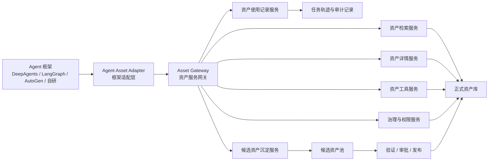
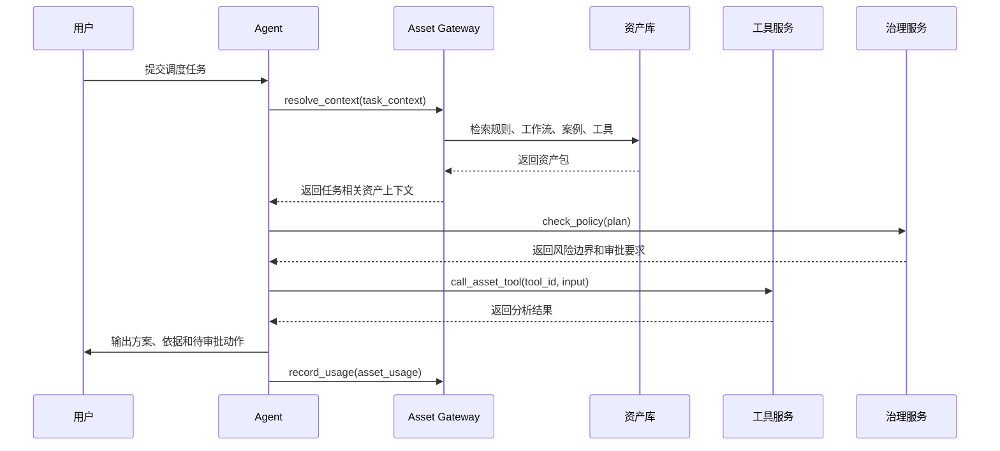
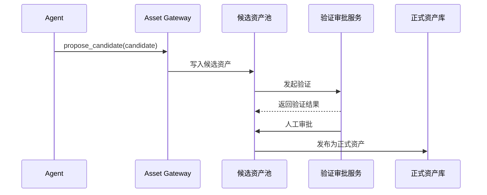

# 工业动态调度智能体资产管理模块架构

## 1. 架构定位

资产管理模块不应只作为人工维护知识、规则、文档和案例的后台，也不应直接绑定某一个 Agent 框架。

本模块的核心定位是：

> 面向工业动态调度 Agent 的长期任务记忆、能力供给层、治理层和资产沉淀闭环。

对人，它提供资产维护、验证、审批、发布、版本、审计和价值度量能力。

对 Agent，它提供可检索、可读取、可调用、可校验、可追踪、可沉淀的资产协议。

## 2. 核心原则

### 2.1 Agent 框架无关

资产管理模块不直接依赖 `deepagents`、LangGraph、AutoGen、CrewAI 或其他具体 Agent 框架。

系统应采用如下结构：

```text
Agent 框架
  -> Agent Asset Adapter
  -> Asset Gateway
  -> 资产检索 / 资产详情 / 工具调用 / 治理校验 / 使用记录 / 候选沉淀
  -> 资产库与候选资产池
```

近期可以基于 `langchain-ai/deepagents` 落地，但 `deepagents` 只应位于 Agent 框架适配层，不能反向决定资产对象模型、治理流程和沉淀机制。

### 2.2 服务职责独立，部署形态渐进

资产管理模块与 Agent Runtime 在领域职责上应保持独立。

Agent Runtime 负责：

- 任务理解。
- 推理规划。
- 对话交互。
- 工具调用编排。
- 调度方案生成。
- 任务执行过程管理。

资产管理模块负责：

- 资产对象管理。
- 资产检索与上下文组装。
- 权限、审批、版本和发布治理。
- 工具目录和工具调用治理。
- Agent 资产使用记录。
- 候选资产沉淀。
- 资产价值度量。

因此，长期架构上，二者应视为两个独立服务：

```text
Agent Runtime Service
  -> Agent Asset Adapter
  -> Asset Gateway
  -> Asset Management Service
```

但首期不一定必须拆成两个独立部署。可以采用“逻辑独立、部署可合并”的方式：

```text
同一个后端工程
  - agent-runtime 模块
  - asset-service 模块
  - asset-gateway 接口
  - asset-db 表结构
```

首期要求是：

- 代码模块边界独立。
- 接口协议边界独立。
- 数据模型边界独立。
- Agent 只能通过 Asset Gateway 使用资产能力。
- 资产治理流程不依赖具体 Agent 框架。

当出现多 Agent 接入、独立审批治理、跨系统审计、高并发调用或资产能力需要被其他系统复用时，再演进为独立部署的资产管理服务。

### 2.3 正式资产与候选资产隔离

Agent 可以自主提出候选资产，但不应直接修改正式资产库。

正式资产必须经过验证、审批和发布流程后，才能影响后续正式调度任务。

### 2.4 资产使用必须可审计

Agent 在任务中使用了哪些资产、为何使用、如何影响决策、是否被人工采纳，都应被记录。

这些记录既用于审计，也用于后续资产价值度量和候选资产沉淀。

### 2.5 治理优先于自动化

工业调度涉及生产计划、交期承诺、跨车间协同、物料替代、系统写回等高风险动作。

资产模块不仅要告诉 Agent “可以用什么”，也要告诉 Agent “哪些动作不能直接做，哪些动作必须审批”。

## 3. 总体架构



## 4. Agent 与资产模块的交互方式

### 4.1 Agent 使用资产

Agent 使用资产不应只等同于 RAG 检索。资产在任务中至少有三种使用方式。

#### 4.1.1 作为上下文

Agent 在处理调度任务时，根据任务上下文检索相关资产。

示例任务：

```text
设备 E-17 故障，预计停机 46 分钟，请评估是否需要重排。
```

Agent 调用资产检索接口：

```text
search_assets(task_context)
```

资产模块返回相关规则、工作流、案例、接口、评测资产等。

Agent 再读取资产详情：

```text
get_asset(asset_id)
```

资产详情中应包含：

- 人类可读说明。
- 结构化条件和适用范围。
- 规则约束或执行步骤。
- 可调用工具。
- 风险边界。
- 人工审批点。
- 版本和证据链。

#### 4.1.2 作为工具

部分资产本身是能力入口，例如：

- MES 设备状态查询接口。
- ERP 订单查询接口。
- APS 排程求解器。
- 规则校验器。
- 交期风险巡检工作流。

Agent 不应直接耦合底层系统接口，而应通过资产模块暴露的工具清单和调用协议使用这些能力。

```text
list_asset_tools(context)
call_asset_tool(tool_id, input)
```

这样底层工具的鉴权、参数映射、错误处理、审计和风险控制都可以由资产模块统一治理。

#### 4.1.3 作为治理约束

Agent 在生成方案、调用工具、发起审批或写回计划前，需要进行治理校验。

```text
check_policy(action, context)
```

示例返回：

```json
{
  "allowed": false,
  "reason": "跨车间调拨必须经过人工审批",
  "required_approval": ["生产经理", "计划主管"],
  "next_action": "create_plan_change_request"
}
```

治理校验应覆盖：

- Agent 是否可读取该资产。
- Agent 是否可调用该工具。
- 当前任务是否落在资产适用范围内。
- 是否涉及高风险动作。
- 是否需要人工审批。
- 是否允许写回业务系统。
- 是否需要记录审计证据。

### 4.2 Agent 自主更新与沉淀资产

Agent 不直接更新正式资产，而是提交候选资产。

推荐闭环：

```text
真实任务执行
  -> Agent 运行轨迹
  -> 资产候选识别
  -> 候选资产生成
  -> 自动验证
  -> 人工审批
  -> 发布为正式资产
  -> 后续任务复用
```

Agent 可在以下场景提出候选资产：

- 某类调度经验被多次采纳。
- 某条规则在真实任务中反复出现。
- 某个接口字段或业务术语被用户纠正。
- 某个 Agent 建议被否决且原因具有复用价值。
- 某个异常处理案例适合作为未来参考。
- 某个高风险错误应加入回归评测集。

候选资产提交接口：

```text
propose_asset_candidate(candidate)
```

示例：

```json
{
  "candidate_type": "rule",
  "title": "高价值急单插入时冻结低优先级尾单",
  "source": "agent_task_trace",
  "evidence": ["TASK-20260518-001", "TASK-20260521-004"],
  "suggested_scope": {
    "factory": "苏州一厂",
    "line": "总装一线",
    "order_type": "急单"
  },
  "risk_level": "medium",
  "human_review_required": true
}
```

候选资产状态建议：

```text
草稿 -> 候选 -> 验证中 -> 待审批 -> 已发布
```

异常状态建议：

```text
退回修改 / 冲突待解 / 停用 / 废止
```

## 5. 标准 Agent 资产接口

为了支持未来切换不同 Agent 框架，资产模块对 Agent 暴露的接口应保持稳定。

第一版建议抽象为 6 个核心接口。

### 5.1 search_assets

根据任务上下文检索相关资产。

输入包括：

- 工厂、车间、产线、设备、产品、订单、客户、异常类型。
- 当前任务目标。
- Agent 身份与权限。
- 是否为正式任务或仿真任务。

输出包括：

- 资产列表。
- 匹配原因。
- 推荐使用方式。
- 置信度。
- 风险提示。

### 5.2 get_asset

读取单个资产详情。

输出包括：

- 基础信息。
- 适用范围。
- 内容载体。
- 结构化规则或流程。
- 关联工具。
- 治理状态。
- 权限要求。
- 版本信息。
- 证据链。

### 5.3 resolve_context

根据任务上下文组装 Agent 可直接使用的资产包。

资产包可包含：

- 任务相关规则。
- 推荐工作流。
- 可调用工具清单。
- 风险边界。
- 审批要求。
- 相关历史案例。
- 输出格式要求。

### 5.4 check_policy

校验 Agent 的计划、工具调用或动作是否允许执行。

输出包括：

- 是否允许。
- 不允许原因。
- 必须满足的前置条件。
- 所需审批角色。
- 推荐下一步动作。
- 审计记录要求。

### 5.5 record_usage

记录 Agent 在任务中如何使用资产。

记录内容包括：

- 任务编号。
- Agent 框架与版本。
- 使用的资产编号和版本。
- 使用阶段。
- 使用方式。
- 对输出方案的影响。
- 用户是否采纳。
- 执行结果。

### 5.6 propose_candidate

提交候选资产。

候选资产应包含：

- 候选类型。
- 来源任务。
- 提炼内容。
- 证据链。
- 适用范围建议。
- 风险等级。
- 冲突资产。
- 建议验证方式。

## 6. 基于 DeepAgents 的近期落地方式

当前选型准备基于 `langchain-ai/deepagents`，建议采用适配层方式接入。

### 6.1 封装为 DeepAgents 工具

将资产模块标准接口包装为 DeepAgents 可调用工具：

```text
search_assets
get_asset
resolve_context
check_policy
record_usage
propose_asset_candidate
list_asset_tools
call_asset_tool
```

DeepAgents 负责在任务执行过程中调用这些工具，但资产模块负责返回可治理、可审计、可复用的资产结果。

### 6.2 使用文件系统上下文承载资产包

DeepAgents 支持类似文件系统的上下文表面，可以将任务相关资产整理为可读文件。

示例：

```text
/assets/relevant_rules.md
/assets/workflow_WF-RES-032.md
/assets/policy_boundaries.md
/assets/tool_manifest.json
/assets/related_cases.md
```

这样 Agent 在复杂任务中可以像读取项目文件一样读取资产上下文，同时资产模块仍然保持独立。

### 6.3 使用子 Agent 分工

在 DeepAgents 内部可以设计专门的子 Agent：

- `AssetRetrieverAgent`：检索和组装任务相关资产。
- `PolicyGuardAgent`：检查权限、风险和审批要求。
- `ReflectionAgent`：任务结束后提炼候选资产。
- `EvaluationAgent`：基于历史案例验证候选资产。

这些子 Agent 属于 DeepAgents 适配实现，不应成为资产模块的核心领域模型。

## 7. 典型交互流程

### 7.1 Agent 执行调度任务



### 7.2 Agent 沉淀候选资产



## 8. 后续需要细化的问题

- 资产对象模型字段和不同资产类型的专属字段。
- Agent 身份、权限和任务上下文模型。
- 候选资产自动识别规则。
- 正式任务、仿真任务和测试任务的隔离机制。
- 资产包的结构化格式。
- DeepAgents 工具封装方式和错误处理规范。
- 资产价值度量指标和任务结果回传口径。
- 首期工程部署形态：单体模块化部署，还是 Agent Runtime 与 Asset Management 分服务部署。
