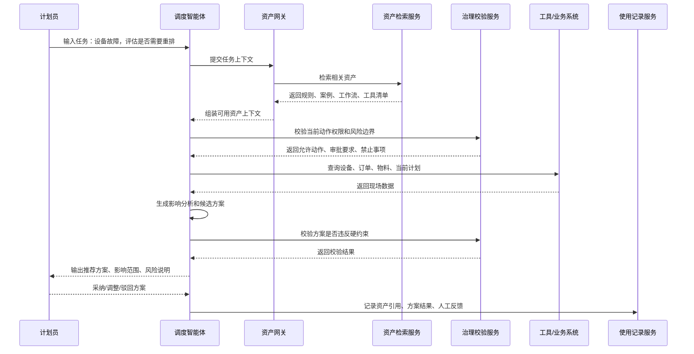
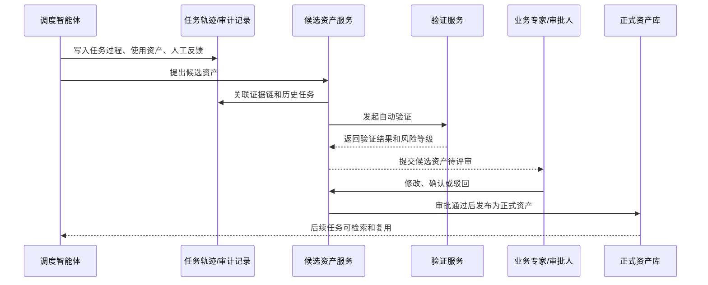

# 智能体资产管理设计报告

## 一、建设背景

我们现在做的资产管理模块，不是一个普通的知识库，也不是附件管理功能。

在工业动态调度场景里，智能体真正能产生价值，核心不在于它能不能回答问题，而在于它能不能持续理解现场的调度规则、业务约束、系统数据、历史案例和专家经验，并且在每一次任务执行后，把有价值的经验沉淀下来。

所以，资产管理模块的定位是：

**把企业在生产调度中的知识、规则、工具、案例和反馈，沉淀成智能体可以长期复用、可治理、可审计的资产。**

它主要解决三个问题：

1. 智能体执行任务时，到底可以使用哪些可信资产。
2. 智能体使用资产的过程是否可控、可追踪。
3. 真实任务中产生的新经验，如何沉淀为后续可复用能力。

## 二、智能体资产的范围

在工业调度场景里，资产不只是文档、数据表或者接口。

更准确地说，智能体资产是：

**经过业务验证、带有适用范围和安全边界、能够支撑智能体完成具体任务的可复用能力。**

目前可以分为几类：

| 类型 | 说明 | 示例 |
| --- | --- | --- |
| 基础数据资产 | 帮助智能体理解调度对象 | 设备、产线、工艺路线、BOM、班组、日历 |
| 规则约束资产 | 明确什么能做、什么不能做 | 设备兼容规则、插单优先级、换型约束 |
| 工作流资产 | 指导智能体如何处理一类任务 | 插单评估、设备故障重排、物料短缺分析 |
| 工具接口资产 | 让智能体安全调用系统能力 | MES 查询、ERP 订单查询、APS 求解器 |
| 案例经验资产 | 沉淀真实调度经验 | 历史插单处理、故障应急方案、人工否决原因 |
| 评估指标资产 | 衡量方案和资产是否有效 | 准交率、换型次数、延期小时、采纳率 |

这里有一个关键原则：

**资产进入资产库，不代表它可以直接影响正式调度决策。**

尤其是规则、策略、工具调用、计划写回这类高影响资产，必须经过验证、审批和发布，才能进入正式使用范围。

## 三、产品设计思路

资产管理模块建议围绕四个核心能力展开。

### 1. 资产工作台

资产工作台主要看整体情况，包括：

- 当前资产总量和分类分布。
- 已发布、待验证、待审批、停用资产数量。
- 高频使用资产。
- 智能体提出的候选资产。
- 存在风险或长期未维护的资产。

这个页面的重点不是展示得多，而是让用户一进来就知道：

**现在有哪些资产在支撑智能体运行，哪些资产需要处理。**

### 2. 资产详情

资产详情页是核心页面。

一项资产不只是展示内容，还要说明：

- 这个资产是什么。
- 适用于哪些工厂、产线、产品、场景。
- 来源是什么。
- 当前处于什么状态。
- 哪些任务引用过它。
- 使用后效果如何。
- 是否有审批记录、版本记录和证据链。

例如一条“设备故障后重排策略”，不能只写一句说明，而是要包含触发条件、输入信息、执行步骤、调用工具、人工审批点、成功判断和风险边界。

这样智能体能用，人也能审。

### 3. 候选资产沉淀

这是智能体资产管理区别于传统知识库的地方。

智能体在真实任务中会产生很多有价值的信息，比如：

- 用户多次修正了同一类规则。
- 某个调度方案被多次采纳。
- 某类错误建议被人工否决，且原因具有复用价值。
- 某个异常处理案例未来可以作为参考。
- 某条业务术语或口径被反复解释。

这些内容不应该散落在聊天记录里，而应该进入“候选资产池”。

但智能体只能提出候选资产，不能直接改正式资产。候选资产需要经过验证、审批、发布后，才能进入正式资产库。

### 4. 价值度量

资产管理不能只看“有多少条资产”，更要看“有没有用”。

建议重点看几类指标：

- 资产被引用次数。
- 引用后方案采纳率。
- 是否减少人工反复解释。
- 是否减少调度错误或违规建议。
- 是否提升插单、故障、物料短缺等场景处理效率。
- 哪些资产长期无人使用，需要清理或下线。

这样资产库不是越堆越多，而是逐步变成一套可运营、可优化的能力体系。

## 四、典型交互流程

### 1. 智能体使用资产完成调度任务

下面以“设备故障后是否需要重排”为例，说明智能体如何使用资产。



这个流程里，资产模块不是简单给智能体“查资料”，而是同时承担三件事：

1. 给智能体提供可信上下文。
2. 控制工具调用和高风险动作。
3. 记录资产使用过程和业务反馈。

### 2. 智能体沉淀候选资产

当某类规则、案例或经验在真实任务中被反复验证后，可以沉淀为候选资产。



这个流程强调一点：

**智能体可以发现资产、建议资产，但不能绕过人工验证直接修改正式资产。**

## 五、系统架构关系

架构上，资产管理模块不建议直接绑定某一个 Agent 框架。

近期可以基于 DeepAgents 落地，但资产对象、治理流程和接口协议要保持独立。

建议整体关系是：

```text
Agent Runtime
  -> Agent Asset Adapter
  -> Asset Gateway
  -> 资产检索 / 资产详情 / 工具调用 / 治理校验 / 使用记录 / 候选沉淀
  -> 资产库与候选资产池
```

智能体使用资产主要有三种方式：

| 使用方式 | 说明 |
| --- | --- |
| 作为上下文 | 检索相关规则、案例、工作流和风险边界 |
| 作为工具 | 调用 MES、ERP、APS、规则校验器等能力 |
| 作为治理约束 | 判断动作是否允许、是否需要审批、是否能写回系统 |

这三类能力统一通过资产网关提供，方便做权限、版本、审计和风险控制。

## 六、首期建设重点

首期不建议一上来做得过重，重点把闭环跑通。

建议聚焦五件事：

1. 建立统一资产对象模型。先支持规则、工作流、工具接口、案例、指标几类核心资产。
2. 做好资产状态流转。草稿、候选、验证中、待审批、已发布、停用、废止。
3. 打通智能体引用资产链路。智能体能检索资产、读取资产、记录使用情况。
4. 建立候选资产机制。智能体可以从任务轨迹中提出候选资产，但必须人工确认后发布。
5. 做出价值度量雏形。先看引用次数、采纳率、场景贡献、人工修正次数等基础指标。

首期技术上可以采用：

```text
Python FastAPI + DeepAgents + PostgreSQL + pgvector
```

先以模块化方式落地，不一定一开始就拆成多个独立服务。但代码边界、接口边界和数据模型边界要提前设计好，后续如果要服务多个智能体或接入更复杂审批流程，可以平滑拆分。

## 七、阶段性结论

这套资产管理模块的价值，不是多建一个后台系统，而是帮助智能体形成持续积累能力。

对业务侧，它解决规则、经验、案例分散的问题。

对智能体侧，它提供可信的上下文、工具和约束。

对管理侧，它提供审批、版本、审计和价值度量。

对后续推广，它让一个场景里验证过的能力，可以沉淀下来，复制到更多产线、车间和工厂。

最终目标是让智能体不是每次从零开始处理任务，而是在企业自己的调度资产基础上，越用越稳、越用越懂现场。
